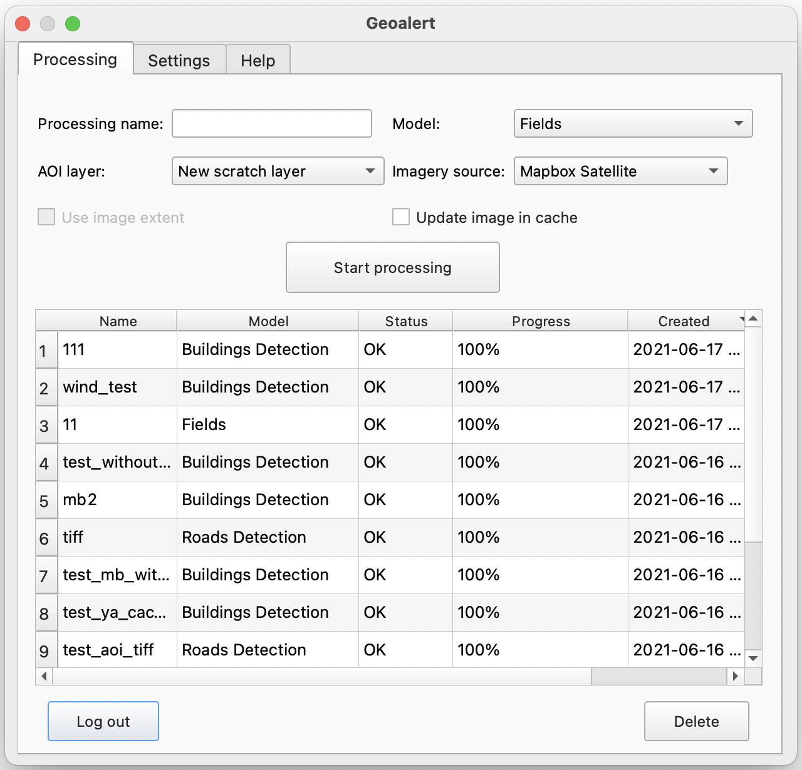
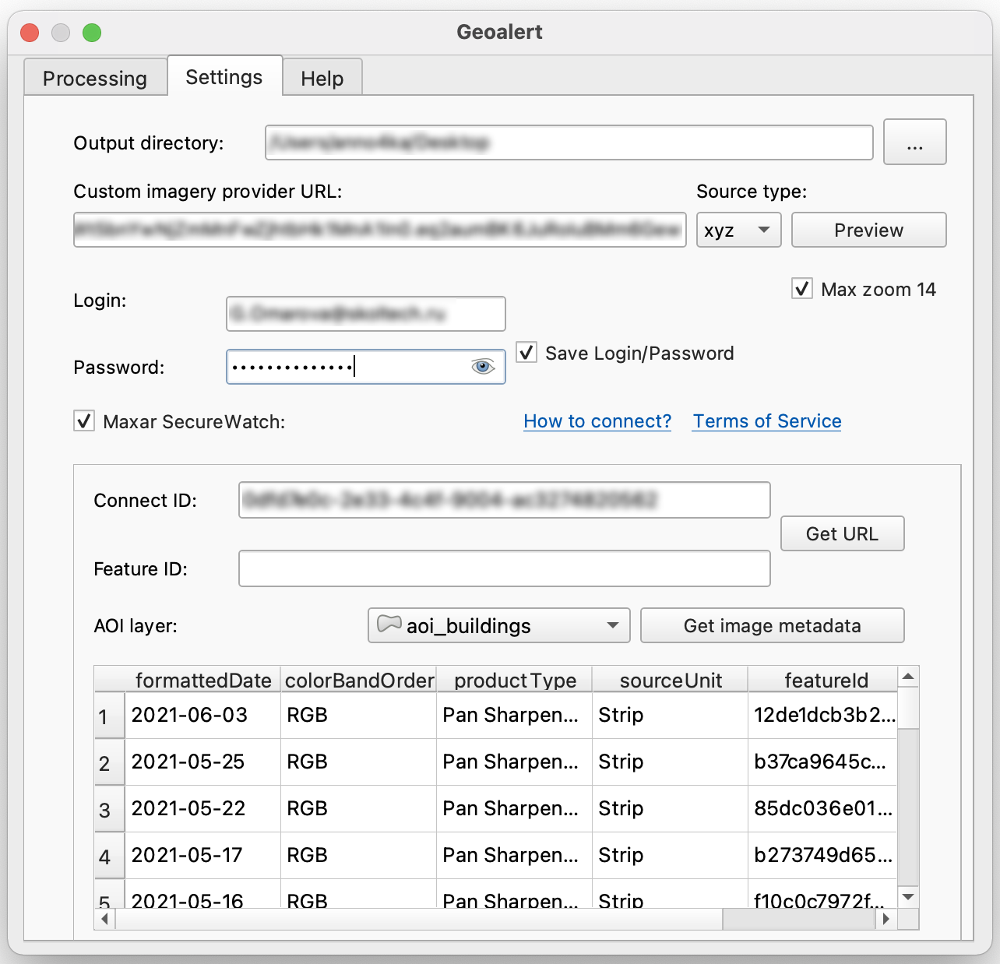

QGIS
=============

 .. attention::
    This application enables to use Mapflow processing capabilities in QGIS (qgis.org). To start using you need :doc:`processing_api` access, please, send us a request to **help@geoalert.io**

What is QGIS
---------------

QGIS is the leading and most popular Open Source Desktop GIS. Users can visualize, manage, edit, analyse data, and compose printable maps. Get a first impression with a more detailed feature list.
Know more on QGIS `official site <https://www.qgis.org/>`_. 

It has an interface for external Python plugins that allows to connect more apps and extend core functionallity. Our app enables connection to Mapflow :doc:`processing_api` to run AI-mapping processings and download output data as QGIS layers.

User interface
--------------

Geoalert plugin working window is divided into 3 tabs:

- Processing;
- Settings;
- Help.

1.Processing
~~~~~~~~~~~~~

**1.1. User authorization area**

    *Login/Password*. You need to enter Login and Password. Go to `mapflow.ai <https://mapflow.ai/en>`_, register and write to the support service on the platform's website a request to provide access to the API for working with the plugin.

    *Save Login/Password*. User's personal data can be saved for further use of the plugin when it is restarted.

    *Connect*. User account login button.

**1.2. Processing parameters area**

    *Processing name*. The name of the treatment.

    *AOI layer*. The area to be processed. This layer is automatically displayed in the drop-down list from the list of QGIS vector layers, load this layer into QGIS or draw it.

    *AI model*. Processing type. In the drop-down list, you can select the following processing types (default list of processing scenarios):
    
    - *Building Detection*;
    - *Roads Detection*;
    - *Forest Detection*;
    - *Buildings detection With Heights*;
    - *Forest Detection With Heights*.

    *Imagery source*. Substrate. By default Mapbox Satellite is selected, in the drop-down list you can also select Custom (see Settings) and Open new .tif.

    *Update image in cache*. Refresh the processing image in the cache.

    *Start processing*. New processing start button.

**1.3. Display unit and work with processing**

    The processing window consists of:

    - *Processing*. The degree of completion of processing in percent.
    - *Name*. The name of the treatment.
    - *Status*. Processing status.
    - *Created*. The date the treatment was created.
    - *ID*. Processing ID.
    - *AI model*. User-selected processing type in the AI ​​model field.

    *Delete*. Button for deleting previously performed processing from the processing window.

    *Load processing results*. A button that allows you to upload the resulting processing result as a layer to QGIS.

2.Settings
~~~~~~~~~~~

*Destination folder*. Path to the directory into which the processing result will be loaded.
    
*Geoalert platform url*. Geoalert Platform URL.
    
*Custom Imagery provider URL*. Satellite imagery provider URL.
    
*Raster tile type*. Raster tile type. You can choose xyz, tms, wms.
    
*Max zoom 14*. Zoom size 14 is selected by default to exclude the consumption of paid traffic for preview (Relevant if connected to Maxar SecureWatch. Viewing data from this service is possible from zoom 9. You can use the zoom up to maximum 18 zoom by unchecking the box).
    
*Preview*. Button to preview the background of the specified satellite imagery and geospatial data provider.
    
**Maxar SecureWatch settings**
    
*Login/Password*. Login credentials for your SecureWatch account.
    
*Save Login/Password*. The user's personal data can be saved for further connectivity to SecureWatch resources.
    
*Connect ID*. The identifier for the connection to SecureWatch resources.
    
*Get URL*. Button to get the URL of the satellite imagery provider Maxar.
    
*AOI layer*. The area for which meta data will be presented.
    
*Get image metadata*. Button to start collecting meta-data for the selected area.
    
3. Help
~~~~~~~~

The tab contains all useful links for working with this plugin.
    

How to install the plugin
--------------------------

You have to add external repository from our site, click *Plugins* --> *Manage...* --> *Add…* and fill out the form with a name and the `URL to repository <https://qgis.mapflow.ai/mapflow.xml>`_. 

 .. figure:: _static/qgis/add_repo.png
         :alt: Add repo
         :align: center
         :width: 15cm

You will be able to see then if the newer version of the app is available and to check the changelog for details.

  
How to connect to Maxar SecureWatch
------------------------------------

.. note::
 SecureWatch is a service that provides flexible access to high-resolution satellite images and imagery basemaps from the world leader in remote sensing, MAXAR. The spatial resolution of images varies in the range from 30 cm to 1 m. All images are accompanied by metadata, including information about the acquisition date and time, cloud cover etc.

1. On the **Processing** tab, in the *Imagery source* drop-down list, select *Custom (in setting)*.
 
 .. figure:: _static/qgis/Geoalert_processing.png
         :alt: Processing dialog
         :align: center
         :width: 15cm

2. Go to the **Settings** tab.
 
3. Enter your SecureWatch account credentials in the *Login* and *Password*.
 
.. important:: 
  If you don't have an account, you need to apply to Maxar `SecureWatch <https://explore.maxar.com/securewatch-demo>`_.
 
4. Select *Maxar Securewatch*. Enter your *Connect ID*. In order to copy your *Connect ID*:

     1.Go to `SecureWatch <https://securewatch.digitalglobe.com/myDigitalGlobe/logout-from-ended-session>`_.

     2.In the title bar select your name, then select **View Profile**. The **User Profile** dialog box will open.
 
     3.Copy your **Current Cnnect ID**.
     
     .. figure:: _static/qgis/SecureWatch_user_profile.jpg
         :alt: Your user profile in SecureWatch
         :align: center
         :width: 15cm

     .. attention::
         The **Connect ID** is different for each product you have in your SecureWatch subscription. Therefore, initially choose the one that suits you. To do this, close the *User Profile* window and in the title bar select the required of the two suggested mosaics (**Vivid** and **SecureWatch**) by clicking on the name of one of them.
 
     4. Return to QGIS to **Geoalert plugin**, paste the copied ID in the *Connect ID* input.
     
     5. Click *Get URL*. 
     
     Now the Maxar layer is available for preview in your raster layers list and for the AI-mapping processing using Mapflow.
     

How to use other imagery services
------------------------------------

You can enter your custom imagery source URL in one of the following formats:

* XYZ;
* TMS;
* WMS.

All formats represent the most widely used protocols to fetch gereferenced imagery via http:
(There is one more type that is supported in the Mapflow which is *quadkey*)

How to process your own imagery data
------------------------------------

You can upload your local raster in GeoTIF format (*Open new .tif*). Every file added as raster layer into QGIS is visible in the drop-down list and can be selected for uploading.

 .. figure:: _static/qgis/upload_tif.png
         :alt: Upload TIF, select from list
         :align: center
         :width: 15cm
