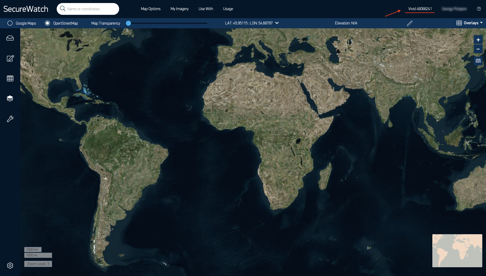
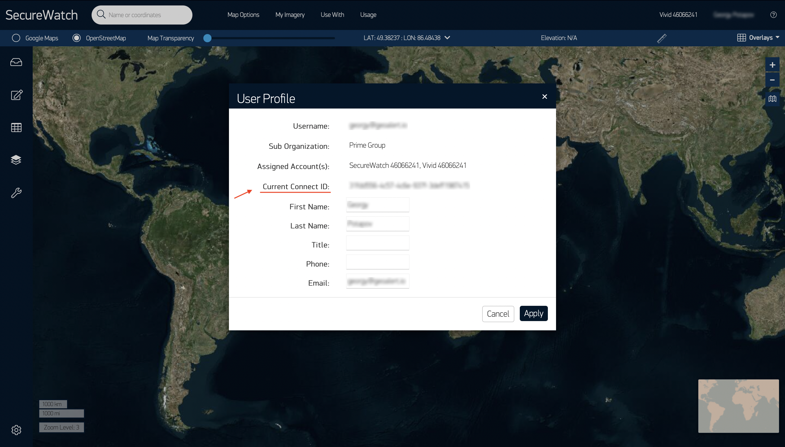

QGIS
=============

 .. attention::
    This application enables to use Mapflow processing capabilities in QGIS (qgis.org). To start using you need :doc:`processing_api` access, please, send us a request to **help@geoalert.io**

What is QGIS
---------------

User interface
---------------

How to install the plugin
------------------------

  
How to connect to Maxar SecureWatch
------------------------------------

SecureWatch is a service that provides flexible access to optical images from the world leader in remote sensing, MAXAR. The spatial resolution of images varies in the range from 30 cm to 1 m. All images are accompanied by metadata, including information about the shooting date and time, shooting angle and cloud cover, spatial resolution, image processing level, etc.

You need a login, password and Connect ID to use the SecureWatch resources in our plugin.

Just go to the `official SecureWatch website <https://securewatch.digitalglobe.com/myDigitalGlobe/logout-from-ended-session>`_  and register.

After registration, you will be offered 2 high-resolution mosaic options, Vivid and SecureWatch, which one to use is up to you.

You can switch between mosaics by clicking on the name of one of them on the top panel.

Go to User Profile to find out your Connect ID.

.. attention:: 
 Please note that the Connect ID is different for each mosaic. Therefore, initially choose the one that suits you.

How to use other imagery services
------------------------------------

How to process your own imagery data
------------------------------------