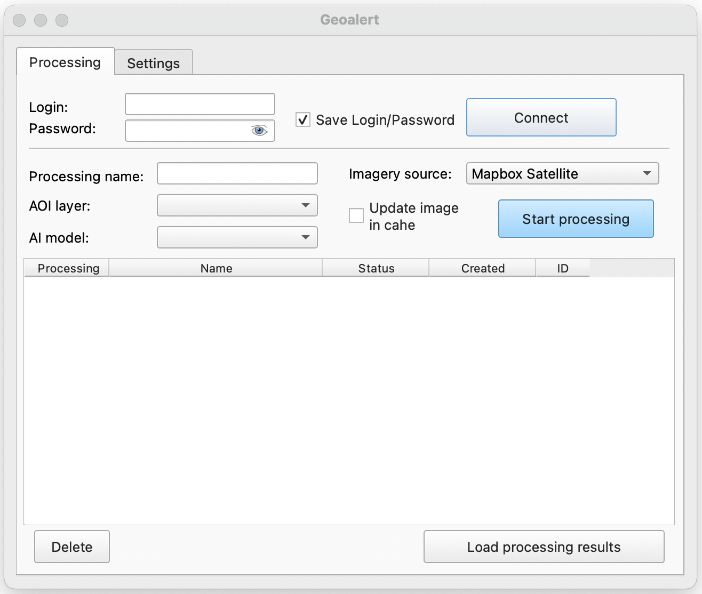
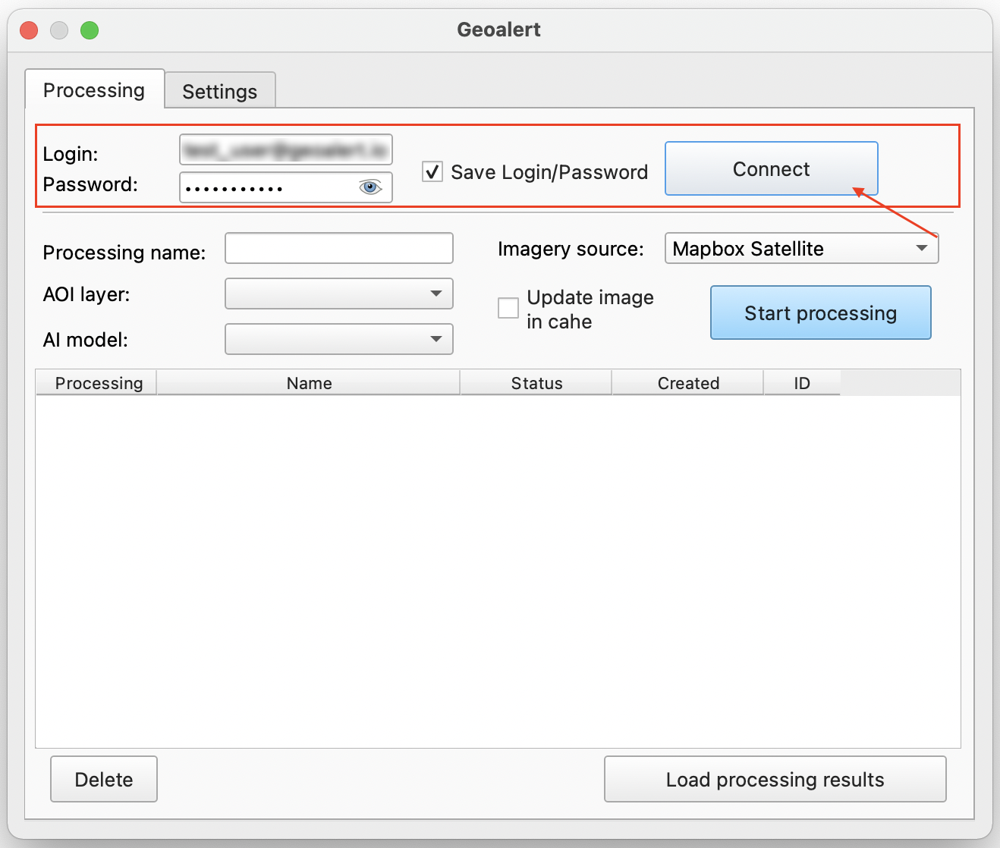
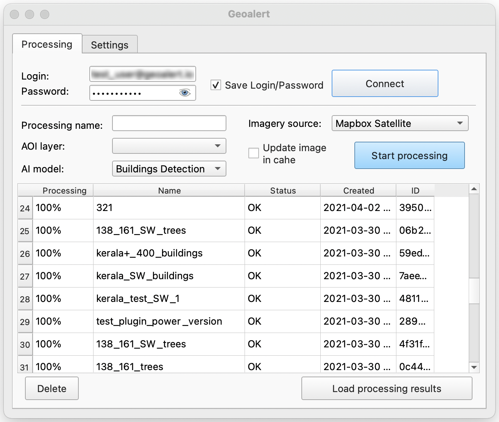
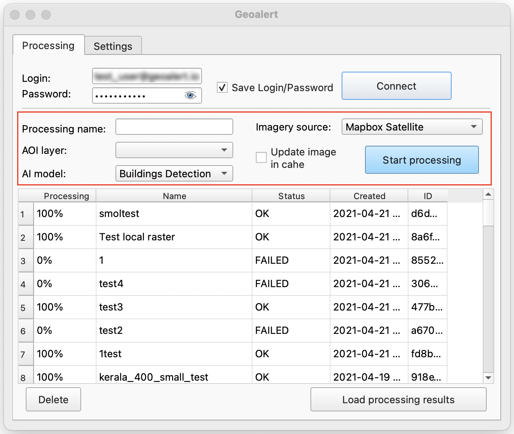

QGIS
=============

 .. attention::
    This application enables to use Mapflow processing capabilities in QGIS (qgis.org). To start using you need :doc:`processing_api` access, please, send us a request to **help@geoalert.io**

What is QGIS
---------------

QGIS is the leading and most popular Open Source Desktop GIS. Users can visualize, manage, edit, analyse data, and compose printable maps. Get a first impression with a more detailed feature list.
Know more on QGIS `official site <https://www.qgis.org/>`_. It has an interface for external Python plugins that allows to connect more apps and extend core functionallity. Our app enables connection to Mapflow :doc:`processing_api` to run AI-mapping processings and download output data as QGIS layers.

User interface
--------------

Geoalert plugin working window is divided into 2 tabs:

- **Processing**;
- **Settings**;

**Processing**

In this tab, the user is given the opportunity to log into his `mapflow.ai account <https://mapflow.ai/en>`_, generate and run his processing in QGIS.

You must fill in the *Login* and *Password* fields to log into your account. By choosing *Save Login / Password* the user's personal data will be saved so as not to enter them when the plugin is restarted. When you press the *Connect button*, you will be connected to your account and you can start composing a processing request.

At the bottom of the window, you will be able to view and information about all previously performed processings: their name, processing type, status, creation date and processing ID.

Let's consider the area of ​​processing parameters.

The *Processing name* field corresponds to the name of the processing.

*AOI layer* - area for processing. This layer is automatically displayed in the drop-down list from the list of QGIS raster layers, load this layer into QGIS or draw it.

.. figure:: _static/qgis/aoi_layer.png
         :alt: AOI layer
         :align: center
         :width: 15cm
 
*AI model* - processing type. In the drop-down list, you can select the following processing types:

- *Building Detection*;
- *Roads Detection*; 
- *Forest Detection*;
- *Buildings detection With Heights*;
- *Forest Detection With Heights*.

*Imagery source* - background. Mapbox Satellite is selected by default, you can also select Custom and Open new .tif from the drop-down list.

The *Start processing* button will start a new processing.
         
Using the *Delete* button, you can delete processing from the processing window.

The *Load processing results* button allows you to upload the resulting processing result as a layer to QGIS. 

How to install the plugin
--------------------------

You have to add external repository from our site, click *Plugins* --> *Manage...* --> *Add…* and fill out the form with a name and the `URL to repository <https://qgis.mapflow.ai/mapflow.xml>`_. 

 .. figure:: _static/qgis/add_repo.png
         :alt: Add repo
         :align: center
         :width: 15cm

You will be able to see then if the newer version of the app is available and to check the changelog for details.

  
How to connect to Maxar SecureWatch
------------------------------------

.. note::
 SecureWatch is a service that provides flexible access to high-resolution satellite images and imagery basemaps from the world leader in remote sensing, MAXAR. The spatial resolution of images varies in the range from 30 cm to 1 m. All images are accompanied by metadata, including information about the acquisition date and time, cloud cover etc.

1. On the **Processing** tab, in the *Imagery source* drop-down list, select *Custom (in setting)*.
 
 .. figure:: _static/qgis/Geoalert_processing.png
         :alt: Processing dialog
         :align: center
         :width: 15cm

2. Go to the **Settings** tab.
 
3. Enter your SecureWatch account credentials in the *Login* and *Password*.
 
.. important:: 
  If you don't have an account, you need to apply to Maxar `SecureWatch <https://explore.maxar.com/securewatch-demo>`_.
 
4. Select *Maxar Securewatch*. Enter your *Connect ID*. In order to copy your *Connect ID*:

     1.Go to `SecureWatch <https://securewatch.digitalglobe.com/myDigitalGlobe/logout-from-ended-session>`_.

     2.In the title bar select your name, then select **View Profile**. The **User Profile** dialog box will open.
 
     3.Copy your **Current Cnnect ID**.
     
     .. figure:: _static/qgis/SecureWatch_user_profile.jpg
         :alt: Your user profile in SecureWatch
         :align: center
         :width: 15cm

     .. attention::
         The **Connect ID** is different for each product you have in your SecureWatch subscription. Therefore, initially choose the one that suits you. To do this, close the *User Profile* window and in the title bar select the required of the two suggested mosaics (**Vivid** and **SecureWatch**) by clicking on the name of one of them.
 
     4. Return to QGIS to **Geoalert plugin**, paste the copied ID in the *Connect ID* input.
     
     5. Click *Get URL*. 
     
     Now the Maxar layer is available for preview in your raster layers list and for the AI-mapping processing using Mapflow.
     

How to use other imagery services
------------------------------------

You can enter your custom imagery source URL in one of the following formats:

* XYZ
* TMS
* WMS

All formats represent the most widely used protocols to fetch gereferenced imagery via http:
(There is one more type that is supported in the Mapflow which is *quadkey*)

How to process your own imagery data
------------------------------------

You can upload your local raster in GeoTIF format (*Open new .tif*). Every file added as raster layer into QGIS is visible in the drop-down list and can be selected for uploading.

 .. figure:: _static/qgis/upload_tif.png
         :alt: Upload TIF, select from list
         :align: center
         :width: 15cm
