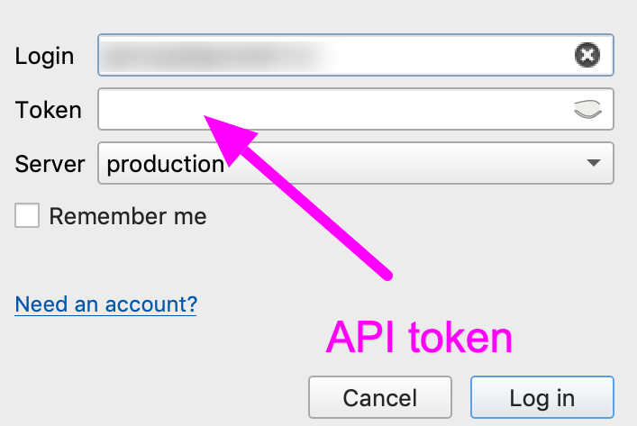

QGIS
=============

 .. attention::
    Mapflow can be used via `QGIS <https://www.qgis.org/>`_. You will need access to the data processing API that to use it (see :doc:`authorization to work with the Mapflow API <../docs_userguides/mapflow_auth>`).

    In the `API tab <https://app.mapflow.ai/account/api>`_ of the profile settings is specified the area limit for processing provided to you (initially 100 km\: sup: `2`) and the total area of ​​already completed processing.

What is QGIS
---------------

QGIS is the leading and most popular Open Source Desktop GIS. Users can visualize, manage, edit, analyse data, and compose printable maps. Get a first impression with a more detailed feature list.
Know more on QGIS `official site <https://www.qgis.org/>`_. 

It has an interface for external Python plugins that allows to connect more apps and extend core functionallity. Our app enables connection to Mapflow :doc:`processing_api` to run AI-mapping processings and download output data as QGIS layers.

How to install the plugin
--------------------------

Click *Plugins* --> *Manage...*, go to the Not installed (or All) tab and enter MapFlow in the search box. Click Install Plugin. You will be able to see then if the newer version of the app is available (in the Upgradeable tab) and to check the changelog for details.

The plugin icon has appeared in the QGIS Toolbar. If the icon isn't automatically displayed, right-click on the Toolbar and check the box Mapflow.

User interface
--------------

You need to log in with your account to use the plugin. Go to `mapflow.ai <https://mapflow.ai/en>`_, register and obtain API token for working with the plugin.

Login window
~~~~~~~~~~~~

  
.. list-table::
   :widths: auto
   :header-rows: 1

   * - Name of the field / button
     - Description
   * - Login/Pssword
     - Fields for entering user account data.
   * - Server
     - Select the platform to which the plugin will address to start processing.
   * - Remember me
     - Saving the user's personal data for using the plugin when you later log out of your account.   
   * - Log in
     - User account login button.
   * - Cancel
     - Button to close the plugin authorization window.

Geoalert plugin
~~~~~~~~~~~~

Geoalert plugin working window is divided into 3 tabs:

:ref:`Processing`

:ref:`Settings`

:ref:`Help`

.. _Processing:

1.Processing
~~~~~~~~~~~~~

.. figure:: _static/qgis/processing_tab.png
         :alt: Veiw of the processing tab
         :align: center
         :width: 15cm

**Processing parameters area**

.. csv-table::
    :file: _static/qgis/processing_parameters_area.csv 
    :header-rows: 1 
    :class: longtable
    :widths: 1 3  

**Display output and work with processing**

.. list-table::
   :widths: auto
   :header-rows: 1

   * - Name of the field / button
     - Description
   * - Name
     - Processing name.
   * - Model
     - User-selected processing type in the Model field.
   * - Status
     - Processing status: IN_PROGRESS, OK, FAILED. 
   * - Progress
     - The degree of completeness of processing as a percentage.
   * - Created
     - The date the processing was created.
  

To unload the processing results, double-click on the completed processing.

.. _Settings:

2.Settings
~~~~~~~~~~~

.. list-table::
   :widths: auto
   :header-rows: 1

   * - Name of the field / button
     - Description
   * - Output directory
     - Path to the directory into which the processing result will be loaded.
   * - Custom imagery provider URL
     - Satellite imagery provider URL.
   * - Source type
     - Raster tile type. You can choose xyz, tms, wms.
   * - Preview
     - The degree of completeness of processing as a percentage.
   * - Max zoom 14
     - Zoom size 14 is selected by default to exclude the consumption of paid traffic for preview (Relevant if connected to Maxar SecureWatch. Viewing data from this service is possible from zoom 9. You can use the zoom up to maximum 18 zoom by unchecking the box).

     
    
**Maxar SecureWatch settings**

.. list-table::
   :widths: auto
   :header-rows: 1

   * - Name of the field / button
     - Description
   * - Login/Password
     - Login credentials for your SecureWatch account.
   * - Save Login/Password
     - The user's personal data can be saved for further connectivity to SecureWatch resources.
   * - Connect ID
     - The identifier for the connection to SecureWatch resources.
   * - Get URL
     - Button to get the URL of the satellite imagery provider Maxar.
   * - Feature ID
     - Image ID obtained from the meta-data that intersects with the selected  AOI layer.
   * - AOI layer
     - he area for which meta-data will be presented.
   * - Get image metadata
     - Button to start collecting meta-data for the selected area. 

.. _Help:

1. Help
~~~~~~~~

The tab contains all useful links about this plugin.

  
How to connect to Maxar SecureWatch
------------------------------------

.. note::
 SecureWatch is a service that provides global access to high-resolution satellite images and imagery basemaps from the world leader in remote sensing, MAXAR, through the subscription model. The spatial resolution of images varies in the range from 30 cm to 1 m. All images are accompanied by metadata, including information about the acquisition date and time, cloud cover etc. In our application we implemented the special interface to connect to this service and use imagery via Mapflow's processings pipelines.

1. On the **Processing** tab, in the *Imagery source* drop-down list, select *Custom URL (in setting)*.
 

2. Go to the **Settings** tab.
 
3. Enter your SecureWatch account credentials in the *Login* and *Password*.
 
.. important:: 
  If you don't have an account, you need to apply to Maxar `SecureWatch <https://explore.maxar.com/securewatch-demo>`_.
 
4. Select *Maxar Securewatch*. Enter your *Connect ID*. In order to copy your *Connect ID*:

     1.Go to `SecureWatch <https://securewatch.digitalglobe.com/myDigitalGlobe/logout-from-ended-session>`_.

     2.In the title bar select your name, then select **View Profile**. The **User Profile** dialog box will open.
 
     3.Copy your **Current Connect ID**.
     
     .. figure:: _static/qgis/SecureWatch_user_profile.jpg
         :alt: Your user profile in SecureWatch
         :align: center
         :width: 15cm

     .. attention::
         The **Connect ID** is different for each product you have in your SecureWatch subscription. Therefore, initially choose the one that suits you. To do this, close the *User Profile* window and in the title bar select the required of the two suggested mosaics (**Vivid** and **SecureWatch**) by clicking on the name of one of them.
 
     4. Return to QGIS to **Geoalert plugin**, paste the copied ID in the *Connect ID* input.
     
     5. Click *Get URL*. 
     
     Now the Maxar layer is available for preview in your raster layers list and for the AI-mapping processing using Mapflow.

How to find and process the image by Feature ID using Maxar SecureWatch
~~~~~~~~~~~~~~~~~~~~~~~~~~~~~~~~~~~~~~~~~~~~~~~~~~~~~~~~~~~~~~~~~~~~~~~

You can use SW to discover and get processed aby avaialble image for you area of interest.

1. Go to *Maxar SecureWatch* setiings.

2. Select the vector layer with the boundary of your area of interest using *AOi layer*.

.. note::
    You have to upload from the file with coordinates or to create the new one area using QGIS.

     .. figure:: _static/qgis/add_SW_WFS.png
         :alt: Get specific image from SW
         :align: center
         :width: 15cm    

3. *Get image metadata*, to view meta-data of all avaialble images intesecting your AOI.

4. Select the prteferable image from the meta-data list or use the WFS generated vector layer (*WFS_temp*) to search through more attributes.

.. note::
    Imagery metadata is saved in the form of vector layer. You can interact with its Attribute Table searching through all attributes.

5. Press *Get URL* to generate the URL request to the selected image (*Feature ID*).

6. Press *Preview*, to view the selected image in the form of new raster layer.

.. attention::
    "max zoom 14" checkbox is avtive to prevent the paid streaming сon the side of SecureWatch. If you like to view the full resolution image - uncheck it and press *Preview* button.
     

How to use other imagery services
------------------------------------

You can enter your custom imagery source URL in one of the following formats:

* XYZ;
* TMS;
* WMS;
* Quadkey.

All formats represent the most widely used protocols to fetch georeferenced imagery via HTTP.

How to process your own imagery
------------------------------------

You can upload your own GeoTIFF (*Open new .tif*). All raster layers currently loaded in your QGIS are visible in the drop-down list and can be selected for upload.

 .. figure:: _static/qgis/upload_tif.png
         :alt: Upload TIF, select from list
         :align: center
         :width: 15cm

.. important::
  You must follow the requirements specified on the page with :ref:`Models reference` when uploading your own images for processing through the API of the Mapflow platform. Send a request using data preprocessing to help@geoalert.io.
