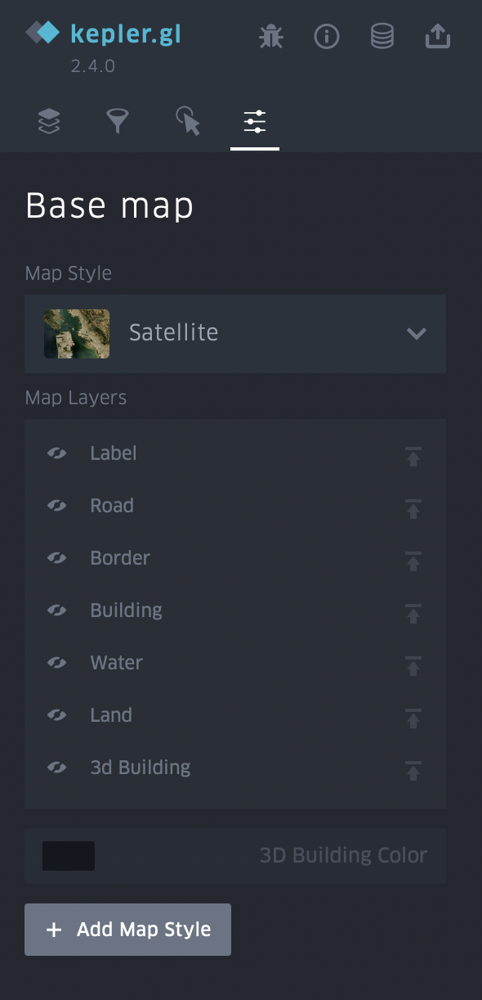

How to view results using Kepler.gl
====================================

**Kepler.gl** is an open source web tool developed by Uber. It is a simple yet powerful tool for displaying and exploring geodatasets.

That to view the data of the processing result, select the required processing and press the button *"Open in kepler.gl"*.

You can also change the visual display of data, set filters, and choose a map style.

Layers tab
^^^^^^^^^^

Click on the layer name to bring up the *Layer settings* from the drop-down menu. To hide all data, click on the eye icon.

.. figure:: _static/kepler/view_layer_settings.png
    :alt: View layer settings
    :align: center
    :width: 15cm

These settings allow you to choose a more suitable type of received data:

* *Fill color.* You can choose any color from the palette for polygons, and also hide the display of data by changing the position of the slider. You can change the transparency of polygons (property *Opacity*) in the additional settings of this function.
* *Stroke color.* You can choose any color from the palette for outlining polygons, as well as completely remove the stroke. You can change the transparency of the stroke (property *Opacity*) In the additional settings of this function.
* *Stroke width.* Controls the thickness of the stroke.
* *Height.* Allows you to view data with heights in 3D format. Set the desired coefficient and select the attribute of the layer with heights.

.. figure:: _static/kepler/3D_buildings.png
    :alt: 3D buildings
    :align: center
    :width: 15cm

Filters tab
^^^^^^^^^^^^

This tab allows you to add a filter of interest by a specific attribute of the layer (as in this case, the filter is set by classes with different typology of buildings).

.. figure:: _static/kepler/filter_panel.png
    :alt: Filter panel
    :align: center
    :width: 15cm

Interaction tab
^^^^^^^^^^^^^^^

You can select or remove attributes that will be visible in the menu that appears when you hover over an object. It is also possible to turn on the panel indicating longitude and latitude.

.. figure:: _static/kepler/interaction_panel.png
    :alt: Interaction panel
    :align: center
    :width: 15cm

Base map tab
^^^^^^^^^^^^

Here you can choose the styles of the map, as well as choose to display its various layers.

