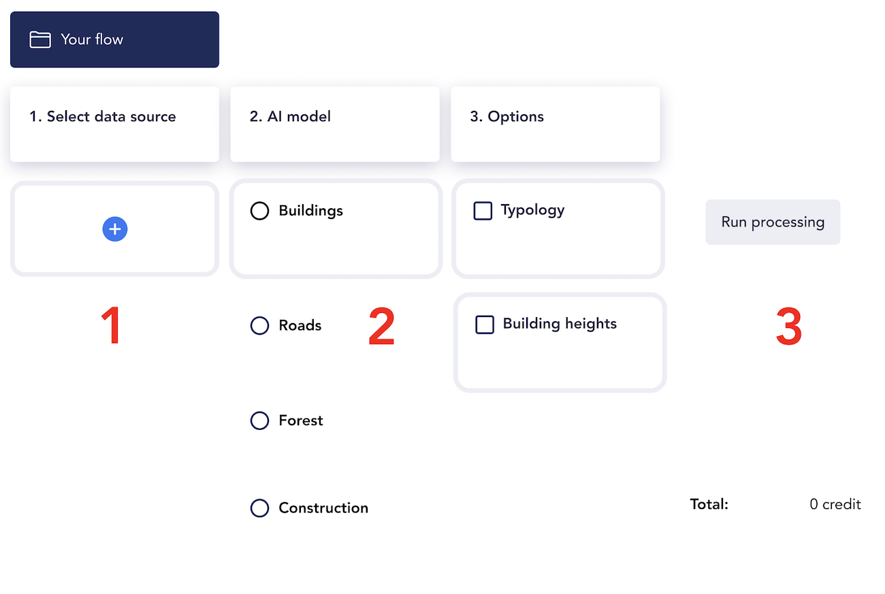
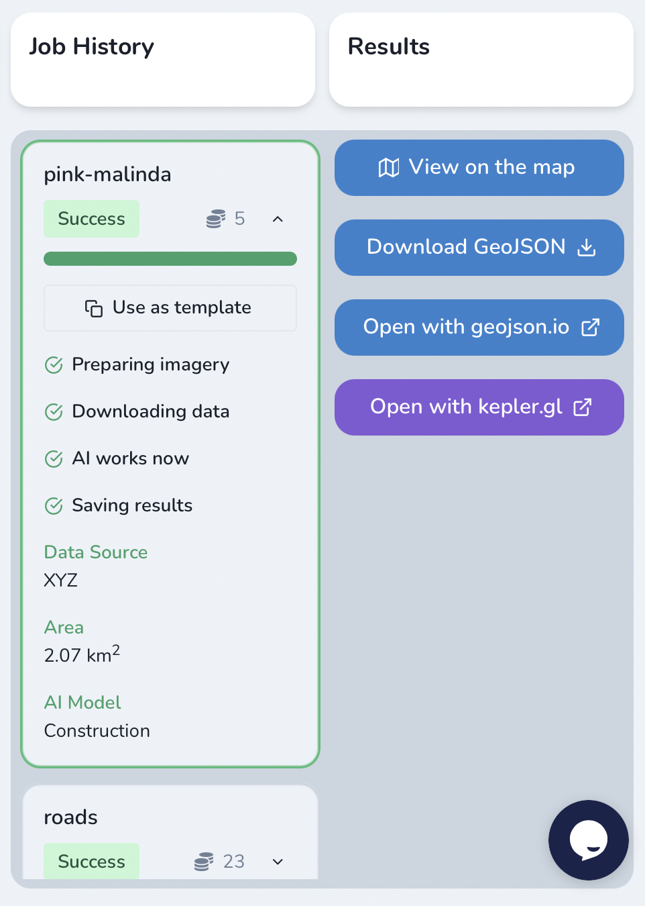
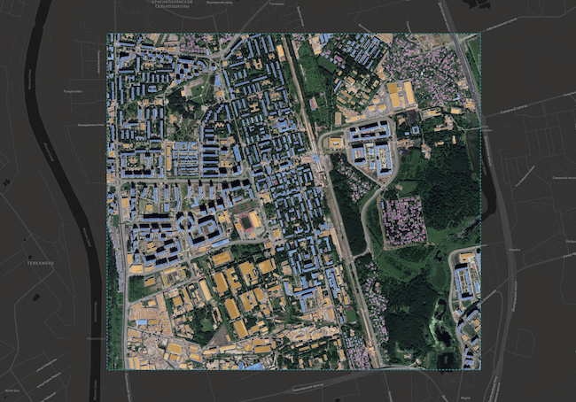

Mapflow Web UI
================

Go to `Mapflow <https://app.mapflow.ai>`_ and register or login using your Google account.
Mapflow processes imagery and extracts vector objects from it. So as a user, you start processings, or as we call it, **flows**. 

How to run your flow
---------------------

Mapflow is designed to be intuitive. Here is our step-by-step user guide: 

1. Data source

 To specify your area of interest (AOI), you can either upload your own `GeoJSON <https://geojson.org>`_ file, or draw the area directly on the map ("Draw rectangle").
 
  .. figure:: _static/ui_map_select_source.png
    :alt: UI Mapflow – define AOI
    :align: center
    :width: 15cm
    
 .. attention:: 
   Be aware that for now, only a single area can be drawn or uploaded per flow. If your GeoJSON file has multiple areas within its FeatureCollection, only the first one will be used. If you want to process multiple AOIs, you can split them into separate GeoJSON files and start a flow for each one separately. Batch processing may become available in the future releases. Other spatial data formats may also become available for upload in the future, although we recommend using GeoJSON since it is a de-facto standard in web mapping. It is natively supported by web mapping frameworks  (e.g. `Leaflet <https://leafletjs.com/>`_ or `Mapbox <https://docs.mapbox.com/mapbox.js/>`_) and GIS like `QGIS <https://qgis.org/>`_ or the ArcGIS Suite.
 
 .. important:: 
   As to the source data, currently we only support RGB imagery. By default, Mapflow uses `Mapbox Satellite <https://mapbox.com/maps/satellite>`_ imagery. Currently, this is the only available source when using the web app. If you would like to upload your own GeoTIFF or choose another satellite imagery mosaic as a service, you can use :doc:`../docs_api/processing_api`. 

2. AI model

 Select one of the AI models (:doc:`See Model description <pipelines>`).

3. Options

 Select the additional options available for the model (e.g. "Typology" and "Heights" for the "Buildings" model).

 .. important:: 
   The **Building heights** option requires a minumum area of 50 sq.km.
 
4. Run the flow

 .. attention::
   Once you have selected the model and the processing parameters, you will see the total cost of your flow counted in Mapflow credits (our local currency units). Upon registration, you receive 500 credits for free for testing the platform (:doc:`See the tariff plan <prices>`).

Working with results
---------------------

The flow's results are saved in the "Job history" panel.
When this panel is opened, the status is displayed, and the previously selected processing parameters are highlighted in the main window.

Once the flow has finished, you can view the results on an interactive map or download it as vector geodata (GeoJSON).

 ..important:: Click "use as template" on an existing flow to use its parameters as a starting point for a new flow (on restart with the same parameters, a new processing is started).

Options for viewing the processing results are:

1. Download as GeoJSON.

2. "Open with geojson.io" - view the results in the browser using `geojson.io <http://geojson.io/#data=data:application/json,%7B%22type%22%3A%20%22Polygon%22%2C%20%22coordinates%22%3A%20%5B%20%5B%20%5B%2037.490057513654946%2C%2055.923029653520395%20%5D%2C%20%5B%2037.490057513654946%2C%2055.949815087874605%20%5D%2C%20%5B%2037.543082024840288%2C%2055.949815087874605%20%5D%2C%20%5B%2037.543082024840288%2C%2055.923029653520395%20%5D%2C%20%5B%2037.490057513654946%2C%2055.923029653520395%20%5D%20%5D%20%5D%7D>`_.

 .. note::
  `geosjon.io <http://geojson.io/#data=data:application/json,%7B%22type%22%3A%20%22Polygon%22%2C%20%22coordinates%22%3A%20%5B%20%5B%20%5B%2037.490057513654946%2C%2055.923029653520395%20%5D%2C%20%5B%2037.490057513654946%2C%2055.949815087874605%20%5D%2C%20%5B%2037.543082024840288%2C%2055.949815087874605%20%5D%2C%20%5B%2037.543082024840288%2C%2055.923029653520395%20%5D%2C%20%5B%2037.490057513654946%2C%2055.923029653520395%20%5D%20%5D%20%5D%7D>`_ also allows you to save the results in a different format (CSV, KML, TopoJSON, WKT, Shapefile). Just click "Save" and select the format of your preference in the menu bar.

 .. figure:: _static/geojson.io.png
   :name: Preview map
   :align: center
   :width: 15cm

3. "View on the map" - use our custom viewer, which displays the results on top of the source satellite images.

4. "Open with kepler.gl" - view the results using an open-source web tool made by Uber. It is a simple but powerful tool for data scientists to explore and analyse geospatial data.

.. figure:: _static/kepler_gl.png
   :alt: Preview map
   :align: center
   :width: 15cm

Working with API
^^^^^^^^^^^^^^^^

Mapflow platform provides a REST API which, for example, allows you to query for currently running flows and fetch the results.
If you are developing application and want to use our API, - check out :doc:`../docs_api/processing_api`.

