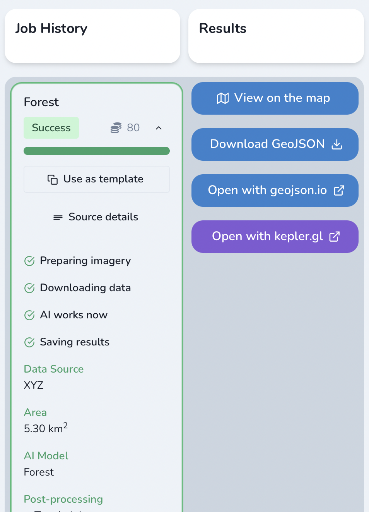

Getting started
=====================

We are happy that you are interested in Earth Observation Data analysis and Mapping - so you want to use it in your applications.

The Earth Observation & Mapping is powered by three main components:

* EO data access (e.g. satellite or aerial imagery service)
* EO data processing and analysis –  here comes `Mapflow <https://mapflow.ai>`_ |:boom:|
* GIS – check results and put them into you application

Mapflow is powered by the engine that enables and operates data processing pipelines (we call "flows").
Using Mapflow you run your flows through all of available Earth Observation & Mapping components - as simple as that.

If you have any questions or suggestions about the process, reach us on `telegram <https://t.me/geoalert>`_ or via `email <mailto:hello@geoalert.io>`_.

Mapping models
--------------

Mapflow enables to detect and extract features in satellite and aerial images powered by semantic segmentation and other deep learning techniques. 
It is connected to global data sources including commercial satellites however supports uploading your own georeferenced images.
Find your way to use Mapflow looking at the basic use case scenarios:

|:house:| **Buildings** 
Extracting of roofprints of buildings from imagery of high resolution

Additional options:

* **Classification by types of buildings** – typology of buildings is represented by the main classes (see `reference <https://mapflow.ai>`_)

* **Building heights**
Building height estimation by the length of the shadow and the visible part of the wall. Requires additional input data according to satellite imagery metadata
Shift to the building footprint

|:christmas_tree:| **Forest** 
Extracting the forest masks from RGB images of high resolution (2 meters) without classification by type, density and heights

Additional options:

* **Classification by heights** – classification the areas of vegetation and shrub vegetation by height classes according to the specified thresholds: by default 0-4 m, 4-10 m, 10+ m. Forest areas of each height class are polygonized in separate features, the height class is indicated in its properties

* **Classification by overgrowth density** – classification of the area of vegetations and shrub vegetation into classes according to the density and height: high forest, low (growing) forest, open woodland, shrub.

|:red_car:| **Roads** 
Extracting the road mask from satellite images of high spatial resolution

Additional options:

* Classification by road pavement
* Transfomation into graph

|:building_construction:| **Construction** 
Detection of the construction sites by classification of tiles of hi-resolution satellite images

Mapflow UI
-----------

How to run your flow
^^^^^^^^^^^^^^^^^^^^

Let's look at each step you need to proceed to define your data processing flow: 

.. figure:: _static/ui_flow_basic.png
   :name: UI Mapflow – run flow
   :align: center
   :width: 15cm

1. Select data source - at this step you define the geographic area and the satellite/aerial image you want to extract features from

 .. IMPORTANT:: 
  * Currently the only one source by default is selected (**Mapbox Satellite**) using Mapflow Web App. See **API DOC** if you want to define your own input data source or upload GeoTIFF image
  * To define area on the map, you either draw a rectangle or drop your polygon coordinates in GeoJSON file

.. figure:: _static/ui_map_select_source.png
   :name: UI Mapflow – define AOI
   :align: center
   :width: 20cm

2. Select one of Mapping Models

3. Select the additional options available for the Model (e.g. "Typology" and "Heights" for the "Building" model)

 .. IMPORTANT::
    Building Heights option is limited by the minumum area of the processing (~70 sq.km)

 .. CAUTION::
    After you choose the Mapping model and the processing params – you will see the total score of your processing cost

4. Run the processing and take a break |:coffee:||:slight_smile:|

Working with results
^^^^^^^^^^^^^^^^^^^^

The main stages of the processing are displayed and all your results are saved in the "Jobs History".

After you're done with the processing you can preview generated features in interactive map or download them in vector (GeoJSON).

#. An interactive map (View on the map) shows you the features mask placed over the input image. This's the fastest way to preview the output results.

.. figure:: _static/preview_map.png
   :name: Preview map
   :align: center
   :width: 20cm

#. Download and check **GeoJSON** - a geodata format that's natively supported by Web-Map tools like **Leaflet** (https://leafletjs.com/) or GIS apps like **QGIS** (https://qgis.org/).

  .. code:: json

        {
          "type": "FeatureCollection",
          "features": [
            {
              "type": "Feature",
              "properties": {
                "in_zkh": false,
                "processing_date": "2020-11-17",
                "id": 256899,
                "class_id": "103"
              },
              "geometry": {
                "type": "Polygon",
                "coordinates": [
                  [
                    [
                      37.51397341489792,
                      55.92332193129306
                    ],
                    [
                      37.51390904188156,
                      55.923422621896684
                    ],
                    [
                      37.513286769390106,
                      55.92329337719366
                    ],
                    [
                      37.51338869333267,
                      55.92313557784403
                    ],
                    [
                      37.51380711793899,
                      55.92323025753092
                    ],
                    [
                      37.51397341489792,
                      55.92332193129306
                    ]
                  ]
                ]
              }
            }
          ]
        }

Here you will see coordinates and additional properties of the object that typicaly refer to the attributes in GIS terminology. 
You are able to analyse it, modify, publish and do what you want.

#. This option allows to open the GeoJSON in external viewer, you get the direct link from Mapflow - `geosjon.io <http://geojson.io/#id=gist:Godnik/ee1894445fbcb1e0ecb8833377c136ed&map=14/55.9366/37.5167>`_ 

This is another way to preview results and save them in preferable formats (CSV, KML, GeoJSON, TopoJSON, WKT, Shapefile). Pretty cool! |:slight_smile:|

.. figure:: _static/geojson.io.png
   :name: Preview map
   :align: center
   :width: 20cm

Working with API
^^^^^^^^^^^^^^^^

Mapflow platform provides Rest API to query for running processings and getting results.
If you are developing application and want to use API - check :doc:`../docs_api/processing_api`

