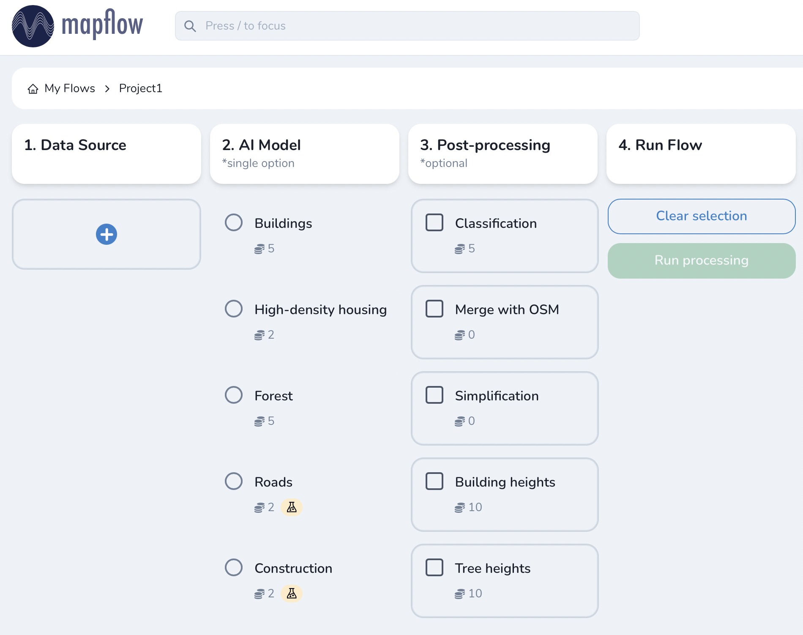

Mapflow Web UI
================

Go to `Mapflow <https://app.mapflow.ai>`_ and register or login using your Google account.
Mapflow processes imagery and extracts vector objects from it. So as a user, you start processings, or as we call it, **flows**. 

How to run your mapping flow
----------------------------

Mapflow is designed to be intuitive. Here is our step-by-step user guide: 

1. Data source

  1.1. Select raster source

    -Default

    Mapflow uses `Mapbox Satellite <https://mapbox.com/maps/satellite>`_ imagery by default. To specify your area of interest (AOI), you can either upload your own `GeoJSON <https://geojson.org>`_ file, or draw the area directly on the map ("Draw rectangle").
 
    -URL

    You can use the satellite imagery data source that you need, specify its URL on this tab.  Besides select XYZ or TMS presentation formats by changing the position of the *Y origin top* slider. The choice of the required projection and zoom is also available. (What image zoom is required for high-quality processing in Mapflow can be seen on the page: doc: `Description of models <pipelines>`_).

  .. figure:: _static/select_raster_source.png
    :alt: UI Mapflow – select source
    :align: center
    :width: 7cm
    

  1.2. Specify area of interest

  This tab displays the type of data source, as well as buttons:

  - replce selected source;
  - toggle source layer visibility;
  - change source layer opacity;

  .. figure:: _static/ui_map_select_source.png
    :alt: UI Mapflow – select source
    :align: center
    :width: 15cm

 .. attention:: 
   Be aware that for now, only a single area can be drawn or uploaded per flow. If your GeoJSON file has multiple areas within its FeatureCollection, only the first one will be used. If you want to process multiple AOIs, you can split them into separate GeoJSON files and start a flow for each one separately. Batch processing may become available in the future releases. Other spatial data formats may also become available for upload in the future, although we recommend using GeoJSON since it is a de-facto standard in web mapping. It is natively supported by web mapping frameworks  (e.g. `Leaflet <https://leafletjs.com/>`_ or `Mapbox <https://docs.mapbox.com/mapbox.js/>`_) and GIS like `QGIS <https://qgis.org/>`_ or the ArcGIS Suite.
 
 .. important:: 
   As to the source data, currently we only support RGB imagery. If you would like to upload your own GeoTIFF you can use `Geoalert API <https://ru.docs.mapflow.ai/docs_api/processing_api.html>`_ or our `Mpflow plugin <https://ru.docs.mapflow.ai/docs_api/qgis_mapflow.html>`_ for QGIS . 

2. AI model

 Select one of the AI models (:doc:`See Model description <pipelines>`).

3. Post-processing

 In this step, you can select additional processing options. Different AI models have their own options.

 AI model "Buildings":

 * *Classification* - we currently recognize the following building types: apartment buildings, single-household dwellings, industrial, commercial, other non-reidential (see `Urban Mapping classes <https://docs.mapflow.ai/docs_um/classes.html>`_).
 * *Merge with OSM* - compare the results with the buildings in OpenStreetMap and, if a sufficient overlap has been found, use the ones from the OSM instead.
 * *Simplification* - simplification and polygonization of building contours.
 * *Building heights* - for each building, we estimate its height using its wall's and shadow's length. If this option is selected, all roof contours will be shifted in accordance with their height, i.e. converted to footprints.
 
 .. important:: 
   **Building heights** option requires a minumum area of 50 sq.km.
 
 AI model "Forest":

 * *Tree heights* - classify vegetation by height: 0-4 m for shrub ("low vegetation"), 4-10 m for regular forest ("medium forest"), 10+ m for area with tall trees ("high forest"). Clasification is dones per vegetated area, and not per single tree (see `Forest Mapping classes <https://docs.mapflow.ai/docs_forest/classes.html>`_).

4. Run the flow

 .. attention::
   Once you have selected the model and the processing parameters, you will see the total cost of your flow counted in Mapflow credits (our local currency units). Upon registration, you receive 500 credits for free for testing the platform (:doc:`See the tariff plan <prices>`).

Working with results
---------------------

The flow's results are saved in the "Job history" panel.
When this panel is opened, the status is displayed, and the previously selected processing parameters are highlighted in the main window.

.. figure:: _static/preview_button.png
   :alt: Preview results
   :align: center
   :width: 7cm

Once the flow has finished, you can view the results on an interactive map or download it as vector geodata (GeoJSON).

 .. important:: 
  Click "use as template" on an existing flow to use its parameters as a starting point for a new flow (on restart with the same parameters, a new processing is started).

Options for viewing the processing results are:

1. Download as GeoJSON.

2. "Open with geojson.io" - view the results in the browser using `geojson.io <http://geojson.io/#data=data:application/json,%7B%22type%22%3A%20%22Polygon%22%2C%20%22coordinates%22%3A%20%5B%20%5B%20%5B%2037.490057513654946%2C%2055.923029653520395%20%5D%2C%20%5B%2037.490057513654946%2C%2055.949815087874605%20%5D%2C%20%5B%2037.543082024840288%2C%2055.949815087874605%20%5D%2C%20%5B%2037.543082024840288%2C%2055.923029653520395%20%5D%2C%20%5B%2037.490057513654946%2C%2055.923029653520395%20%5D%20%5D%20%5D%7D>`_.

 .. note::
  `geosjon.io <http://geojson.io/#data=data:application/json,%7B%22type%22%3A%20%22Polygon%22%2C%20%22coordinates%22%3A%20%5B%20%5B%20%5B%2037.490057513654946%2C%2055.923029653520395%20%5D%2C%20%5B%2037.490057513654946%2C%2055.949815087874605%20%5D%2C%20%5B%2037.543082024840288%2C%2055.949815087874605%20%5D%2C%20%5B%2037.543082024840288%2C%2055.923029653520395%20%5D%2C%20%5B%2037.490057513654946%2C%2055.923029653520395%20%5D%20%5D%20%5D%7D>`_ also allows you to save the results in a different format (CSV, KML, TopoJSON, WKT, Shapefile). Just click "Save" and select the format of your preference in the menu bar.

 .. figure:: _static/geojson.io.png
   :name: Preview map
   :align: center
   :width: 15cm

3. "View on the map" - use our custom viewer, which displays the results on top of the source satellite images.

 .. figure:: _static/preview_map.png
   :alt: Preview map
   :align: center
   :width: 15cm

4. "Open with `kepler.gl <https://kepler.geoalert.io/>`_" - view the results using an open-source web tool made by Uber. It is a simple but powerful tool for data scientists to explore and analyse geospatial data.

 .. figure:: _static/kepler_gl.png
   :alt: Preview map
   :align: center
   :width: 15cm

 .. note::
   You can find detailed information about kepler.gl in the `user manual <https://docs.kepler.gl/docs/user-guides/j-get-started>`_.

Working with API
^^^^^^^^^^^^^^^^

Mapflow provides a REST API which, for example, allows you to query for currently running flows and fetch the results.
If you are developing application and want to use our API, - check out :doc:`../docs_api/processing_api`.

