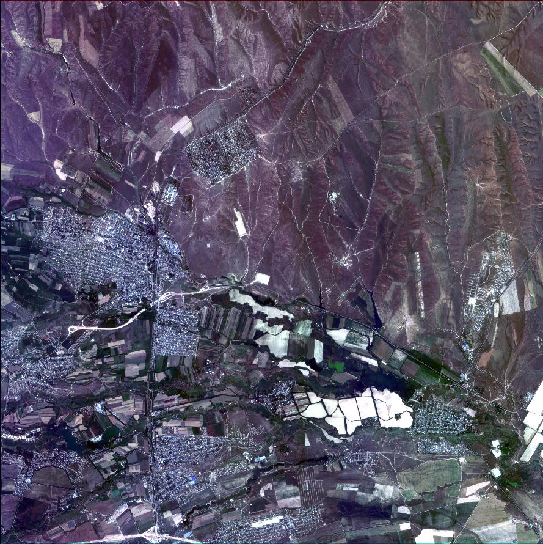

.. _api-reference:

API Reference
=============

Projects
--------

Create project
^^^^^^^^^^^^^^

**POST** ``/projects``

Creates a new project container for organizing processings.

.. list-table::
   :header-rows: 1
   :widths: 20 15 15 50

   * - Parameter
     - Type
     - Required
     - Description
   * - ``name``
     - string
     - Yes
     - Project name
   * - ``description``
     - string
     - No
     - Project description

**Example Request**

.. code-block:: json

   {
     "name": "Urban Analysis 2026",
     "description": "Building footprints for city planning"
   }

**Example Response**

.. code-block:: json

   {
     "id": "546d148f-19a1-40d8-8f16-d1e6dabfd204",
     "name": "Urban Analysis 2026",
     "description": "Building footprints for city planning"
   }

Update project
^^^^^^^^^^^^^^

**PUT** ``/projects/{projectId}``

Updates project name and/or description.

.. list-table::
   :header-rows: 1
   :widths: 20 15 15 50

   * - Parameter
     - Type
     - Required
     - Description
   * - ``projectId``
     - string
     - Yes
     - Project UUID (path parameter)
   * - ``name``
     - string
     - No
     - New project name
   * - ``description``
     - string
     - No
     - New project description

**Example Request**

.. code-block:: json

   {
     "name": "Urban Analysis 2026 - Updated",
     "description": "Building and road detection"
   }

Processings
-----------

.. note::
   **v2 API is recommended.** It uses structured ``sourceParams`` and ``inferenceParams``. v1 uses a flat ``params`` map and is maintained for backward compatibility.

Create processing (v2)
^^^^^^^^^^^^^^^^^^^^^^

**POST** ``/processings/v2``

Creates and runs an imagery analysis processing.

.. list-table::
   :header-rows: 1
   :widths: 20 15 15 50

   * - Parameter
     - Type
     - Required
     - Description
   * - ``name``
     - string
     - Yes
     - Processing name
   * - ``projectId``
     - string
     - Yes
     - Project UUID
   * - ``wdId`` or ``wdName``
     - string
     - Yes
     - Workflow definition ID or name (e.g., "🏠 Buildings")
   * - ``geometry``
     - GeoJSON
     - Yes
     - Area of interest (Polygon or MultiPolygon)
   * - ``params.sourceParams``
     - object
     - Yes
     - Imagery source configuration (see :ref:`source-params`)
   * - ``params.inferenceParams``
     - object
     - No
     - Model-specific parameters
   * - ``blocks``
     - array
     - No
     - Enable/disable workflow steps (see :ref:`workflow-blocks`)
   * - ``description``
     - string
     - No
     - Processing description
   * - ``meta``
     - object
     - No
     - Custom metadata

**Example Request: Using Mapbox**

.. code-block:: json

   {
     "name": "Downtown Buildings",
     "projectId": "546d148f-19a1-40d8-8f16-d1e6dabfd204",
     "wdName": "🏠 Buildings",
     "geometry": {
       "type": "Polygon",
       "coordinates": [[[37.615, 55.755], [37.625, 55.755],
                        [37.625, 55.760], [37.615, 55.760],
                        [37.615, 55.755]]]
     },
     "params": {
       "sourceParams": {
         "dataProvider": {
           "providerName": "Mapbox",
           "zoom": 18
         }
       }
     }
   }

**Example Request: Using Custom Imagery**

.. code-block:: json

   {
     "name": "Aerial Survey 2026",
     "projectId": "546d148f-19a1-40d8-8f16-d1e6dabfd204",
     "wdName": "🏠 Buildings",
     "geometry": {"type": "Polygon", "coordinates": [...]},
     "params": {
       "sourceParams": {
         "myImagery": {
           "imageIds": ["0c26a0d3-96d8-4ed5-aa62-3843d1d7905c"]
         }
       }
     }
   }

**Example Response**

.. code-block:: json

   {
     "id": "3fa85f64-5717-4562-b3fc-2c963f66afa6",
     "name": "Downtown Buildings",
     "status": "IN_PROGRESS",
     "percentCompleted": 0,
     "cost": 150,
     "created": "2026-02-10T10:30:00Z"
   }

Get processing (v2)
^^^^^^^^^^^^^^^^^^^

**GET** ``/processings/{processingId}/v2``

Retrieves processing status and details.

.. list-table::
   :header-rows: 1
   :widths: 20 15 15 50

   * - Parameter
     - Type
     - Required
     - Description
   * - ``processingId``
     - string
     - Yes
     - Processing UUID (path parameter)

**Example Response**

.. code-block:: json

   {
     "id": "3fa85f64-5717-4562-b3fc-2c963f66afa6",
     "name": "Downtown Buildings",
     "status": "OK",
     "percentCompleted": 100,
     "area": 1200000,
     "cost": 150,
     "vectorLayer": {
       "id": "layer-uuid",
       "tileUrl": "https://app.mapflow.ai/api/layers/{z}/{x}/{y}.pbf"
     },
     "created": "2026-02-10T10:30:00Z",
     "updated": "2026-02-10T10:45:00Z"
   }

**Status values:** ``UNPROCESSED``, ``IN_PROGRESS``, ``AWAITING``, ``OK``, ``FAILED``, ``CANCELLED``

List processings (v2)
^^^^^^^^^^^^^^^^^^^^^

**GET** ``/processings/v2``

Lists all user processings.

**Example Response**

.. code-block:: json

   [
     {
       "id": "uuid-1",
       "name": "Processing 1",
       "projectId": "project-uuid",
       "status": "OK",
       "percentCompleted": 100
     },
     {
       "id": "uuid-2",
       "name": "Processing 2",
       "status": "IN_PROGRESS",
       "percentCompleted": 45
     }
   ]

List processings by project (v2)
^^^^^^^^^^^^^^^^^^^^^^^^^^^^^^^^^

**GET** ``/projects/{projectId}/processings/v2``

Lists processings for a specific project.

Calculate cost (v2)
^^^^^^^^^^^^^^^^^^^

**POST** ``/processing/cost/v2``

Estimates processing cost before running.

.. list-table::
   :header-rows: 1
   :widths: 20 15 15 50

   * - Parameter
     - Type
     - Required
     - Description
   * - ``wdId``
     - string
     - Yes
     - Workflow definition ID
   * - ``geometry``
     - GeoJSON
     - No*
     - Area of interest
   * - ``areaSqKm``
     - number
     - No*
     - Area in km² (alternative to geometry)
   * - ``params``
     - object
     - No
     - Source and inference parameters
   * - ``blocks``
     - array
     - No
     - Enabled workflow blocks

.. note::
   *Provide either ``geometry`` or ``areaSqKm`` (or both).

**Example Request**

.. code-block:: json

   {
     "wdId": "8cb13006-a299-4df6-b47d-91bd63de947f",
     "areaSqKm": 1.5,
     "params": {
       "sourceParams": {
         "dataProvider": {"providerName": "Mapbox"}
       }
     }
   }

**Example Response**

.. code-block:: json

   150

Download results
^^^^^^^^^^^^^^^^

**GET** ``/processings/{processingId}/result``

Downloads processing results as GeoJSON.

**Query Parameters:**

* ``aoiId`` (optional) — Filter results to specific AOI

**Example**

.. code-block:: bash

   curl https://api.mapflow.ai/rest/processings/{id}/result \
     -H "Authorization: Bearer YOUR_TOKEN" \
     -o results.geojson

Processing management
^^^^^^^^^^^^^^^^^^^^^

**Restart processing**

``POST /processings/{processingId}/restart``

Restarts failed partitions only.

**Update processing**

``PUT /processings/{processingId}``

.. code-block:: json

   {
     "name": "New name",
     "description": "Updated description",
     "projectId": "new-project-uuid"
   }

**Delete processing**

``DELETE /processings/{processingId}``

Deletes processing and all child entities.

User & Account
--------------

Get user status
^^^^^^^^^^^^^^^

**GET** ``/user/status``

Returns account details, available models, and workflow definitions.

**Example Response**

.. code-block:: json

   {
     "user": {
       "id": "user-uuid",
       "email": "user@example.com",
       "credits": 5000
     },
     "models": [
       {
         "id": "model-uuid",
         "name": "🏠 Buildings",
         "pricePerSqKm": 15.0,
         "blocks": [...]
       }
     ]
   }

Processing history
^^^^^^^^^^^^^^^^^^

**POST** ``/processings/stats``

Returns processing history with pagination and filtering.

**Query Parameters:**

* ``type`` (optional) — Response format: ``JSON`` or ``CSV``

**Request Body:**

.. list-table::
   :header-rows: 1
   :widths: 20 15 65

   * - Parameter
     - Type
     - Description
   * - ``page``
     - integer
     - Page number
   * - ``perPage``
     - integer
     - Items per page
   * - ``sort``
     - string
     - Sort expression (e.g., ``"created:desc"``)
   * - ``filter``
     - string
     - Filter expression (e.g., ``"status=OK"``)

**Example Request**

.. code-block:: json

   {
     "page": 1,
     "perPage": 50,
     "sort": "created:desc",
     "filter": "status=OK"
   }

.. _source-params:

Data Sources
------------

The ``sourceParams`` object specifies where to get imagery. Choose one option:

Default Data Provider
^^^^^^^^^^^^^^^^^^^^^

Use built-in providers like Mapbox, ArcGIS.

.. code-block:: json

   {
     "sourceParams": {
       "dataProvider": {
         "providerName": "Mapbox",
         "zoom": 18
       }
     }
   }

.. list-table::
   :header-rows: 1
   :widths: 25 75

   * - Field
     - Description
   * - ``providerName``
     - Provider name: ``Mapbox``, ``arcgis_world_imagery``, etc.
   * - ``zoom``
     - Zoom level (typically 17-19 for 0.5m resolution)

My Imagery
^^^^^^^^^^

Use imagery uploaded via :ref:`Data API`.

**Single image:**

.. code-block:: json

   {
     "sourceParams": {
       "myImagery": {
         "imageIds": ["image-uuid"]
       }
     }
   }

**Mosaic (multiple images):**

.. code-block:: json

   {
     "sourceParams": {
       "myImagery": {
         "imageIds": ["img1-uuid", "img2-uuid"],
         "mosaicId": "mosaic-uuid"
       }
     }
   }

Imagery Search
^^^^^^^^^^^^^^

Search and use imagery from commercial providers.

.. code-block:: json

   {
     "sourceParams": {
       "imagerySearch": {
         "dataProvider": "maxar",
         "imageIds": ["image-uuid"],
         "zoom": 18
       }
     }
   }

Custom URL
^^^^^^^^^^

Use your own XYZ/TMS/WMS tile service.

.. code-block:: json

   {
     "sourceParams": {
       "userDefined": {
         "sourceType": "XYZ",
         "url": "https://tiles.example.com/{z}/{x}/{y}.png",
         "zoom": 18,
         "crs": "EPSG:3857",
         "rasterLogin": "username",
         "rasterPassword": "password"
       }
     }
   }

.. list-table::
   :header-rows: 1
   :widths: 25 15 60

   * - Field
     - Type
     - Description
   * - ``sourceType``
     - string
     - ``XYZ``, ``TMS``, ``QUADKEY``, ``SENTINEL_L2A``, ``LOCAL``
   * - ``url``
     - string
     - Tile URL template
   * - ``zoom``
     - integer
     - Zoom level
   * - ``crs``
     - string
     - Coordinate reference system (e.g., ``EPSG:3857``)
   * - ``rasterLogin``
     - string
     - Optional authentication username
   * - ``rasterPassword``
     - string
     - Optional authentication password

.. _upload-images:

Uploading Custom Imagery
^^^^^^^^^^^^^^^^^^^^^^^^

1. Use :ref:`Data API` to create a mosaic and upload images
2. Reference uploaded images in ``sourceParams.myImagery.imageIds``

.. code-block:: json

   {
     "params": {
       "sourceParams": {
         "myImagery": {
           "imageIds": ["uploaded-image-uuid"]
         }
       }
     }
   }

.. _data-api-reference:

Data API
--------

Mosaics
^^^^^^^

A **mosaic** is a collection of georeferenced images organized for processing and preview. Mosaics help when working with multiple aerial images covering an area or batching large orthomaps for optimized cloud storage.

Create Mosaic
^^^^^^^^^^^^^

``POST /rasters/mosaic``

Creates an empty mosaic collection.

**Request Body**

.. list-table::
   :widths: 20 15 10 55
   :header-rows: 1

   * - Parameter
     - Type
     - Required
     - Description
   * - ``name``
     - string
     - Yes
     - Mosaic name
   * - ``tags``
     - array
     - No
     - Tags for organizing mosaics

**Example Request**

.. code-block:: bash

   curl -X POST https://api.mapflow.ai/rest/rasters/mosaic \
     -H "Authorization: Bearer YOUR_TOKEN" \
     -H "Content-Type: application/json" \
     -d '{
       "name": "Aerial Survey 2024",
       "tags": ["agriculture", "spring"]
     }'

**Response**

.. code-block:: json

   {
     "id": "6ee95ae6-f26e-41bd-8cb1-39bea545119f",
     "name": "Aerial Survey 2024",
     "tags": ["agriculture", "spring"],
     "created_at": "2024-03-15T10:30:00Z"
   }

Get Mosaic
^^^^^^^^^^

``GET /rasters/mosaic/{mosaic_id}``

Retrieves mosaic metadata by ID.

**Response**

.. code-block:: json

   {
     "id": "6ee95ae6-f26e-41bd-8cb1-39bea545119f",
     "name": "Aerial Survey 2024",
     "tags": ["agriculture", "spring"],
     "created_at": "2024-03-15T10:30:00Z",
     "image_count": 15
   }

Update Mosaic
^^^^^^^^^^^^^

``PUT /rasters/mosaic/{mosaic_id}``

Updates mosaic name and tags.

**Request Body**

.. list-table::
   :widths: 20 15 10 55
   :header-rows: 1

   * - Parameter
     - Type
     - Required
     - Description
   * - ``name``
     - string
     - No
     - New mosaic name
   * - ``tags``
     - array
     - No
     - New tag list (replaces existing)

**Example Request**

.. code-block:: bash

   curl -X PUT https://api.mapflow.ai/rest/rasters/mosaic/{mosaic_id} \
     -H "Authorization: Bearer YOUR_TOKEN" \
     -H "Content-Type: application/json" \
     -d '{
       "name": "Updated Survey Name",
       "tags": ["agriculture", "summer"]
     }'

Upload Images to Mosaic
^^^^^^^^^^^^^^^^^^^^^^^^

``POST /rasters/mosaic/{mosaic_id}/image``

Uploads georeferenced image files to an existing mosaic.

.. attention::
   All images in a mosaic must have:
   
   - Same coordinate reference system (CRS)
   - Same number of bands
   - Same spatial resolution

**Request**

- Content-Type: ``multipart/form-data``
- Body: ``file`` field with image file

**Example Request**

.. code-block:: bash

   curl -X POST https://api.mapflow.ai/rest/rasters/mosaic/{mosaic_id}/image \
     -H "Authorization: Bearer YOUR_TOKEN" \
     -H "Content-Type: multipart/form-data" \
     -F "file=@/path/to/orthophoto.tif"

**Response**

.. code-block:: json

   {
     "id": "6ae7f9e9-da2d-41e0-b16f-83396003af57",
     "mosaic_id": "6ee95ae6-f26e-41bd-8cb1-39bea545119f",
     "filename": "orthophoto.tif",
     "file_size": 68417439,
     "uploaded_at": "2024-03-15T10:35:00Z"
   }

Create Mosaic and Upload Image
^^^^^^^^^^^^^^^^^^^^^^^^^^^^^^^

``POST /rasters/mosaic/image?name={name}&tags={tag1}&tags={tag2}``

Creates a mosaic and uploads an image in a single request.

**Example Request**

.. code-block:: bash

   curl -X POST 'https://api.mapflow.ai/rest/rasters/mosaic/image?name=QuickSurvey&tags=test' \
     -H "Authorization: Bearer YOUR_TOKEN" \
     -H "Content-Type: multipart/form-data" \
     -F "file=@/path/to/image.tif"

Link External Image to Mosaic
^^^^^^^^^^^^^^^^^^^^^^^^^^^^^^

``POST /rasters/mosaic/{mosaic_id}/link-image``

Links an existing S3 image URL to a mosaic without uploading.

**Request Body**

.. list-table::
   :widths: 20 15 10 55
   :header-rows: 1

   * - Parameter
     - Type
     - Required
     - Description
   * - ``url``
     - string
     - Yes
     - S3 URL of the image file

**Example Request**

.. code-block:: bash

   curl -X POST https://api.mapflow.ai/rest/rasters/mosaic/{mosaic_id}/link-image \
     -H "Authorization: Bearer YOUR_TOKEN" \
     -H "Content-Type: application/json" \
     -d '{
       "url": "s3://bucket/path/image.tif"
     }'

**Response**

.. code-block:: json

   {
     "message": "File successfully linked to a mosaic",
     "mosaic_id": "6ee95ae6-f26e-41bd-8cb1-39bea545119f"
   }

Get Images in Mosaic
^^^^^^^^^^^^^^^^^^^^

``GET /rasters/mosaic/{mosaic_id}/image``

Lists all images in a mosaic with metadata.

**Response**

.. code-block:: json

   [
     {
       "id": "6ae7f9e9-da2d-41e0-b16f-83396003af57",
       "filename": "area-1101712.tif",
       "file_size": 68417439,
       "uploaded_at": "2024-03-15T10:35:00Z",
       "footprint": "POLYGON((1.9915 48.7643, ...))",
       "preview_url_s": "https://api.mapflow.ai/rest/rasters/image/{id}/preview/s",
       "preview_url_l": "https://api.mapflow.ai/rest/rasters/image/{id}/preview/l",
       "meta_data": {
         "crs": "EPSG:32631",
         "width": 5589,
         "height": 4079,
         "count": 3,
         "pixel_size": [0.3, 0.3]
       }
     }
   ]

Delete Mosaic
^^^^^^^^^^^^^

``DELETE /rasters/mosaic/{mosaic_id}``

Deletes a mosaic and all its linked images.

.. warning::
   This action is **irreversible**. All images linked to the mosaic will be permanently deleted.

**Example Request**

.. code-block:: bash

   curl -X DELETE https://api.mapflow.ai/rest/rasters/mosaic/{mosaic_id} \
     -H "Authorization: Bearer YOUR_TOKEN"

Images
^^^^^^

Manage individual image files and metadata.

Get Image Metadata
^^^^^^^^^^^^^^^^^^

``GET /rasters/image/{image_id}``

Retrieves detailed metadata for a specific image.

**Response**

.. code-block:: json

   {
     "id": "6ae7f9e9-da2d-41e0-b16f-83396003af57",
     "filename": "orthophoto.tif",
     "file_size": 68417439,
     "uploaded_at": "2024-03-15T10:35:00Z",
     "footprint": "POLYGON((...))",
     "meta_data": {
       "crs": "EPSG:32631",
       "width": 5589,
       "height": 4079,
       "count": 3,
       "dtypes": ["uint8", "uint8", "uint8"],
       "pixel_size": [0.3, 0.3]
     },
     "cog_link": "s3://bucket/path/cog/image.tif"
   }

Update Image Name
^^^^^^^^^^^^^^^^^

``PUT /rasters/image/{image_id}?name={new_name}``

Updates the display name of an image.

**Example Request**

.. code-block:: bash

   curl -X PUT 'https://api.mapflow.ai/rest/rasters/image/{image_id}?name=Updated%20Name' \
     -H "Authorization: Bearer YOUR_TOKEN"

Delete Image
^^^^^^^^^^^^

``DELETE /rasters/image/{image_id}``

Deletes an image from storage.

**Example Request**

.. code-block:: bash

   curl -X DELETE https://api.mapflow.ai/rest/rasters/image/{image_id} \
     -H "Authorization: Bearer YOUR_TOKEN"

Get Image Preview
^^^^^^^^^^^^^^^^^

``GET /rasters/image/{image_id}/preview/{size}``

Retrieves a preview thumbnail of the image.

**Path Parameters**

.. list-table::
   :widths: 20 80
   :header-rows: 1

   * - Size
     - Description
   * - ``s``
     - Small preview (256×256 pixels)
   * - ``l``
     - Large preview (1024×1024 pixels)

**Example Request**

.. code-block:: bash

   curl https://api.mapflow.ai/rest/rasters/image/{image_id}/preview/s \
     -H "Authorization: Bearer YOUR_TOKEN" \
     -o preview.jpg

**Response**

Returns JPEG image data.

.. image:: _static/data_api/response_preview_s.jpeg
   :alt: Image preview example
   :align: center
   :width: 256px

.. _storage-management:

Storage
^^^^^^^

Get Storage Usage
^^^^^^^^^^^^^^^^^

``GET /rasters/memory``

Returns current storage usage and limits for your account.

**Example Request**

.. code-block:: bash

   curl https://api.mapflow.ai/rest/rasters/memory \
     -H "Authorization: Bearer YOUR_TOKEN"

**Response**

.. code-block:: json

   {
     "used_bytes": 5368709120,
     "limit_bytes": 10737418240,
     "used_gb": 5.0,
     "limit_gb": 10.0,
     "usage_percent": 50.0
   }

.. _imagery-search:

Imagery Catalog
^^^^^^^^^^^^^^^

.. note::
   The Imagery Search API connects you to external satellite imagery providers. Search results depend on providers linked to your account. Contact support to add provider access.

Search Available Imagery
^^^^^^^^^^^^^^^^^^^^^^^^^

``POST /catalog/meta``

Searches satellite imagery from external providers by area and metadata filters.

**Request Body**

.. list-table::
   :widths: 25 15 10 50
   :header-rows: 1

   * - Parameter
     - Type
     - Required
     - Description
   * - ``aoi``
     - object
     - Yes
     - GeoJSON Polygon or MultiPolygon
   * - ``acquisitionDateFrom``
     - string
     - No
     - UTC datetime (ISO 8601)
   * - ``acquisitionDateTo``
     - string
     - No
     - UTC datetime (ISO 8601)
   * - ``minResolution``
     - float
     - No
     - Minimum resolution (meters/pixel)
   * - ``maxResolution``
     - float
     - No
     - Maximum resolution (meters/pixel)
   * - ``maxCloudCover``
     - float
     - No
     - Maximum cloud cover (0.0-1.0)
   * - ``minOffNadirAngle``
     - float
     - No
     - Minimum off-nadir angle (degrees)
   * - ``maxOffNadirAngle``
     - float
     - No
     - Maximum off-nadir angle (degrees)
   * - ``minAoiIntersectionPercent``
     - float
     - No
     - Minimum AOI overlap (0.0-1.0)
   * - ``limit``
     - integer
     - No
     - Max results (default: 100)
   * - ``offset``
     - integer
     - No
     - Pagination offset
   * - ``sortBy``
     - string
     - No
     - Sort field (e.g., ``ACQUISITION_DATE``)
   * - ``sortOrder``
     - string
     - No
     - ``ASC`` or ``DESC``
   * - ``hideUnavailable``
     - boolean
     - No
     - Exclude unavailable products
   * - ``dataProviders``
     - array
     - No
     - Filter by provider IDs
   * - ``productTypes``
     - array
     - No
     - Filter by product types

.. warning::
   Search area size is limited by your account's AOI limit.

**Example Request**

.. code-block:: bash

   curl -X POST https://api.mapflow.ai/rest/catalog/meta \
     -H "Authorization: Bearer YOUR_TOKEN" \
     -H "Content-Type: application/json" \
     -d '{
       "aoi": {
         "type": "Polygon",
         "coordinates": [[[76.6755,43.2234],[76.6755,43.4712],
                          [77.0163,43.4712],[77.0163,43.2234],
                          [76.6755,43.2234]]]
       },
       "acquisitionDateFrom": "2024-01-01T00:00:00Z",
       "acquisitionDateTo": "2024-03-01T00:00:00Z",
       "maxCloudCover": 0.1,
       "maxResolution": 0.5,
       "limit": 10,
       "sortBy": "ACQUISITION_DATE",
       "sortOrder": "DESC"
     }'

**Response – Scene Product**

.. code-block:: json

   [
     {
       "id": "JL1GF03A_PMS_20220607132729_200087596_103_0002_001_L1",
       "productType": "Scene",
       "acquisitionDate": "2022-06-07T13:27:33Z",
       "sensor": "JL1GF03A",
       "pixelResolution": 1.06,
       "cloudCover": 0.09,
       "offNadirAngle": -3.91,
       "colorBandOrder": "B,G,R,NIR,PAN",
       "providerName": "CG",
       "previewType": "png",
       "previewUrl": "https://example.com/preview.jpg",
       "footprint": {
         "type": "Polygon",
        "coordinates": [[[76.5009, 43.3412]]]
       }
     }
   ]

|

**Response – Mosaic Product**

.. code-block:: json

   [
     {
       "id": "JL1KF01A_PMS04_20220717131252_200093089_101_0005_001_L1",
       "productType": "Mosaic",
       "acquisitionDate": "2022-07-17T00:00:00Z",
       "sensor": "JL1KF01A",
       "pixelResolution": 0.0,
       "cloudCover": 0.0,
       "offNadirAngle": 3.0,
       "colorBandOrder": "RGB",
       "providerName": "CG_mosaic_2022",
       "previewType": "xyz",
       "previewUrl": "https://app.mapflow.ai/tiles/provider/{z}/{x}/{-y}.png",
       "footprint": {
         "type": "MultiPolygon",
        "coordinates": [[[[76.9037, 43.2529]]]]
       }
     }
   ]

Use Search Results in Processing
^^^^^^^^^^^^^^^^^^^^^^^^^^^^^^^^^

To run processing with imagery from search results, use the ``imagerySearch`` source parameter:

.. code-block:: json

   {
     "params": {
       "sourceParams": {
         "imagerySearch": {
           "dataProvider": "CG_mosaic_2022",
           "imageIds": ["JL1KF01A_PMS04_20220717131252_200093089_101_0005_001_L1"]
         }
       }
     }
   }

See :doc:`Processing API <processing_api>` for complete processing workflow.

Product Types
^^^^^^^^^^^^^

.. list-table::
   :widths: 20 80
   :header-rows: 1

   * - Type
     - Description
   * - **Scene**
     - Single satellite capture. Available for ordering by request. Contact support to order specific scenes.
   * - **Mosaic**
     - Pre-processed imagery mosaic. Available for instant processing if provider is linked to your account.

Preview Sizes
^^^^^^^^^^^^^

.. list-table::
   :widths: 20 80
   :header-rows: 1

   * - Size Code
     - Dimensions
   * - ``s``
     - 256×256 pixels
   * - ``l``
     - 1024×1024 pixels

.. _workflow-blocks:

Workflow Blocks
---------------

Customize processing by enabling/disabling optional workflow steps.

.. code-block:: json

   {
     "blocks": [
       {"name": "Simplification", "enabled": false},
       {"name": "Classification", "enabled": true}
     ]
   }

Available blocks vary by model. Retrieve options via ``GET /user/status``.

.. _Model requirements:

AI Models
---------

.. list-table::
   :header-rows: 1
   :widths: 20 30 15 15 20

   * - Model
     - Description
     - Resolution
     - Zoom
     - Optional Blocks
   * - 🏠 Buildings
     - Building footprints with classification
     - 0.5 m/px
     - 17-18
     - Simplification, Classification, OSM
   * - 🏠 Buildings (Aerial)
     - High-resolution aerial imagery (10 cm/px)
     - 0.1 m/px
     - 19-20
     - Simplification
   * - 🌲 Forest
     - Tree cover detection
     - 0.5 m/px
     - 17-18
     - Heights
   * - 🚗 Roads
     - Road network extraction
     - 0.5 m/px
     - 17-18
     - —
   * - 🏗️ Construction
     - Construction site detection
     - 0.5 m/px
     - 17-18
     - —

See :doc:`model descriptions <../userguides/pipelines>` for detailed requirements.

Status Codes
------------

.. list-table::
   :header-rows: 1
   :widths: 25 75

   * - Status
     - Description
   * - ``UNPROCESSED``
     - Processing created but not started
   * - ``IN_PROGRESS``
     - Processing is running
   * - ``AWAITING``
     - Awaiting imagery from provider
   * - ``OK``
     - Processing completed successfully
   * - ``FAILED``
     - Processing failed (check ``messages`` field)
   * - ``CANCELLED``
     - Processing was cancelled by user
   * - ``REFUNDED``
     - Credits refunded by administrator

Review Status
-------------

.. list-table::
   :header-rows: 1
   :widths: 25 75

   * - Review Status
     - Description
   * - ``ACCEPTED``
     - Results accepted
   * - ``NOT_ACCEPTED``
     - Results rejected
   * - ``REFUNDED``
     - Credits refunded
   * - ``IN_REVIEW``
     - Under review by team

Error Messages
--------------

For detailed error codes and troubleshooting, see :doc:`Error Messages <error_messages>`.

Common errors:

* ``source-validator.PixelSizeTooHigh`` — Imagery resolution too low (max 1.2 m/px)
* ``source-validator.NoDataInAOI`` — No imagery available for AOI
* ``geometry.Invalid`` — Invalid GeoJSON geometry

Best Practices
==============

1. **Check cost before running** — Use ``/processing/cost/v2`` to estimate credits
2. **Poll status efficiently** — Check status every 30-60 seconds for ``IN_PROGRESS`` processings
3. **Handle errors gracefully** — Check ``messages`` field in failed processings
4. **Use appropriate zoom levels** — Match zoom to model requirements (typically 17-18)
5. **Validate geometry** — Ensure GeoJSON is valid and not too large (< 100 km²)
6. **Organize with projects** — Group related processings in projects
7. **Store processing IDs** — Save IDs for later result retrieval

Support
=======

Rate Limits
-----------

* No strict rate limits currently
* Concurrent processings limited by account tier
* Contact support for high-volume use cases

Get Help
--------

* Email: help@geoalert.io
* Documentation: https://docs.mapflow.ai
* Web app: https://app.mapflow.ai