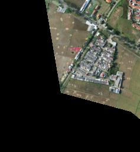

.. _data-api:

Mapflow Data API
================

.. note::
    .. figure:: _static/postman_logo.png
       :alt: Preview results
       :align: left
       :width: 1cm

   Check and run this `Postman collection for API <https://documenter.getpostman.com/view/5400715/2s935hS7ky>`_.

.. note::
    Data API allows to manage your imagery, organise it into collections (mosaics), reuse for processings with Mapflow and preview them as XYZ layers.
    👉 To use the imagery processing API see :doc:`this documentation <processing_api>`

.. note::
    What is "mosaic"? This is the collection of single images, aimed at instant preview and processing. It's helpful in such cases as mosaicing the number of single aerial images covering some area or batching the large ortho-plan for faster uploading and optimized storing it in the cloud.

.. attention::
    ⚠️ The uploaded images are required to have the same georeference system, number of bands, and spatial resolution.    

Authorization
--------------
The API uses the ``Basic Auth`` authorization method, for details about how it works, click :doc:`here <../userguides/mapflow_auth>`.

Manage Imagery Mosaics
----------------------

Create mosaic
'''''''''''''

``POST https://api.mapflow.ai/rest/rasters/mosaic`` 

.. code:: bash

    curl --location --request POST 'https://whitemaps-production.mapflow.ai/rest/rasters/mosaic' \
    --header 'Content-Type: application/json' \
    --header 'Authorization: Basic <Basic Auth>' \
    --data-raw '{
    "name": "mosaic-name",
    "tags": [
        "tag-1",
        "tag-2"
        ]
    }'

Creates the mosaic (the empty collection of images) and returns its ID. 

Update mosaic
''''''''''''''

.. code:: bash

    curl --location --request PUT 'https://whitemaps-production.mapflow.ai/rest/rasters/mosaic/{mosaic_id}' \
    --header 'Content-Type: application/json' \
    --header 'Authorization: Basic <Basic Auth>' \
    --data-raw '{
    "name": "new-mosaic-name",
    "tags": [
        "new-tag-1",
        "new-tag-2"
        ]
    }'

Upload images to the existing mosaic
''''''''''''''''''''''''''''''''''''''

``POST https://api.mapflow.ai/rest/rasters/{mosaic_id}/image`` 

Creates mosaic and uploads images to the mosaic.

.. code:: bash

    curl --location -g --request POST 'https://api.mapflow.ai/rest/rasters/mosaic?name={name}&tags={tag1}&tags={tag2}' \
    --header 'Content-Type: multipart/form-data' \
    --header 'Authorization: Basic <Basic Auth>' \
    --form 'file=@"/path/to/file"'

Get mosaic
'''''''''''

``GET https://api.mapflow.ai/rest/rasters/{mosaic_id}`` 

Delete mosaic
''''''''''''''

``DELETE https://api.mapflow.ai/rest/rasters/{mosaic_id}`` 

.. attention::
    Deleting mosaic also deletes all linked images and they cannot be restored

Manage Images
-------------

Get image metadata by image ID
''''''''''''''''''''''''''''''''

``GET https://api.mapflow.ai/rest/rasters/image/{image_id}``

Link image to the existing mosaic
''''''''''''''''''''''''''''''''''''

``POST https://api.mapflow.ai/rest/rasters/{mosaic_id}/link-image``

.. code:: bash

    curl --location -g --request POST 'https://api.mapflow.ai/rest/rasters/mosaic/{mosaic_id}/link-image' \
    --header 'Content-Type: application/json' \
    --header 'Authorization: Basic <Basic Auth>' \
    --data-raw '{
    "url": "s3://users-data/user@email.com_045b8085-0ab8-42dc-8c65-c366cbaab5e0/8b6e9f1e-8ee6-4c15-9b39-c3bd6431f3f6/cog/area-5911389.tif"
    }'

Response example:

.. code:: json

    {
    "message": "File successfully linked to a mosaic",
    "mosaic_id": "6ee95ae6-f26e-41bd-8cb1-39bea545119f"
    }

Delete image
''''''''''''

``DELETE https://api.mapflow.ai/rest/rasters/image/{image_id}``

Get image preview
''''''''''''''''''

``GET https://api.mapflow.ai/rest/rasters/{image_id}/preview/{preview_type}``

E.g.:

.. code:: bash

    curl --location --request GET 'https://api.mapflow.ai/rest/rasters/image/{image_id}/preview/s' \
    --header 'Content-Type: image/jpg' \
    --header 'Authorization: Basic <Basic Auth>'

Response example:

.. list-table::
    :widths: 10 20
    :header-rows: 1

    * - PREVIEW TYPE
      - DESCRIPTION
    * - s
      - image 256x256
    * - l
      - image 1024x1024

.. attention::
    Mapflow Storage

Get user's storage limits
-------------------------

``GET https://api.mapflow.ai/rest/rasters/memory``

This method allows to check user's storage usage against the available limit.

