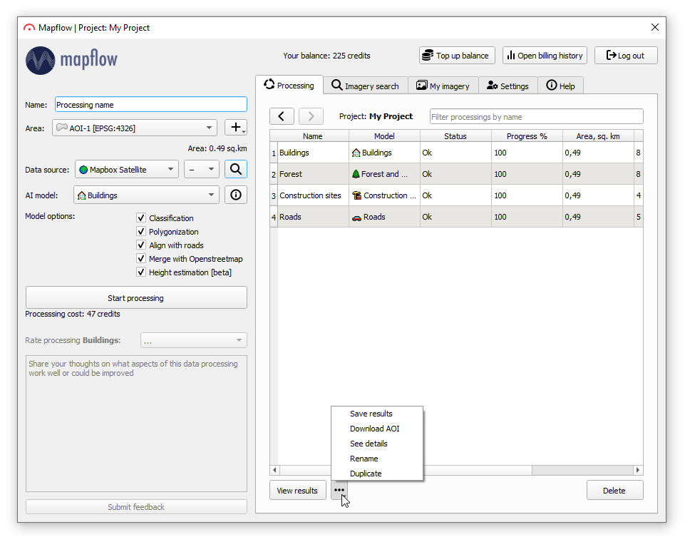

Mapflow – QGIS
==============

 .. attention::
    Mapflow can be used via `QGIS <https://www.qgis.org/>`_. You will need access to the data processing API that to use it (see :doc:`authorization to work with the Mapflow API <../userguides/mapflow_auth>`).

    In the `API tab <https://app.mapflow.ai/account/api>`_ of the profile settings is specified the area limit for processing provided to you (initially 100 km\ :sup:`2`) and the total area of ​​already completed processing.

What is QGIS
-------------

QGIS is the leading and most popular Open Source Desktop GIS. Users can visualize, manage, edit, analyse geodata, and compose printable maps. Get a first impression with a more detailed feature list.
Know more on QGIS and istall `official site <https://www.qgis.org/>`_. 

QGIS has an interface for external Python plugins that allows to connect more apps and extend core functionallity. Our "Mapflow - QGIS" app enables connection to Mapflow :doc:`processing_api` to run AI-mapping and add output as layers to the QGIS workspace.

How to install the plugin
--------------------------

Click *Plugins* --> *Manage...*, go to the *Not installed* (or *All*) tab and enter "MapFlow" in the search box. Click *Install Plugin*. You will be able to see then if the newer version of the app is available (in the Upgradeable tab) and to check the changelog for details.

The plugin icon has appeared in the QGIS Toolbar. 
.. hint::
   If the icon isn't automatically displayed, right-click on the Toolbar and check if the Mapflow toolbar is activated.

User interface
--------------

You need to log in with your credentials to start using the plugin. Go to `mapflow.ai <https://mapflow.ai/en>`_, register and obtain :doc:`API token <../userguides/mapflow_auth>`.

Login window
~~~~~~~~~~~~

  
.. list-table::
   :widths: auto
   :header-rows: 1

   * - Name of the field / button
     - Description
   * - Token
     - Enter your :doc:`API token <../userguides/mapflow_auth>` here.
   * - Log in
     - User account login button.
   * - Cancel
     - Button to close the authorization window.

Mapflow plugin
~~~~~~~~~~~~~~~~

Main plugin workspace is divided into 3 tabs:

:ref:`Processing`

:ref:`Providers`

:ref:`Help`

.. _Processing:

1. Processing
~~~~~~~~~~~~~~

|

**Processing parameters**

.. csv-table::
    :file: _static/qgis/processing_parameters_area.csv 
    :header-rows: 1 
    :class: longtable
    :widths: 1 3  
|

**Start processings and display the output on the map**

.. list-table::
   :widths: auto
   :header-rows: 1

   * - Name of the field / button
     - Description
   * - Name
     - Processing name.
   * - Model
     - User-selected processing type in the Mapflow model field.
   * - Status
     - Processing status: IN_PROGRESS, OK, FAILED. 
   * - Progress
     - The degree of completeness of processing as a percentage.
   * - Created
     - The date-time of the processing creation.
  

To download the processing results, double-click on the completed processing.

.. _Providers:

2. Providers
~~~~~~~~~~~~~

.. figure:: _static/qgis/Providers_tab.png
         :alt: Veiw of the providers tab
         :align: center
         :width: 15cm

|

.. list-table::
   :widths: auto
   :header-rows: 1

   * - Name of the field / button
     - Description
   * - Output directory
     - Path to the directory into which the processing result will be loaded.
   * - Additional sources of images
     - Drop-down list with additional satellite imagery providers.
   * - "Add" button
     - Button for adding a source of satellite images. 
   * - "Delete" button
     - Button for deleting the source of satellite images.
   * - "Edit" button
     - Button for changing the parameters of the source of satellite images.
   * - Preview
     - A button to preview the background of the specified satellite imagery and geospatial provider.
   * - Max zoom
     - Zoom number is selected by default to exclude the consumption of paid traffic for preview (Relevant if connected to **Maxar SecureWatch**).

.. hint::
    You can define your own source of data in XYZ format. Here is the example: http://``your_site.xyz``/``{z}``/``{x}``/``{y}``

    Check for free aerial images and try XYZ links at  `Open aerial Map <https://tiles.openaerialmap.org>`_.

    
**Maxar SecureWatch settings**

.. list-table::
   :widths: auto
   :header-rows: 1

   * - Name of the field / button
     - Description
   * - Authorisation
     - *Login / Password* credentials for your SecureWatch account. If you are not using your SecureWatch account or Mapflow Premium, the zoom number is limited up to 13, but you can get metadata and preview the satellite imagery on the map.
   * - Area
     - The area for which metadata will be presented.
   * - Get metadata
     - Use to collect metadata for the selected area. After clicking it, a list will be shown with all the images intersecting with your selected area of processing.

.. _Help:

3. Help
~~~~~~~~

The tab contains all useful links about this plugin.

  
How to connect to Maxar SecureWatch
------------------------------------

.. note::
 SecureWatch is a service that provides global access to high-resolution satellite images and imagery basemaps from the world leader in remote sensing, MAXAR, through the subscription model. The spatial resolution of images varies in the range from 30 cm to 1 m. All images are accompanied by metadata, including information about the acquisition date and time, cloud cover etc. In our application we implemented the special interface to connect to this service and use imagery via Mapflow's processings pipelines.

* **Use of embedded Maxar SecureWatch for image processing by Mapflow**

  On the **Processing** tab, in the *Remote sensing data* drop-down list, select the required Maxar product (SecureWatch, Vivid or Basemaps), specify all processing parameters and click the *Start processing*.

* **Maxar preview**

  1. Select the required Maxar product in the drop-down list on the **Data sources** tab;
  2. Select your AOI in the Area drop-down list and click on the *Get Metadata*.
  3. Double click on the selected image in the search results (or click Preview button) to add it on the map.

.. important:: 
   In the free tariff plan the *Max zoom* is limited up to 13 and processing cannot be started using SecureWatch. If you want to use this data provider - you have to switch to the Premium tariff plan - pls request us at help@geoalert.io

* **Using your SecureWatch account for image processing by the Mapflow**

   1. Open the block *Authorization* on the *Providers* tab and enter *Login / Password* from your Maxar SecureWatch account;

   2. Select the Maxar SecureWatch from the drop-down list above;

   3. Click *Edit* button and enter your *Connect ID*. Click the *OK* after.

  .. hint::
       How to find out your Connect ID:

      1. Go to `SecureWatch <https://securewatch.digitalglobe.com/myDigitalGlobe/logout-from-ended-session>`_.

      2. In the title bar, select your name, then select **View Profile**. The **User Profile** dialog box will open.

      3. Copy your Current Connect ID.

        .. figure:: _static/qgis/SecureWatch_user_profile.jpg
         :alt: Your user profile in SecureWatch
         :align: center
         :width: 15cm
      
        The **Connect ID** is different for each product you have in your SecureWatch subscription. Therefore, initially choose the one that suits you. To do this, close the *User Profile* window and in the title bar select the required of the two suggested mosaics (**Vivid** and **SecureWatch**) by clicking on the name of one of them.
     

  4. Click *Preview*. 
     
Now the Maxar layer is available for preview in your raster layers list and for the AI-mapping processing using Mapflow.

How to find and process the image by Feature ID using Maxar SecureWatch
~~~~~~~~~~~~~~~~~~~~~~~~~~~~~~~~~~~~~~~~~~~~~~~~~~~~~~~~~~~~~~~~~~~~~~~

You can use SW to discover avaialble images for you area of interest.

1. Go to the *Providers* tab.
2. Select Maxar SecureWatch from the dropdown list.
3. In the Maxar SecureWatch option select the vector layer with the boundary of your area of interest.

.. note::
    You have to create the new one area (*Layer -> Create layer -> ...*, select *Polygon* as a geometry type, in the created layer using the tool *Add polygon feature* draw an area of ​​interest) or to upload from the file with coordinates using QGIS. If there is more than one polygon in the file, select with the tool *Select object(s)* the polygon you need. For more information on creating and working with vector layers, see the `QGIS User Guide <https://docs.qgis.org/3.16/en/docs/training_manual/create_vector_data/create_new_vector.html>`_.

     .. figure:: _static/qgis/add_SW_WFS.png
         :alt: Get specific image from SW
         :align: center
         :width: 15cm    

4. *Get metadata*, to view meta-data of all avaialble images intesecting your AOI.
5. Select the prteferable image from the meta-data list or use the WFS generated vector layer (*WFS_temp*) to search through more attributes.

.. note::
    Imagery metadata is saved in the form of vector layer. You can interact with its Attribute Table searching through all attributes.

6. Click *Preview* to view the selected image in the form of new raster layer (or double-clicking on the row in the table).

.. attention::
    "max zoom 13" checkbox is active to prevent the paid streaming on the side of SecureWatch.
     

How to use other imagery services
------------------------------------

You can enter your custom imagery source URL in one of the following formats:

* XYZ;
* TMS;
* WMS;
* Quadkey.

All formats represent the most widely used protocols to fetch georeferenced imagery via HTTP.

How to process your own imagery
------------------------------------

You can upload your own GeoTIFF. All raster layers currently loaded in your QGIS are visible in the drop-down list and can be selected for upload. Opening files from the *Additional options* button also adds it to the list of QGIS layers with a choice.

 .. figure:: _static/qgis/upload_tif.png
         :alt: Upload TIF, select from list
         :align: center
         :width: 15cm
|

.. important::
  You should follow the requirements specified on the page with :ref:`Models reference` when uploading your own images for processing through the API of the Mapflow platform. 
  You can use our `preprocessing script <https://github.com/Geoalert/mapflow_data_preprocessor/>`_ to convert your data to 8 bit. Make sure that your imagery is georeferenced in GEORGAPHIC or PROJECTED coordinate system.

  Send a request using data preprocessing to help@geoalert.io.
