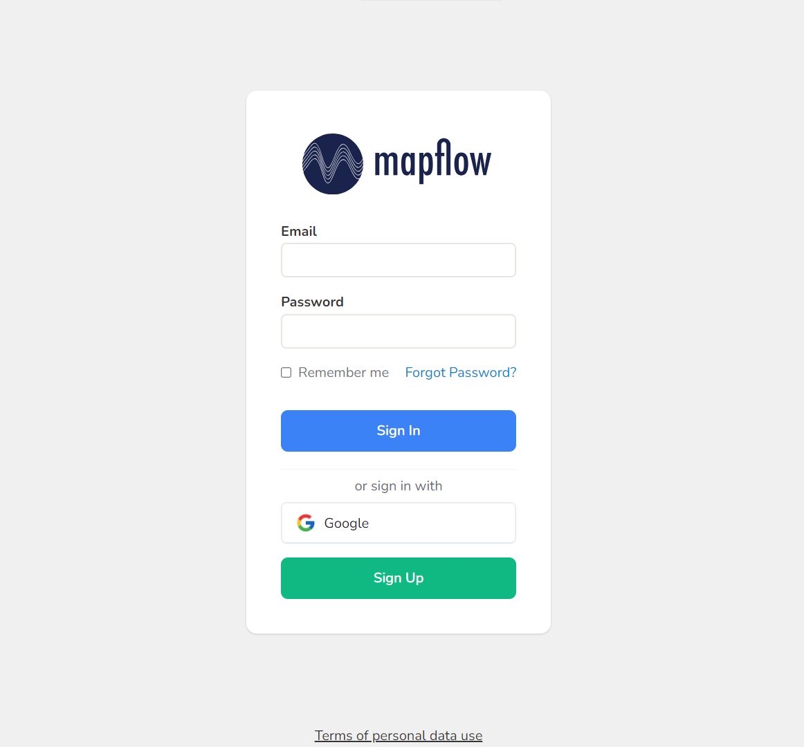
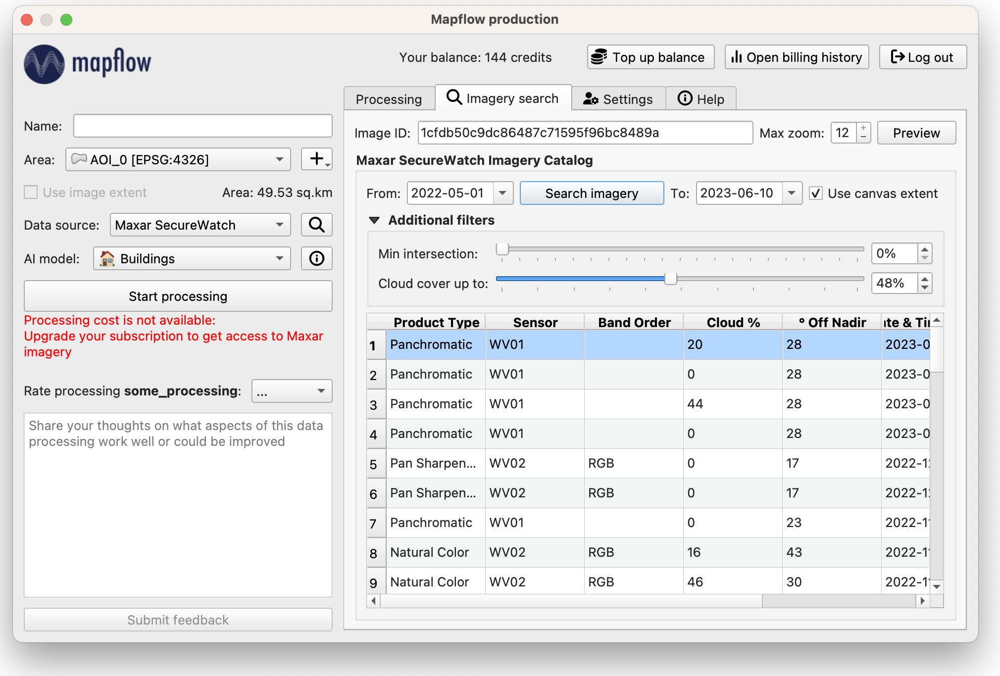

Mapflow <> QGIS
================

.. attention::
    Mapflow can be used via QGIS. You need to autohorise :doc:`authorization to work with the Mapflow API <../userguides/mapflow_auth>` and get `API token <https://app.mapflow.ai/account/api>`_ to login.

.. note::
      .. figure:: _static/github_logo.png
       :alt: Preview results
       :align: left
       :width: 1cm
       
  Join Mapflow <> QGIS `open source project on Github <https://github.com/Geoalert/mapflow-qgis>`_. 

What is QGIS
-------------

QGIS (`qgis.org <https://www.qgis.org/>`_) is the leading and most popular Open Source Desktop GIS. Users can visualize, manage, edit, analyse geodata, and compose printable maps. Get a first impression with a more detailed feature list.
Know more about QGIS and istall it from `official site <https://www.qgis.org/>`_. 

QGIS has an interface for external Python plugins that allows to connect more apps and extend core functionallity. Our "Mapflow - QGIS" app enables connection to Mapflow :doc:`processing_api` to run AI-mapping and add output as layers to the QGIS workspace.

How to install the plugin
-------------------------

Click *Plugins* -–> *Manage...*, go to the *Not installed* (or *All*) tab and enter "MapFlow" in the search box. Click *Install Plugin*. You will be able to see then if the newer version of the app is available (in the Upgradeable tab) and to check the changelog for details.

The plugin icon has appeared in the QGIS Toolbar. 
If the icon isn't automatically displayed, right-click on the Toolbar and check if the Mapflow checkbox is activated.

How to login
------------

You need to log in with your credentials to start using the plugin. Go to `mapflow.ai <https://app.mapflow.ai/>`_, register and obtain `API token <https://app.mapflow.ai/account/api>`_.

.. figure:: _static/qgis/login_window_w_oauth.png
         :alt: Login window
         :align: center
         :width: 9cm

|

Or you can use the `OAuth 2.0 <https://en.wikipedia.org/wiki/OAuth>`_ protocol as a more convenient and secure way.

.. note::
  

.. warning::
  Logging in with OAuth is a convenient feature, but still experimental for us.

  Also keep in mind that at the moment this feature does not support proxies.

OAuth2 setup
~~~~~~~~~~~~
**1. Select the** ``Use OAuth2`` **option in the login window**

.. figure:: _static/qgis/login_oauth_window.png
         :alt: OAuth login window
         :align: center
         :width: 9cm

|

**2. Set the master password**

You will be prompted to set a new `master authentication password <https://docs.qgis.org/3.28/en/docs/user_manual/auth_system/auth_overview.html#master-password>`_ - qgis feature to ensure the security of sensitive information storage.

.. figure:: _static/qgis/master_password.png
         :align: center
         :width: 9cm

|

**3. Click** ``Log in`` **button**

You will receive the following message, **restart** QGIS before the next steps.

|

**4. After restarting QGIS, click** ``Log in``

You will be redirected to the browser to log in/register in the mapflow system:

|

After successfully logging in, you will receive a message about the successful verification of QGIS OAuth2:

.. figure:: _static/qgis/oauth_message.png
         :align: center
         :width: 15cm

|
.. note:: 
  You can close this page

**5. Go back to QGIS**

OAuth login completed!

.. important::
  If you have serious problems with authorization, you can delete the authentication config by going to ``Settings -> Options -> Authentication``, select the config and remove it:

  .. figure:: _static/qgis/delete_oauth_config.png
         :align: center
         :width: 18cm

|
  

User interface
--------------

Main plugin workspace has two sections: left sidebar with the processing controls and the tabs section.

.. figure:: _static/qgis/main_window.png
         :alt: View of the main window
         :align: center
         :width: 20cm
         :class: no-scaled-link 

|

Processing controls panel allows to start new processing and/or rate finished processings, and includes following:

**Processing controls panel**

.. csv-table::
    :file: _static/qgis/processing_controls_panel.csv 
    :header-rows: 1
    :class: longtable

Your current balance is dispayed in the Tob bar. It also contains menu to access you personal profile on Mapflow.ai: top up you balance; open billing history; log out of current session. 

Tabs section contains 4 tabs:

:ref:`Processing`

:ref:`Providers`

:ref:`Settings`

:ref:`Help`

.. _Processing:

1. Processing
~~~~~~~~~~~~~~

.. figure:: _static/qgis/processing_tab.png
         :alt: View of the processing tab
         :align: center
         :width: 15cm
         :class: with-border no-scaled-link 

|

**Explanation of the fields and buttons of this tab:**

.. list-table:: Fields
   :widths: 5 10
   :header-rows: 1

   * - Name of the field
     - Description
   * - Name
     - Your processing name.
   * - Model
     - User-selected item from the list of available models.
   * - Status
     - Processing status: IN_PROGRESS, OK, FAILED. 
   * - Progress
     - The percentage of completeness of the processing.
   * - Area
     - The processing area (AOI).
   * - Created
     - The date-time of the processing creation.

.. list-table:: Buttons
   :widths: 5 10
   :header-rows: 1

   * - Name of the button
     - Description
   * - View results
     - Shows the results of completed processing in QGIS layers.
   * - See details
     - Shows information about processing (*Name, Status, Model, Model options, Data provider*).
   * - Save results
     - Saves processing results to GeoJSON file. 
   * - Delete
     - Deletes selected processing/processings.

.. hint::
    To download the processing results, you can double-click on the completed processing in the list

.. _Providers:

2. Imagery search
~~~~~~~~~~~~~~~~~~~

|

.. list-table::
   :widths: auto
   :header-rows: 1

   * - Name of the field / button
     - Description
   * - "Edit" button
     - Button for changing the parameters of the source of satellite images.
   * - Preview
     - A button to preview the specified satellite imagery by geospatial provider.
   * - Image ID
     - Image ID from the *Imagery catalog* of the selected image of specified satellite image source.
   * - Max zoom
     - Zoom number is selected by default to exclude the consumption of paid traffic for preview (Relevant if connected to **Maxar SecureWatch**).
   * - Area
     - The area for which metadata will be presented.
   * - Use canvas extent
     - The processing area will be taken from the QGIS map canvas.
   * - Period of time (From...To)
     - The images will be provided for the specified time period.
   * - Search imagery
     - Use to collect metadata for the selected area. After clicking it, a list will be shown with all images intersecting your area.
   * - Additional Filters
     - Use to set the minimum intersection rate between the image and the area of interest and the minimum percentage of image cloudiness.

.. hint::
    You can define your own source of data in XYZ format. Here is the example: ``https://your_site.xyz/{z}/{x}/{y}``

    Check for free aerial images and try XYZ links at  `OpenAerialMap <https://openaerialmap.org>`_.

.. _Settings:

3. Settings
~~~~~~~~~~~~~

.. figure:: _static/qgis/settings_tab_w_projects.png
         :alt: View of the providers tab
         :align: center
         :width: 15cm

|
.. list-table:: Edit imagery providers available to the plugin
   :align: center
   :widths: auto
   :header-rows: 1

   * - Name of the field / button
     - Description
   * - Imagery providers
     - Drop-down list with additional satellite imagery providers.
   * - Mapflow project
     - Drop-down list with mapflow projects on you account.
   * - "Add" button
     - Button for adding a source of images. 
   * - "Delete" button
     - Button for deleting the custom data provider.
   * - "Edit" button
     - Opens dialog to edit custom data provider

Here you can configure how the processing results will be uploaded to QGIS. There are two ways:

1. ``view result as a vector layer``
   - This is streaming vector tiles directly from our server, which allows you to view results of the processings without downloading full results file, so it will be faster for big processings.
2. ``save local gpkg file to view results``
   - Saving local gpkg files on your disk for further loading as QGIS layers.

.. warning::
  Vector tiles are an experimental feature for us, so choose the method that is convenient for you.

.. hint::
    This tab contains also *Output directory* button. 

    *Output directory* - set up where the processing results will be loaded on your local disk If the ``save local gpkg file to view result`` option is selected.

.. _Help:

4. Help
~~~~~~~~

The tab contains all useful links to the plugin documentation.

How to run the processing
~~~~~~~~~~~~~~~~~~~~~~~~~

To start the processing you need to add the Polygon **Area of Interest** (AOI).

The plugin has several built-in options for creating AOI.

   1. Create new AOI from the map canvas extent using the "+" button;

   2. Upload the existing AOI using the "+" button;
   
   3. Draw AOI at the map;

   4. Use the extent of the uploaded image.

Besides, you can create a new vector layer or add existing AOI into QGIS project. If the vector layer consists of several polygons select one of them.

  .. figure:: _static/qgis/AOI_button.png
         :alt: View of the aoi 
         :align: center
         :width: 15cm
         :class: with-border no-scaled-link

Use of commercial satellite imagery providers
----------------------------------------------

How to connect to Maxar SecureWatch
~~~~~~~~~~~~~~~~~~~~~~~~~~~~~~~~~~~~

.. note::
 SecureWatch is a service that provides global access to high-resolution satellite images and imagery basemaps from the world leader in remote sensing, MAXAR, through the subscription model. The spatial resolution of images varies in the range from 30 cm to 1 m. All images are accompanied by metadata, including information about the acquisition date and time, cloud cover etc. In our application we implemented the special interface to connect to this service and use imagery via Mapflow's processings pipelines.

* **Use of embedded Maxar SecureWatch for image processing by Mapflow**

   In the *Data source* drop-down list, select the required Maxar product (SecureWatch, Vivid), switch to the *Imagery search* tab.

* **Maxar preview**

  1. Select your AOI in the Area drop-down list and click on the *Search imagery*.
  2. Double click on the selected image in the search results (or click Preview button) to add it on the map.

.. important:: 
   In the free tariff plan the *Max zoom* is limited up to 12 and the processing cannot be started using SecureWatch. If you want to use this data provider - you have to switch to the `Premium <https://mapflow.ai/pricing>`_ tariff plan or `write to us <https://geoalert.io/#contacts>`_ to get a quote.

* **Using your SecureWatch account for image processing by the Mapflow**

.. figure:: _static/qgis/addnewprovider.png
         :alt: View of the providers tab
         :align: center
         :width: 10cm
         :class: with-border no-scaled-link 

|

   1. Click *+* button and choose Maxar WMTS option in the dropdown list;

   2.  Enter *Login / Password* from your Maxar SecureWatch account;

   3.  Enter WMTS URL link for Maxar Secure Watch (`SecureWatch <https://securewatch.digitalglobe.com/myDigitalGlobe/logout-from-ended-session>`_ - Login - Securewatch - Use with - Web Services - WMTS)

   4.  Optional: specify the coordinate system (default epsg:3857);

   5.  Optional: Check *Save login and password*

  .. hint::
       How to find Maxar WMTS URL:

      1. Go to `SecureWatch <https://securewatch.digitalglobe.com/myDigitalGlobe/logout-from-ended-session>`_ and login.

      2. In the upper menu select **Use With** >> **Web Services** >> **WMTS**

      3. Copy the WMTS (or TMS) url.

        .. figure:: _static/qgis/SecureWatch_user_profile.png
         :alt: Your user profile in SecureWatch
         :align: center
         :width: 15cm
         :class: with-border no-scaled-link 

        The **Connect ID** is different for each product you have in your SecureWatch subscription. Therefore, initially choose the one you want. To do this, open the *User Profile* menu and in the title bar select the required of the two suggested mosaics (**Vivid** and **SecureWatch**).
     

  4. Click *Preview*. 
     
Now the Maxar layer is available for preview in your raster layers list and for the AI-mapping processing using Mapflow.

How to find and process the image by Feature ID using Maxar SecureWatch
~~~~~~~~~~~~~~~~~~~~~~~~~~~~~~~~~~~~~~~~~~~~~~~~~~~~~~~~~~~~~~~~~~~~~~~~~~

You can use SW to discover available images for you area of interest.

1. Go to the *Providers* tab.
2. Select Maxar SecureWatch from the dropdown list.
3. In the *Maxar SecureWatch imagery Catalog* select the vector layer containing the boundary of your area of interest.

.. note::
    To define the imagery search area you can create the new polygon (*Layer -> Create layer -> ...*, select *Polygon* as a geometry type, add polygon using the tool *Add polygon feature*) or upload it from the file with coordinates. If there is more than one polygon in the file, select with the tool *Select object(s)* the polygon you need. For more information on creating and working with vector layers, see the `QGIS User Guide <https://docs.qgis.org/3.16/en/docs/training_manual/create_vector_data/create_new_vector.html>`_.
    Alternatively, you can check the option "use canvas extent".

     .. figure:: _static/qgis/add_SW_WFS.png
         :alt: Get specific image from SW
         :align: center
         :width: 15cm

4. *Search imagery*, to view meta-data of all available images intesecting your AOI. You can apply search filters and specify the period for which you would like to receive images. This will help in forming an imagery catalog with the necessary parameters.
5. Select the prteferable image from the imagery catalog or use the WFS generated vector layer (*Maxar SW metadata*) to search through more attributes. If you want to process a specific image in advance, insert your image ID in the field on the top of the plugin, this will make it easier to find the image in the imagery catalog.

.. note::
    Imagery metadata is saved in the form of vector layer. You can interact with its Attribute Table by searching through all attributes.

6. Click *Preview* to view the selected image in the form of new raster layer (or double-clicking on the row in the table).

.. attention::
    "max zoom 12" checkbox is active to prevent the paid streaming on the side of Maxar SecureWatch.
     

How to use other imagery services
------------------------------------

For example, let's use the `OpenAerialMap <https://openaerialmap.org/>`_ is an open collection of UAV imagery data, crowdsourced by users. The project is supported by a consortium of companies developing open source software and services for working with spatial data.
As soon as your aerial image is published on OpenAerialMap it's presented on the public map and can be fetched using TMS/WMTS protocols.

Select the image and copy link to TMS.

  .. figure:: _static/qgis/search_openaerialmap_image.png
         :alt: Search for imagery in OpenAerialMap 
         :align: center
         :width: 15cm

|

Go to the plugin, on the *Providers* tab click on the *Add* (1) and enter the relevant data in the opened window (2). Click the *Preview* (3) the image, - you must be at the correct zoom and coordinates to see the image.

To start processing using this data source, go to the *Processing* tab, fill in all fields of processing parameters, click *Start processing*.

 .. figure:: _static/qgis/custom_imagery_source.png
         :alt: Custom imagery source
         :align: center
         :width: 15cm

 |

.. list-table::
   :widths: 10 30
   :header-rows: 1
 
   * - Name of the field / button
     - Description
   * - Name
     - Name of other imagery data provider
   * - URL
     - URL of the imagery data provider
   * - Type
     - Data source type. You can enter your custom imagery source URL in one of the following formats: `XYZ <https://en.wikipedia.org/wiki/Tiled_web_map>`_, `TMS <https://en.wikipedia.org/wiki/Tile_Map_Service>`_, `WMS <https://en.wikipedia.org/wiki/Web_Map_Tile_Service>`_, `Quadkey <https://docs.microsoft.com/en-us/bingmaps/articles/bing-maps-tile-system>`_. All formats represent the most widely used protocols to fetch georeferenced imagery via HTTP.

How to upload your image
-------------------------

You can upload your own GeoTIFF. All raster layers currently loaded in your QGIS (1) are visible in the drop-down list (2) and can be selected for upload.

 .. figure:: _static/qgis/upload_tif.png
         :alt: Upload TIF, select from list
         :align: center
         :width: 15cm
         :class: with-border no-scaled-link 

.. important::

  Please, follow the requirements specified on the page with :doc:`../userguides/requirements` when uploading your own images for processing through the API of the Mapflow platform.

    * **Check the data type** 
          The Data type must be Byte (8 bit). If the Data type is Int16,  or Float32 etc, please follow the instruction :doc:`../userguides/howto`.
          Alternative option: use the `preprocessing script <https://github.com/Geoalert/mapflow_data_preprocessor/>`_ 
    * **Check the image size**
          Both sides image dimension must not exceed 30.000x30.000 pixels. If you have larger images you should either cut them in smaller chunks or switch to the `Mapflow custom <https://geoalert.io/#contacts>`_.
    * **Check the number of channels**  
          Normally, the Mapflow processes 3-channel RGB rendered images. Mapflow platform can also process single-band (panchromatic) imagery, but the NN models are not
          tuned for such kind of data, so the quality of the result may be worse than expected.
    * **Check the projection and georeference** 
          Make sure that your imagery is georeferenced in geographic or projected coordinate system.
    * **Check the resolution**
          The resolution restrictions vary for different models, see :ref:`Model requirements`   
  
You can send a request for data preprocessing to help@geoalert.io

Work with results
------------------

View the results
~~~~~~~~~~~~~~~~~~~~~

The processing results that are 100% complete can be downloaded as a vector file to your local directory or streaming as a vector tiles and automatically added as layer to QGIS workspace.

Double click on the processing name in the :ref:`Processing` Table or select it and push the button "View results".
The layer will appear in the Layers panel (QGIS --> View --> Panels --> Layers) in the folder "Mapflow".
You can work with it further as with the usual vector layer in QGIS.

.. note::
  If the default AI model is used, the plugin automatically assigns predefined styles to the vector layer. For all custom models / pipelines the single default style is assigned. You can always change it.

Save results
~~~~~~~~~~~~~~~~~~~~~~
The processing results, which are 100% complete, can be downloaded in GeoJSON format, to do this, click on the ``Save results`` button, select output directory in the window that appears and name the file to be saved.

Delete the processing
~~~~~~~~~~~~~~~~~~~~~~

To delete the processing - select it in the list, click the button "Delete" and confirm.

.. warning::
  The processing cannot be restored by user. Before the permanent deletion the data backup is **temporarily stored** on the Mapflow server in case of emergency. So if you deleted your results by mistake and want us to restore the processing – send your request to the support without delay.
 

Review the results*
~~~~~~~~~~~~~~~~~~~~

.. note::
   ❗️ This option is available for the limited number of Mapflow customers who have signed up for the enterprise support

If activated, every completed processing comes with the status **"Review required"**. The user can either accept the result or request the review, so the support can reprocess it and get better results, until it meets the requirements. 
To request the **Review** of the results:

.. _Review workflow:

1. Select the processing with the Status **"Review required"** and click the "Review" button

2. Provide comments in the Review dialogue:

.. epigraph::
  * Add your comment on why and what you want us to make a review
  * *Optionally* Add the polygon area, highlighting the objects that are not correctly processed, weren't identified correctly, etc – it will help us to pay attention to the specific issues
  * The processing Status will change to **"In review"**

 .. figure:: _static/qgis/review_required.jpg
         :alt: Upload TIF, select from list
         :align: center
         :width: 15cm
         :class: with-border
         
         Select AOI and request a Review

3. As soon as Review is done on our side the Status will change back to **"Review required"**. Accept the results or return to the #1

 .. figure:: _static/qgis/review_accept.jpg
         :alt: Upload TIF, select from list
         :align: center
         :width: 15cm
         :class: with-border
         
         Accept the results when Review is done

Proxy-settings
---------------

If you are behind a firewall, go to *QGIS* -> *Preferences* -> *Network* and will please adjust the proxy settings for plugin connection.

 .. figure:: _static/qgis/proxy_settings.png
         :alt: Proxy settings
         :align: center
         :width: 15cm
         
