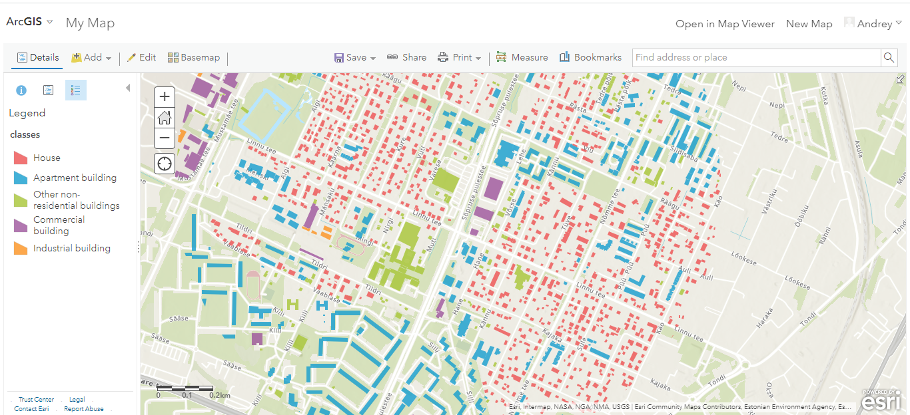
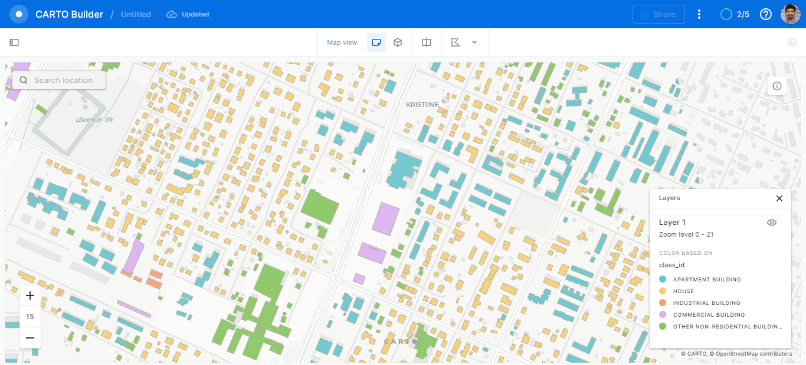

   
Urban Mapping classes
=====================

Reference
---------

   .. tabularcolumns:: |p{3cm}|p{5cm}|p{7cm}|p{3cm}|

   .. csv-table::
      :file: _static/csv/classes_um.csv 
      :header-rows: 1 
      :class: longtable
      :widths: 1 1 1 1

Urban Mapping visualization with ArcGIS Online, Carto, and EverGIS online
-------------------------------------------------------------------------

Mapflow Web easily processes imagery and extracts vector objects that can be downloaded in **GeoJSON** format. We recommend using GeoJSON since it is a de-facto standard in web mapping. 
It is natively supported by web mapping frameworks (e.g. Leaflet or Mapbox) and GIS software like QGIS or the ArcGIS Suite.

.. note::
   GeoJSON is an open standard format designed for representing simple geographical features, along with their non-spatial attributes. It is based on the JSON format. The features include points, linestrings (Mapflow roads), polygons (Mapflow buildings footprints, forest and field masks), or multi-part collections of these types.
   Mapflow allows different options for actions with processing results stored in GeoJSON. You are able to download or “Open with **geojson.io**”.

.. figure:: _static/img/open_with.png
    :alt: Interaction panel
    :align: center
    :width: 20cm

    Open with geojson.io

.. note::
   `Geojson.io <https://geojson.io>`_ allows you to view and save the results in a different format (CSV, KML, TopoJSON, WKT, Shapefile). Click “Save” and select the format in the menu bar.

.. figure:: _static/img/geojson.io.png
    :alt: Interaction panel
    :align: center
    :width: 20cm

Using GeoJSON allows you to use only drag&drop to visualize Mapflow output results in numerous Web-GIS without converting data formats. `See this video <https://youtu.be/ZG5fVut87ZQ>`_ about how to upload and style a building classification results with ArcGIS online, Carto, and Evergis online.

    Urban Mapping classes in ArcGIS online

    Urban Mapping classes in Evergis online

    Urban Mapping classes in Carto
