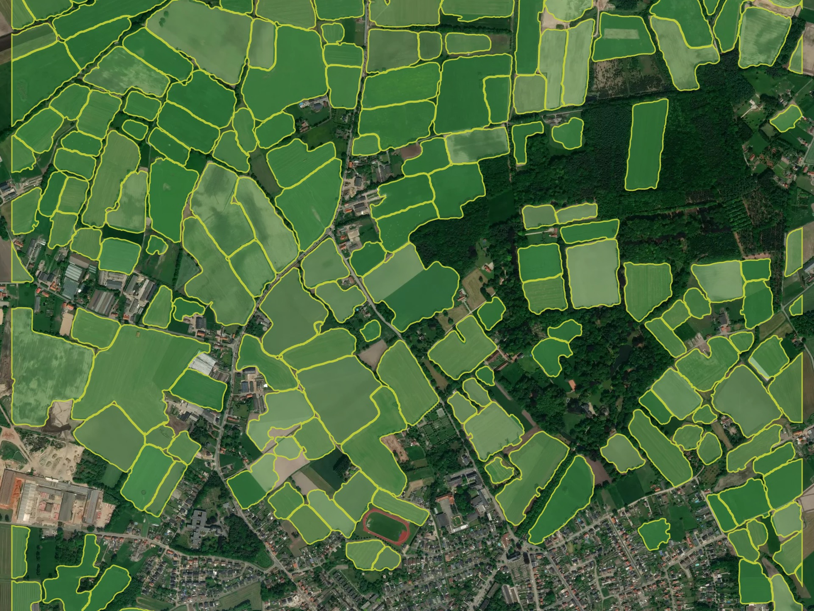
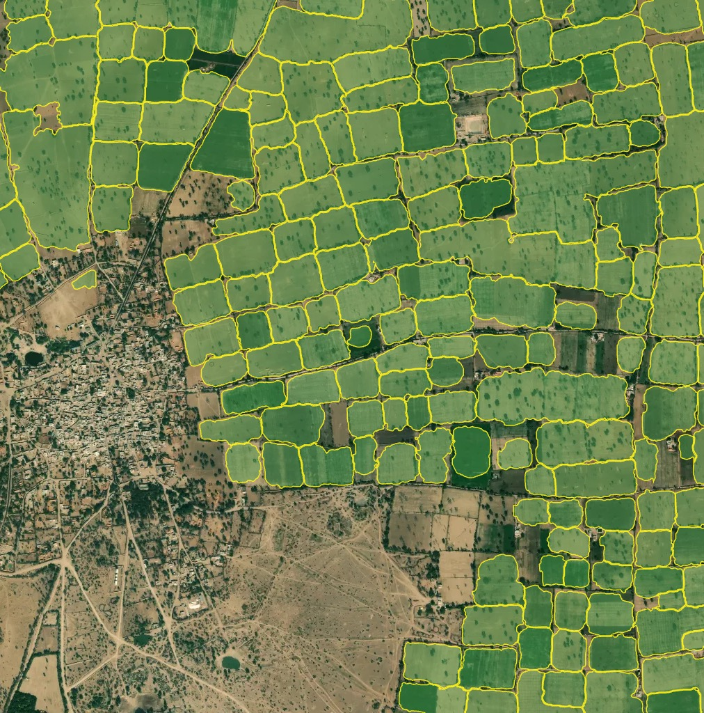

|:tractor:| Agriculture fields (DEPRECATED)
--------------------------------------------

.. warning::
   This model has been deprecated as default one. it's available only by request.

Model for fields segmentation allows to detect the agricultural fields and delineate the nearby fields from each other, if there is a visual boundary (forest line, road, different crop stage). The model is trained on the high resolution data (1-1.2 m), primarily for Europe, Russia. It performs better with larger fields with active vegetation. Smaller and terrace fields (typical for Asia) are delineated not so good. Fields without vegetation, especially in winter period, are not target class.

   
   Processing result sample for Europe (Belgium)

   
   Processing result sample for Asia (Northern India)