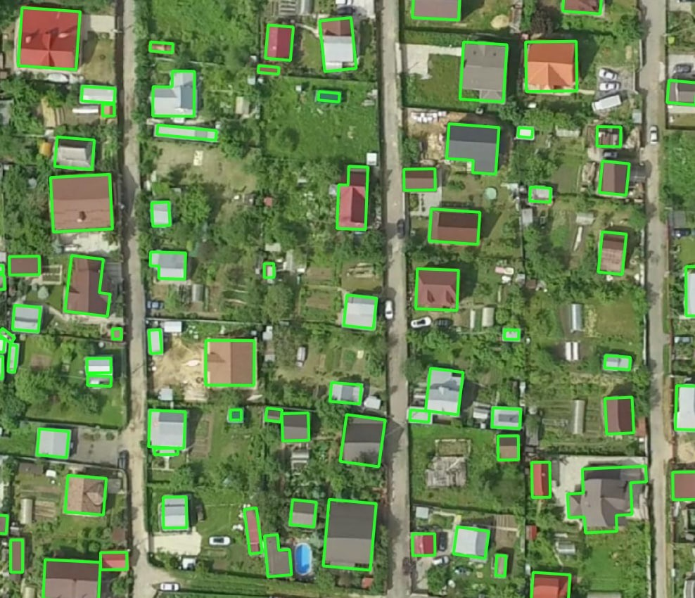
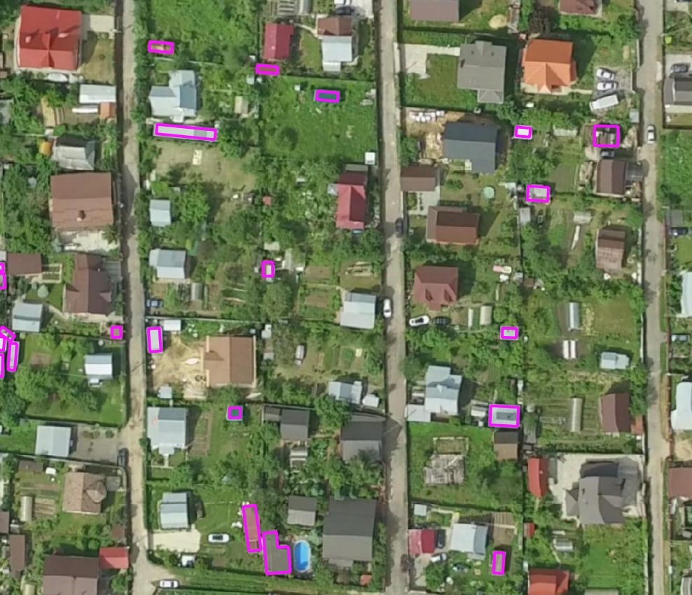

🏠⭐️ Buildings (Aerial) (CUSTOM)
--------------------------------------------
.. note::
   This model has been deprecated as default one and moved to custom as its geodomain application is limited. it's available by request.

This model is specifically designed to be used on a high resolution aerial imagery (15-10cm per pixel) for extraction of small buildings and detailed structure outlines. It is best suited for rural and suburban residential areas. We do not recommend using this model in areas with high-dense urban buildings. Use :doc:`Buildings model <buildings_model>` instead, even for aerial imagery.

.. list-table::
   :widths: 15 30 15 5 15
   :header-rows: 1

   * - Model name
     - Model type
     - Zoom level
     - F1 (testing)
     - Geo domain
   * - Buildings (Aerial)
     - Instance segmentation
     - zoom 20-21
     - > 0.82
     - urban pattern: low-rise - rural 

    Processing example – rural residential area

    Small objects that have been missed by default :ref:`Buildings model` but detected using an aerial image with the Buildings (Aerial imagery)