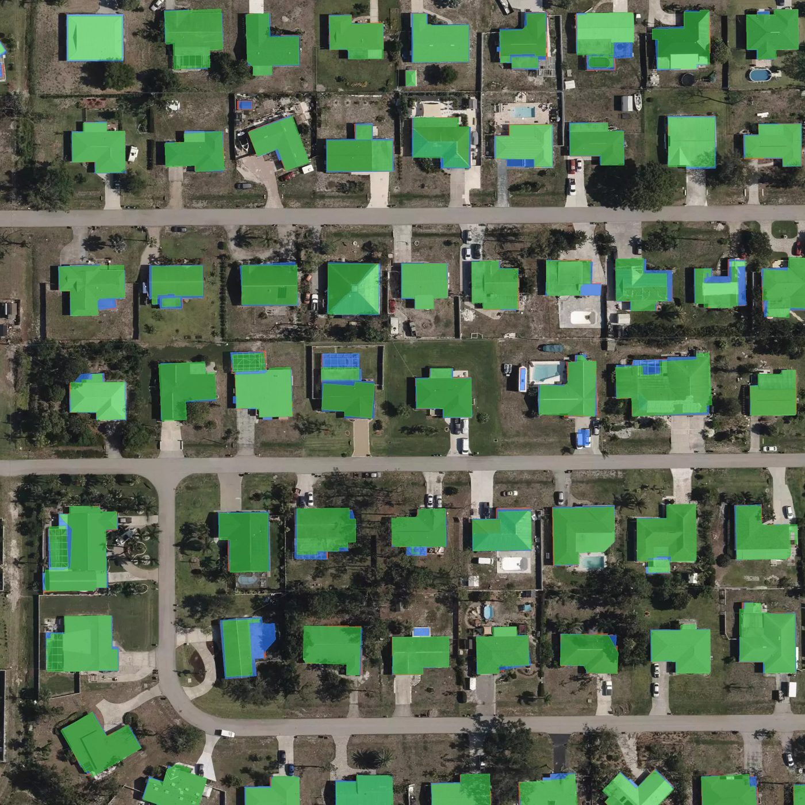
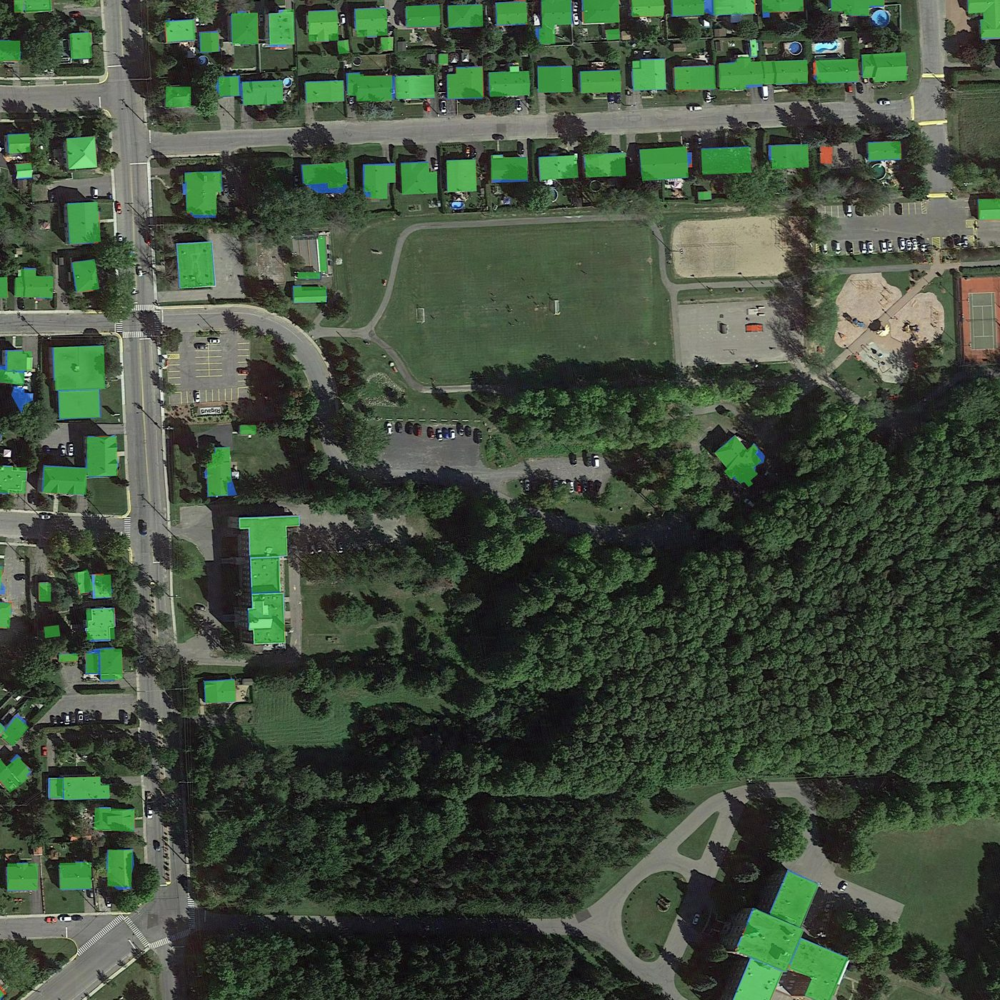
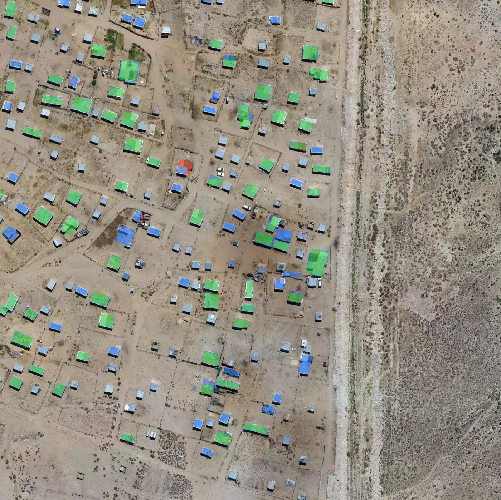
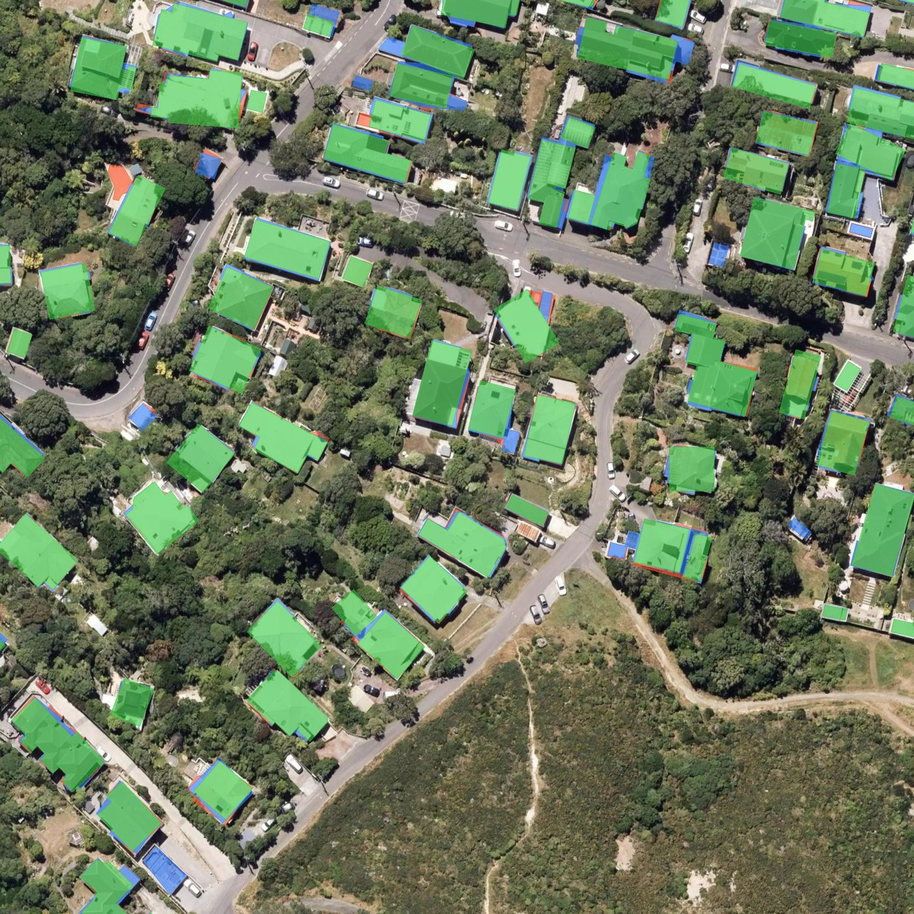
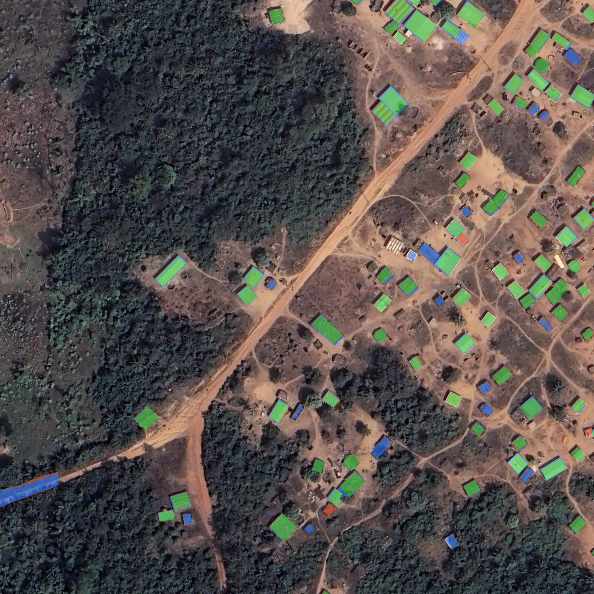
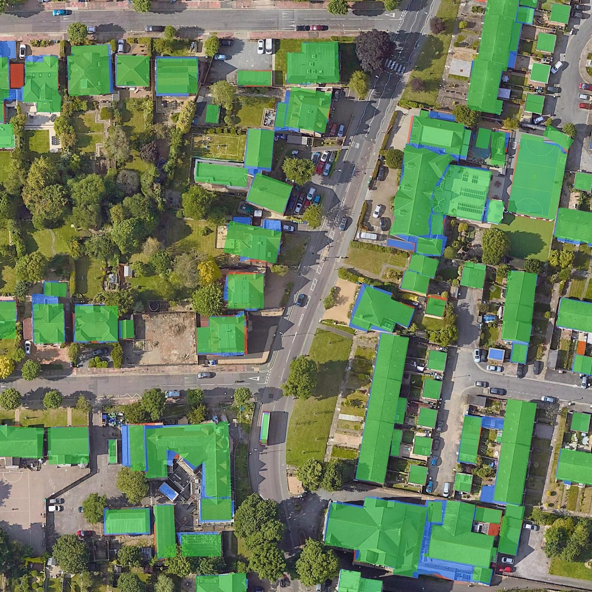
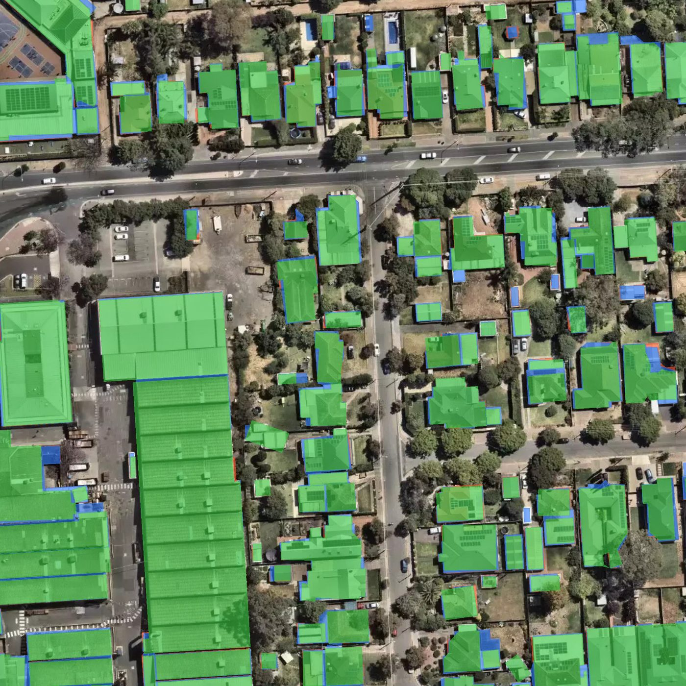

:orphan:

.. _buildings_benchmark_07-06:

🏠 Buildings v.07-06 — per-location benchmark
==============================================

This page details the validation of the **🏠 Buildings v.07-06** segmentation model
(Global domain, 0.3 m / z19) on a set of 7 areas of interest (AOI), compared against
manually annotated ground truth. For reference, each AOI is also evaluated for the
previous candidate **v.02-06** and the current production **🏠 Buildings** model.

All metrics are object-wise: a predicted footprint counts as a true positive (TP)
when it matches a ground-truth footprint, otherwise it is a false positive (FP);
unmatched ground-truth footprints are false negatives (FN).
Evaluation run: 2026-06-09.

.. note::
   In the overlay images, predicted footprints are compared visually against the
   ground-truth annotation for each AOI (combined view exported from the test pipeline).

United States
~~~~~~~~~~~~~~

.. list-table::
   :widths: 26 14 14 14 22
   :header-rows: 1

   * - Model
     - F1
     - Precision
     - Recall
     - TP / FP / FN
   * - v.02-06
     - 0.945
     - 0.923
     - 0.968
     - 60 / 5 / 2
   * - **v.07-06**
     - **0.960**
     - **0.952**
     - **0.968**
     - 60 / 3 / 2
   * - 🏠 Buildings (current)
     - 0.916
     - 0.870
     - 0.968
     - 60 / 9 / 2

   United States — prediction vs ground-truth overlay.

|

Canada
~~~~~~~

.. list-table::
   :widths: 26 14 14 14 22
   :header-rows: 1

   * - Model
     - F1
     - Precision
     - Recall
     - TP / FP / FN
   * - v.02-06
     - 0.826
     - 0.784
     - 0.874
     - 76 / 21 / 11
   * - **v.07-06**
     - **0.809**
     - 0.771
     - 0.851
     - 74 / 22 / 13
   * - 🏠 Buildings (current)
     - 0.809
     - 0.752
     - 0.874
     - 76 / 25 / 11

   Canada — prediction vs ground-truth overlay.

|

South Africa
~~~~~~~~~~~~~

.. list-table::
   :widths: 26 14 14 14 22
   :header-rows: 1

   * - Model
     - F1
     - Precision
     - Recall
     - TP / FP / FN
   * - v.02-06
     - 0.779
     - 0.917
     - 0.677
     - 44 / 4 / 21
   * - **v.07-06**
     - **0.739**
     - 0.891
     - 0.631
     - 41 / 5 / 24
   * - 🏠 Buildings (current)
     - 0.782
     - 0.956
     - 0.662
     - 43 / 2 / 22

   South Africa — prediction vs ground-truth overlay.

|

New Zealand
~~~~~~~~~~~~

.. list-table::
   :widths: 26 14 14 14 22
   :header-rows: 1

   * - Model
     - F1
     - Precision
     - Recall
     - TP / FP / FN
   * - v.02-06
     - 0.756
     - 0.716
     - 0.800
     - 48 / 19 / 12
   * - **v.07-06**
     - **0.734**
     - 0.691
     - 0.783
     - 47 / 21 / 13
   * - 🏠 Buildings (current)
     - 0.788
     - 0.722
     - 0.867
     - 52 / 20 / 8

   New Zealand — prediction vs ground-truth overlay.

|

Côte d'Ivoire
~~~~~~~~~~~~~~

.. list-table::
   :widths: 26 14 14 14 22
   :header-rows: 1

   * - Model
     - F1
     - Precision
     - Recall
     - TP / FP / FN
   * - v.02-06
     - 0.802
     - 0.859
     - 0.753
     - 67 / 11 / 22
   * - **v.07-06**
     - **0.717**
     - 0.814
     - 0.640
     - 57 / 13 / 32
   * - 🏠 Buildings (current)
     - 0.778
     - 0.863
     - 0.708
     - 63 / 10 / 26

   Côte d'Ivoire — prediction vs ground-truth overlay.

|

United Kingdom
~~~~~~~~~~~~~~~

.. list-table::
   :widths: 26 14 14 14 22
   :header-rows: 1

   * - Model
     - F1
     - Precision
     - Recall
     - TP / FP / FN
   * - v.02-06
     - 0.650
     - 0.565
     - 0.765
     - 39 / 30 / 12
   * - **v.07-06**
     - **0.703**
     - 0.650
     - 0.765
     - 39 / 21 / 12
   * - 🏠 Buildings (current)
     - 0.646
     - 0.539
     - 0.804
     - 41 / 35 / 10

   United Kingdom — prediction vs ground-truth overlay.

|

Australia
~~~~~~~~~~

.. list-table::
   :widths: 26 14 14 14 22
   :header-rows: 1

   * - Model
     - F1
     - Precision
     - Recall
     - TP / FP / FN
   * - v.02-06
     - 0.721
     - 0.617
     - 0.866
     - 71 / 44 / 11
   * - **v.07-06**
     - **0.674**
     - 0.625
     - 0.732
     - 60 / 36 / 22
   * - 🏠 Buildings (current)
     - 0.579
     - 0.525
     - 0.646
     - 53 / 48 / 29

   Australia — prediction vs ground-truth overlay.

|

Summary
~~~~~~~~

Compared with the **previous version** (the current production 🏠 Buildings model),
**v.07-06** lifts the mean object-wise **F1 from 0.757 to 0.762** (+0.005), with mean
precision up (+0.024) and recall slightly down (−0.023). The gains are largest on the
weaker AOIs — Australia (F1 +0.095), United Kingdom (+0.057) and the United States
(+0.044) — while Canada holds parity. The trade-off is lower recall on dense / informal
patterns: New Zealand (−0.054), Côte d'Ivoire (−0.061) and South Africa (−0.043).
Overall the update raises precision and the floor on the hardest areas at a small cost
to recall elsewhere. The tables above also list the earlier candidate **v.02-06** for
reference.
