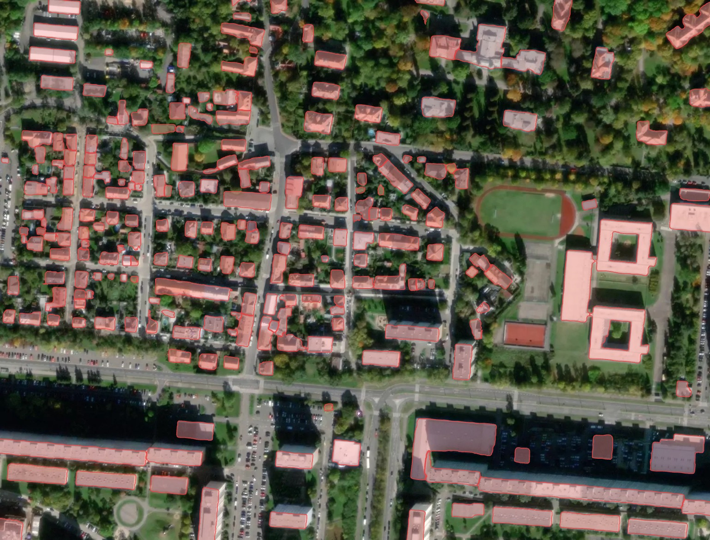
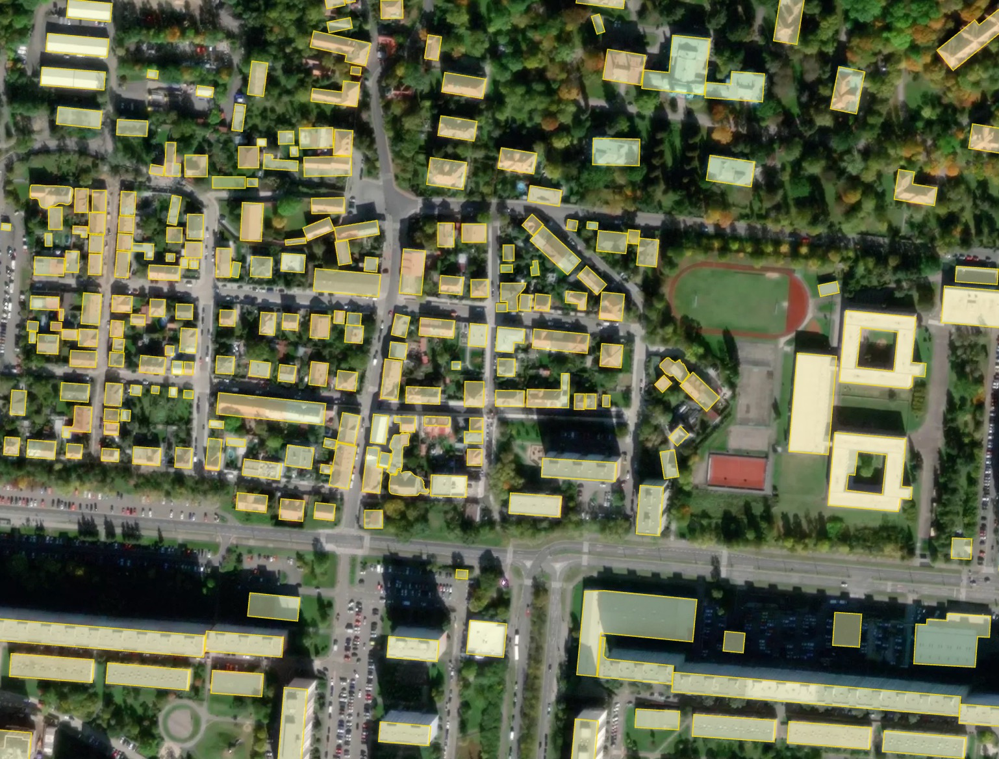
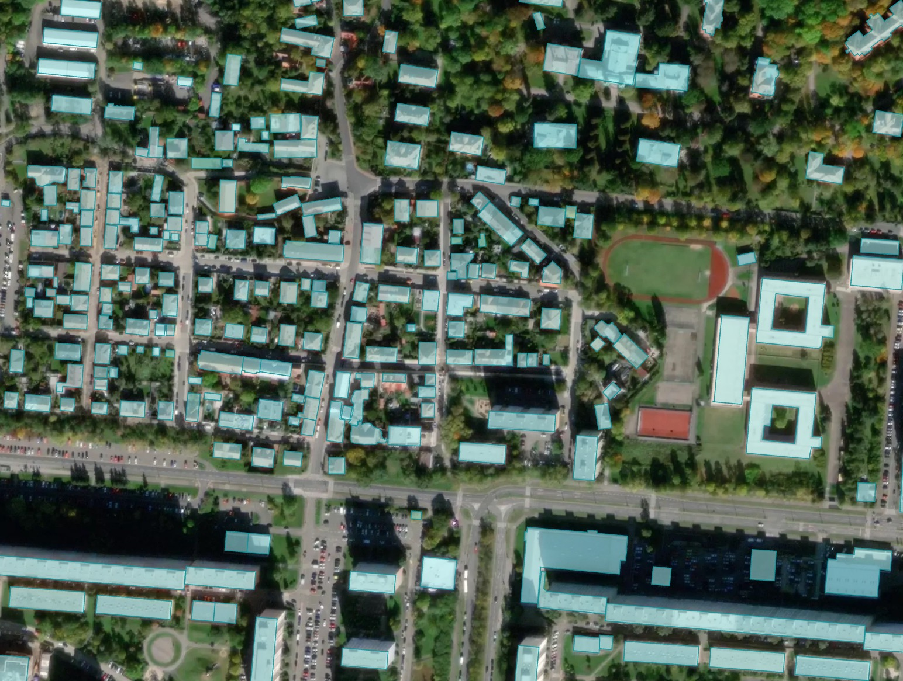
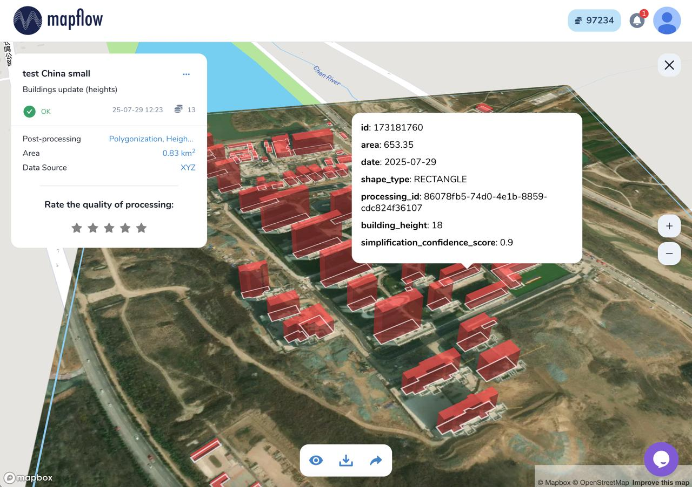
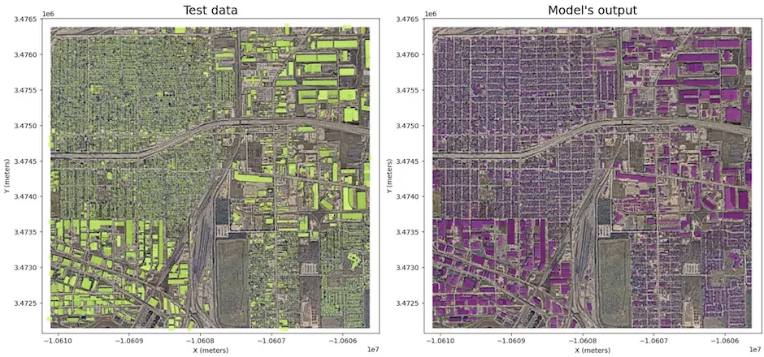
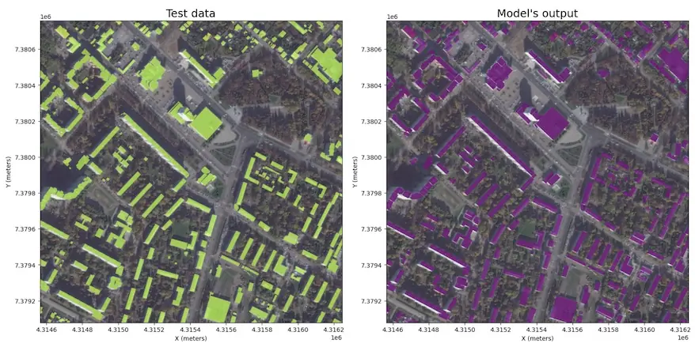

.. _Buildings model:

🏠 Buildings
=================

Extracting of rooftops of buildings from imagery of high resolution.
High performance deep learning model is trained to detect the buildings roofs.

*Note:* The building predictions with area less than 20 sq.m. are removed to avoid clutter

The model does not extract the footprints directly, because they are not clearly visible in the images, but it can obtain them, just like human cartographers, by moving the roof to the bottom of the wall (see Additional options).

**Additional options:**

* **Classification by types of buildings** – typology of buildings is represented by the main classes (see :ref:`reference <buildings_classes>`).
* **Regularization** - the algorithm corrects the irregularities of the contours of our model. The irregular geometries are replaced with rectangles, circles or arbitary polygons with 90 degree angles, which fits better to the original shape. This option produces much more map-friendly shapes which look better, but some original mask accuracy can be lost.
* **Simplification** - simplifies the building shape, staying close to the original mask, adjusted for curve and complex shapes. More approximated shapes, but less right angles.
* **Merge with OSM** - some of the areas have great coverage of OpenStreetMap data, and if you prefer human-annotated data, you can select this option.In this case, we check for each building whether it has a good corresponding object in OSM (Jaccard index) and if there is one, we replace our result with OSM polygon. This makes the result not based on the image, so the buildings can be shifted from actual positions. Also the corrected buildings are rotated to align with the nearest roads downloaded from OSM. 
* **Height Estimation (beta)** – feature leverages a dedicated regression-based model that infers height using visual indicators such as shadow length and visible wall segments. The result is what is termed **3D building footprints** where the building's countour is projected to ground level instead of the roof outline. This is especially useful for oblique imagery, where roofs often appear shifted.

A sample of processing result with different options for Prague, Czech Republic.

   
   Result without postprocessing: irregular building shapes, but best fit to the actual rooftop contour seen in the image.

   
   Result with simplification: most of the buildings become rectangular.

   
   Result merged with OSM: some of the buildings imported from OSM have more accurate shape, but may be shifted from the image position.

   Processing result of buildings model with height estimation in Mapflow Web

   
Benchmarks - segmentation
----------------------------

**Houston, U.S. (-95.2920, 29.7718)**
 – `View on the Map <https://app.mapflow.ai>`_

.. list-table::
   :widths: 15 20 15 10 20
   :header-rows: 1

   * - Model version
     - Model type
     - Zoom level
     - F1 (AOI)
     - Urban-pattern
   * - 🏠 Buildings v.8a
     - Instance segmentation
     - zoom 18
     - objectwise 0.72
     - low-rise – urban mixed

|

**Kolomna, Russia (38.7657, 55.0928)**
 – `View on the Map <https://app.mapflow.ai/>`_

.. list-table::
   :widths: 15 20 15 10 20
   :header-rows: 1

   * - Model version
     - Model type
     - Zoom level
     - F1 (AOI)
     - Urban-pattern
   * - 🏠 Buildings v.8a
     - Instance segmentation
     - zoom 18
     - objectwise 0.75
     - urban mixed - regular

|

