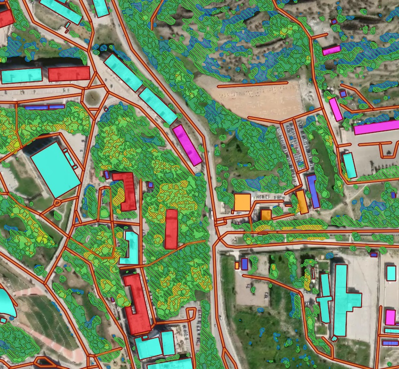

[multi] Buildings + Roads + Forest + Water
-------------------------------------------

This pipeline combines Buildings, Forest and Roads in a single workflow and returns the topology-corrected GeoJSON output. 

   
   Processing result sample for a combined scenario featuring Buidlings, Roads and Forest models.