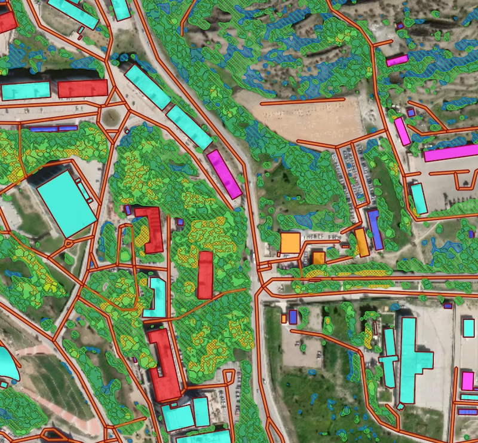

.. meta::
   :description: Run Buildings, Roads and Forest detection in a single Mapflow workflow and get one topology-corrected GeoJSON output.

[multi] Buildings + Roads + Forest
=====================================

This pipeline combines Buildings, Forest and Roads in a single workflow and returns the topology-corrected GeoJSON output. 

   
   Processing result sample for a combined scenario featuring Buidlings, Roads and Forest models.

.. tip::

   Looking to run this in production? See the `model catalog and deployment options <https://mapflow.ai/models>`_, or `request a custom model <https://mapflow.ai/custom-models>`_.
