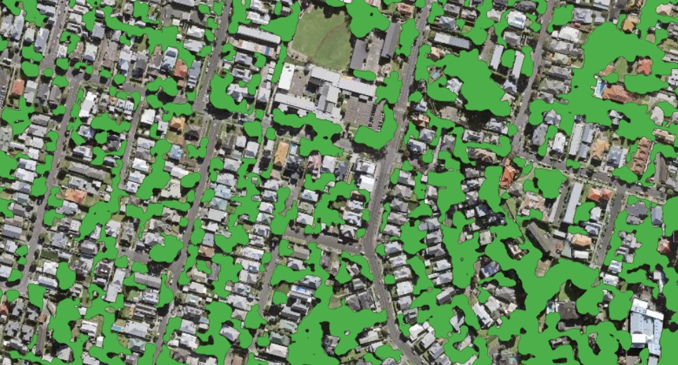
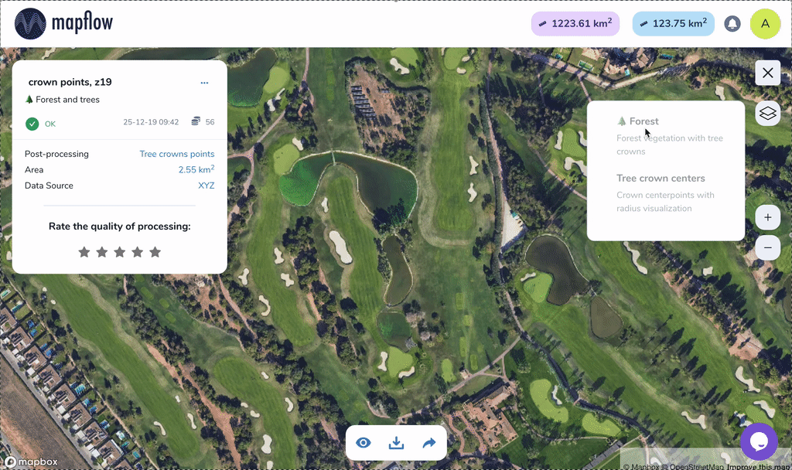
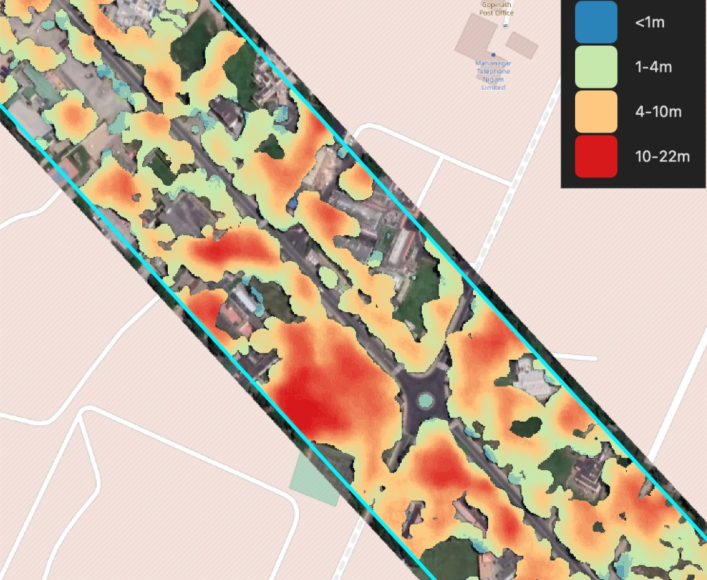

🌲 Forest and trees
====================

The model is trained on high-resolution data (0.6-0.3m) for different areas and climate zones.

The result includes all areas covered with tree and shrub vegetation, including sparse forest and shrublands.

Model resolution allows to detect small group of trees and narrow tree lines.

The model is robust to region change, and performs well in most environments, including urban. The image should be taken in active vegetation period, because leafless trees or vegetation covered with snow are not the target class.

**Latest model tags** |:label:|

:Version: 2026-07-03
:Geo Domain: Global
:Model method: Segmentation
:GSD / Map Zoom: 0.6–0.3 m / z18–19

   
   Sample of processing results for solid **Forest** mask

**Additional options:**

* *Height estimation* – forest mask classification by height classes
* *Tree crown polygons* - extracts tree crowns from forest vegetation as well as free-standing trees, provides them as polygons
* *Tree crown points* - extracts tree crowns from forest vegetation as well as free-standing trees, provides them as points

.. important::
   We recommend using the **Tree crown** options with 0.3m resolution imagery (~ 19 zoom) for the best results in case you need to detect individual trees.

.. _forest_classes:

.. note::
   Forest Height classification follows the following classes:

   * Shrubs lower than 4 meters;
   * Forest from 4 to 10 meters high;
   * Forest more than 10 meters high;

   This classification is used as a decision support for the vegetation management in powerline zones, etc. See the `professional solutions by Geoalert <https://geoalert.io/solutions/power>`_. The tresholds can be customized depending on the requirements.

**Processing results samples**

   
   Sample of results for **Tree crowns, points**

   Sample of results for **Forest with heights** mask (raster output)

Benchmarks - segmentation
----------------------------

Latest update — **🌲 Forest and trees v.2026-07-03** (Global, Segmentation).
The model was evaluated on a validation set of 6 areas of interest (AOI) against
manually annotated ground truth. Metrics are area-based: IoU is the intersection-over-union
of the predicted and ground-truth vegetation masks, and F1 / Precision / Recall are
computed on the overlapping mask area.

.. list-table::
   :widths: 32 14 12 14 14 14
   :header-rows: 1

   * - AOI (location)
     - Predicted features
     - IoU
     - F1
     - Precision
     - Recall
   * - Italy — Crotone
     - 254
     - 0.862
     - **0.926**
     - 0.944
     - 0.909
   * - Spain — Madrid
     - 368
     - 0.813
     - **0.897**
     - 0.880
     - 0.915
   * - Philippines — Balanga
     - 220
     - 0.806
     - **0.892**
     - 0.864
     - 0.923
   * - Spain — Velilla de San Antonio
     - 1070
     - 0.784
     - **0.879**
     - 0.894
     - 0.864
   * - Spain — Cuenca
     - 409
     - 0.763
     - **0.865**
     - 0.859
     - 0.872
   * - Spain — Rus
     - 249
     - 0.617
     - **0.763**
     - 0.699
     - 0.841
   * - **Global (mean of 6 AOIs)**
     - 2570
     - 0.774
     - **0.870**
     - 0.857
     - 0.887

*Area-based IoU / F1 / Precision / Recall measured against ground-truth vegetation masks; evaluation run 2026-07-03.
Compared with the previous version v.2025-06-14 (mean F1 0.501, IoU 0.395).*

.. seealso::

    📊 See :doc:`per-location benchmark details <forest_benchmark_2026-07-03>` for the
    area-by-area breakdown, including comparison with the previous version and prediction-vs-ground-truth overlays.