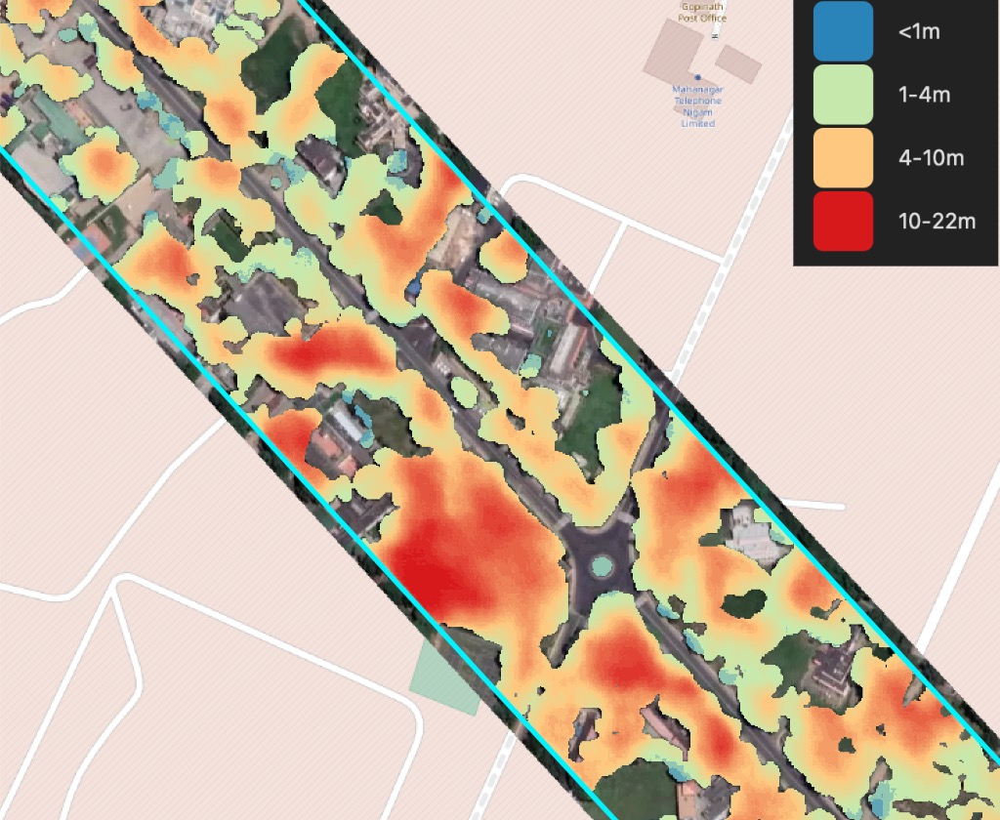

🌲 Forest and trees
----------------------

Forest Segmentation. The model is trained on high-resolution data (0.6 m) for different areas and climate zones.

The result includes all areas covered with tree and shrub vegetation, including sparse forest and shrublands.

Model resolution allows to detect small group of trees and narrow tree lines.

The model is robust to region change, and performs well in most environments, including urban. The image should be taken in active vegetation period, because leafless trees or vegetation covered with snow are not target class.

.. hint::
   This model can be used to speed up trees detection and area estimation in forest inventory assessment.

.. figure:: _static/processing_result/forest_model_3.jpg
   :alt: Processing result of forest model
   :align: center
   :width: 15cm
   :class: with-border no-scaled-link
   
   Sample of processing results for solid **Forest** mask

**Additional options:**

* *Heights* – Forest Segmentation follows the usual forest segmentation model, with additional separation of forest height classes.
* *Tree crowns* - extracts tree crowns from dense forest cover as well as free-standing trees.

Additionally we use models for density and height estimation, dividing the forested area into the following classes:

* Shrubs lower than 4 meters;
* Forest from 4 to 10 meters high;
* Forest more than 10 meters high;

.. hint::
   This model can be used as a decision support for the forest growth clearing. See the `professional solutions by Geoalert <https://geoalert.io/solutions/power>`_

**Processing results samples**

.. figure:: _static/processing_result/forest_tree_crowns_qgis.png
   :alt: Processing result of forest model (Tree crowns)
   :align: center
   :width: 15cm
   :class: with-border no-scaled-link
   
   Sample of results for **Tree crowns**

   
   Sample of results for **Forest with heights** mask (raster output)