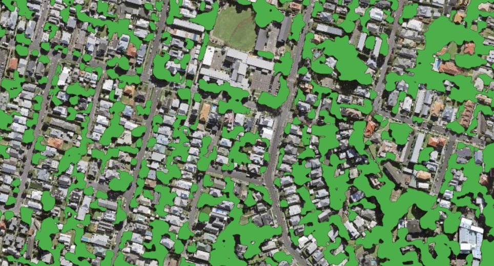

🌲 Forest
---------

Forest Segmentation. The model is trained on high-resolution data (0.6 m) for different areas and climate zones.

The result includes all areas covered with tree and shrub vegetation, including sparse forest and shrublands.

Model resolution allows to detect small group of trees and narrow tree lines.

The model is robust to region change, and performs well in most environments, including urban. The image should be taken in active vegetation period, because leafless trees or vegetation covered with snow are not target class.

.. hint::
   This model can be used to speed up trees detection and area estimation in forest inventory assessment.

   
   Sample of processing results for solid **Forest** mask