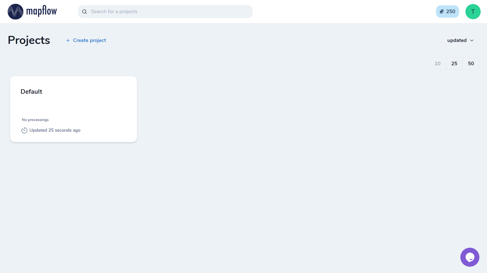
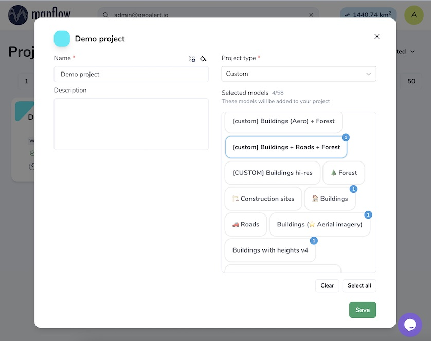
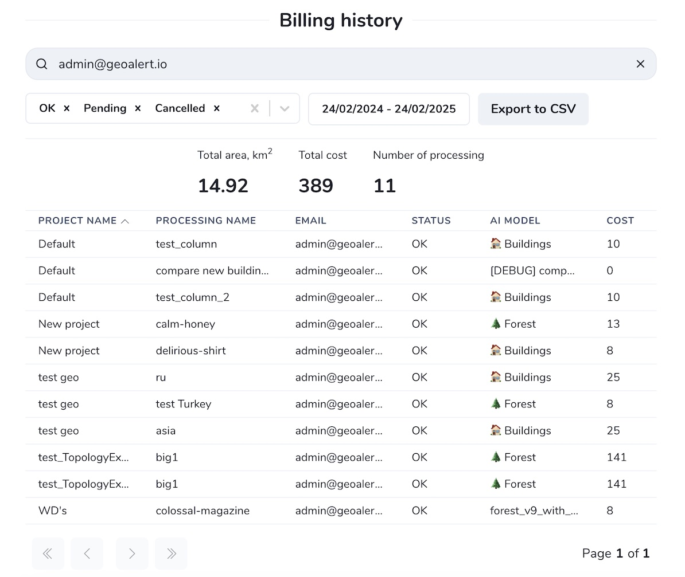
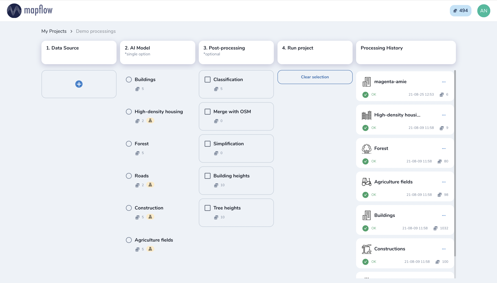
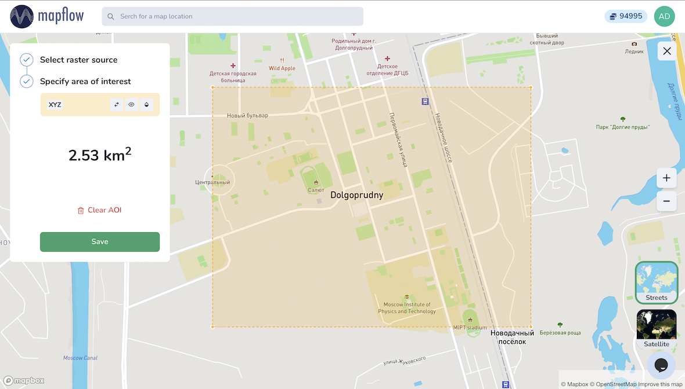

Mapflow - Get started
======================

Go to `Mapflow <https://app.mapflow.ai>`_ and register or login using your email. You can also use Google account to login.
Mapflow processes imagery and extracts vector objects from it. So as a user, you start processings, or as we would call it, AI- **mapping flows**.

Upon the registration, the *Default* project will be created automatically and you will be redirected to the main dashboard:

|

You can create as many projects as you want to organise your work and share the project access with your coworkers.

.. note::
  See about the Mapflow :ref:`Team accounts` to collaborate with other users. 👈

When starting a new project, you can set a name, customize icons, and modify a list of available AI-mapping workflows that are enabled in your project.

|

.. note::
  If your account is upgraded to the Premium or Custom – you might be able to customize your project mapping workflows and some of their options.

Mapflow My account
-----------------------

This section contains tabs for user account settings and services.

The following services are available here:

1. User info
^^^^^^^^^^^^^^^
* Fill in the user profile details
* Set up your preferred language from the available
* Enable email notifications (about the processing status, etc.)

2. Balance
^^^^^^^^^^^^^^^^
Top up your Mapflow account with :ref:`credits`.

3. Billing history
^^^^^^^^^^^^^^^^^^^^^^
Here you can see your processing history with the details. If you are a Team account owner, you can search through the history of the entire team processings. 
Use filters to sort by date and processing status. 
To filter by the custom parameters like user email or processing name - start typing in the search input.

|

.. note::
    You can export billing history as CSV.

4. Team
^^^^^^^^^^^^^
Create and manage your :ref:`Team accounts`.

5. My Imagery
^^^^^^^^^^^^^^^^^^^^^

Manage your :ref:`imagery collections <My imagery main>` that you can currently use in the :ref:`Maplfow QGIS plugin <My imagery qgis>`.

6. API
^^^^^^^^^^^
Obtain or reset your :ref:`Mapflow API` token.

How to run your AI mapping workflow in Web app
------------------------------------------------

Mapflow is designed to be intuitive. Here is our step-by-step user guide:

|

1. Data source
^^^^^^^^^^^^^^^

1.1. Select the raster source
"""""""""""""""""""""""""""""

.. image:: _static/select_provider.png
    :alt: Select provider
    :align: center
    :scale: 60
    :class: with-border no-scaled-link

|

.. _Imagery:

Imagery providers
~~~~~~~~~~~~~~~~~~
 
Here you can select one of the default providers:

  * `Mapbox Satellite <https://mapbox.com/maps/s satellite>`_ is a provider of global high resolution satellite imagery. The date of the image and updates cannot be chosen.

  * **"Global mosaic"** is a pilot version of mosaic of high res imagery (0.75–0.5 m/px) for year 2022. The preview is limited to zoom 12. Limited coverage for some countries. The mosaic is supposed to be updated annually. 

By request:

  * `ArcGIS World Imagery <https://www.arcgis.com/home/item.html?id=226d23f076da478bba4589e7eae95952>`_ is a provider of the global coverage composed of the high and medium resolution satellite imagery and the aerial imagery, hosted by ESRI. The frequency of updating images is 3-5 years. 
 
 .. hint::
    You can check the ArcGIS World Imagery metadata (date, resolution, and precision) by location. To do this, follow this `link <https://www.arcgis.com/apps/mapviewer/index.html?layers=10df2279f9684e4a9f6a7f08febac2a9>`_, zoom in, choose the point on the map and click.

    .. image:: _static/image_metadata.png
        :alt: Search image metadata
        :align: center
        :class: with-border

.. important::

    Data providers are the TMS / XYZ data streaming services that can be connected to Mapflow to enable the instant imagery analysis and AI mapping.
    Under the Mapflow commercial plans, we provide commercial providers access, a services that provide basemaps and imagery updates on the specific terms. We are continuosly working on adding more commercial providers.
    For more detail about the Imagery providers cost see :ref:`Mapflow prices <credits>`.

Custom URL
~~~~~~~~~~~~~

This tab allows you to:

 * Specify the XYZ link to the source of the images. The link is automatically checked for validity (for example, :ref:`Openaerialmap <Openaerialmap>` - ``https://apps.kontur.io/raster-tiler/oam/mosaic/{z}/{x}/{y}.png``);
 * When adding you custom tile service it might be needed to define Y position: XYZ (top left), TMS/WMTS (bottom left);
 * Set source image coordinate reference system (espg:3857 or espg:3395);
 * Reset all entered custom parameters;
 ..  * Set the scale (Zoom), which will be processed. All Mapflow models have their recommended input resolution (see on the page :doc:`Model description <pipelines>`), but sometimes it can be useful to play around with the scales and compare the results;

.. _upload-geotiff-section:

Upload GeoTIFF
~~~~~~~~~~~~~~~~~~

 Here you can upload your own image in GeoTiff format.

.. warning::
    Currently, a preview of the uploaded image is not possible after loading the image, you will see only the area of its extent.
    
The processing AOI must be located in the area of this extent, otherwise the area will be cut off by the extent boundaries. The processing area is calculated by the intersection of the image extent and the AOI. If the AOI doesn't intersect the image boundaries the error will pop up.

Image upload requirements (free plan):

  - The file size must be less than 1 Gb
  - Both sides image dimensions must not exceed 30.000x30.000 pixels
  - The image must be georeferenced and the CRS must be one of:
    - WGS84 (EPSG: 4326)
    - Web mercator (EPSG: 3857)
    - `UTM <https://proj.org/operations/projections/utm.html?highlight=utm>`_ (any zone)
    

.. hint::
    If your image doesn't meet the params above, we suggest to use :doc:`Mapflow API <../api/processing_api>` / :doc:`QGIS plugin <../api/qgis_mapflow>` which have more capabilities. There you can also use our new :ref:`My imagery main` tool for storing and processing multiple images. Mapflow supports RGB imagery and also process single-band (panchromatic) imagery, but the AI models are not tuned for such kind of data, so the quality of the result may be worse than expected.
    

1.2. Specify the area of interest
"""""""""""""""""""""""""""""""""

|

This tab is used to add a processing area. The user can draw the area using *Draw rectange* / *Draw polygon* tool or download it in GeoJSON format (draw and download, as well as view the data structure, follow this link - `geojson.io <http://geojson.io/>`_).

About *Draw Polygon* tool:

There may be confusion when drawing AOI using this tool, however, everything is quite simple. The area in this case is calculated not by the polygon, but by the **Bounding Box** (`Bbox <https://en.wikipedia.org/wiki/Minimum_bounding_box>`_). Therefore, a warning ``MAX BBOX 100 KM²`` appears in the example below (bounding box is highlighted with yellow hatching):

.. image:: _static/bbox_explanation.png
  :alt: Bounding Box
  :align: center
  :width: 15cm
  :class: with-border no-scaled-link  

|

.. attention::
  Be aware that for now, only a single area can be drawn or uploaded per processing. If your GeoJSON file has multiple areas within its FeatureCollection, only the first one will be used. If you want to process multiple AOIs, you can split them into separate GeoJSON files and start processing for each one separately. Multiply AOI processing is supported in :doc:`Mapflow – QGIS <qgis_plugin>`  and API and will become available in the Web app next releases. Other spatial data formats may also be supported for upload in the future, although we recommend using GeoJSON since it is a de-facto standard in a web mapping. It is natively supported by web mapping frameworks  (e.g. `Leaflet <https://leafletjs.com/>`_ or `Mapbox <https://docs.mapbox.com/mapbox.js/>`_) and GIS like `QGIS <https://qgis.org/>`_ or the ArcGIS Suite.

2. AI model
^^^^^^^^^^^

Select one of the AI models (see :doc:`Model description <pipelines>`).

.. note::
  You can manage a set of models linked to a project (click the |edit| button on the project card):

  .. figure:: _static/link_unlink_wd.png
    :align: center
    :width: 13cm
    :class: with-border

|

3. Post-processing options
^^^^^^^^^^^^^^^^^^^^^^^^^^

In this step, you can select additional processing options. Different AI models have their own options.

AI model "🏠 Buildings":

* *Classification* - we currently recognize the following building types: apartment buildings, single-household dwellings, industrial, commercial, other non-residential (see :doc:`../um/classes`).
* *Merge with OSM* - compare the results with the buildings in OpenStreetMap and, if a sufficient overlap has been found, use the ones from the OSM instead.
* *Simplification* - simplification and polygonization of building contours.
.. * *Building heights* - for each building, we estimate its height using its wall's and shadow's length. If this option is selected, all roof contours will be shifted in accordance with their height, i.e. converted to footprints.

.. ..  important::
..   **Building heights** option requires a minimum area of 50 sq.km.

AI model "🌲 Forest":

* *Heights* - classifies vegetation by height: by default 0-4 m for shrub ("low vegetation"), 4-10 m for regular forest ("medium forest"), 10+ m for area with tall trees ("high forest"). Clasification is done per vegetated area, and not per single tree (see `Forest Mapping classes <https://docs.mapflow.ai/forest/classes.html>`_).

4. Run the processing
^^^^^^^^^^^^^^^^^^^^^^

At this step, you can set the name of your processing or use the initially generated one (the button allows you to generate variants of the name).

The "Start processing" will start processing.

The "Clear Selection" will clear the previously selected processing parameters.

.. attention::
   Once you have selected the model and the processing parameters, you will see the total cost of your processing counted in Mapflow credits (our local currency units). Upon registration, you receive 250 credits for free for testing the platform (See the :doc:`Mapflow credits <prices>`).

View the results
----------------

In the "Processing history" you see the progress of processing as well as view and get the processing results.
Each running processing displays the selected model, the status, the creation date and the processing cost.

View on the map
^^^^^^^^^^^^^^^^^

After the successful processing completion, the card can be opened to view more detailed information about the processing parameters - AI Model, Post-processing, Area, Data Source.

 .. image:: _static/processing_card.png
     :alt: Processing card
     :align: center
     :width: 8cm
     :class: with-border no-scaled-link 

Click the "View on the Map" to quickly view the processing result on the built-in interactive map.

 .. figure:: _static/preview_map.png
     :alt: Preview results
     :align: center
     :width: 18cm
     :class: with-border

Feature attributes
^^^^^^^^^^^^^^^^^^

Depending on the model and the options applied the extracted features might contain the semantic information that is written in the feature properties in GeoJSON.

 .. figure:: _static/feature_attr.png
     :alt: Preview results
     :align: center
     :width: 18cm
     :class: with-border

E.g. "Buildings" model with "simplification" and "classification" options:

.. list-table::
   :widths: 10 20
   :header-rows: 1

   * - PROPERTY
     - DESCRIPTION
   * - Area
     - Feature area in meters
   * - Class_id
     - Buildings typology (see the :doc:`../um/classes`)
   * - Shape_type
     - The geometry primitive depending on the polygonization algorithm that's been applied to the feature mask
   * - Processing_date
     - The date of the processing completion
   * - Simplification_score
     - The score is counted by the intersection of the pixel feature and polygonized feature. The higher score - the closer polygonized feature to the pixel one.

Rate the processing
^^^^^^^^^^^^^^^^^^^

.. important::
 We encourage you to rate the processing results. ⭐️⭐️⭐️ Your assessment is important for further improvement of the Mapflow AI models. We review all the user's feedback and get back to you if any issues.
   .. figure:: _static/animation_rate.gif
     :alt: Rate your processing
     :align: center
     :width: 15cm
     :class: with-border

Share the results
^^^^^^^^^^^^^^^^^^^^

You can share your project with the external users for the view-only access. Go to the Project -- Share and enter the Mapflow user's email.

 .. figure:: _static/project_share/read-only.jpg
     :alt: Share project externally
     :align: center
     :width: 15cm
     :class: with-border
|

.. note::
  To upgrade project sharing rights and provide your collaborators with the editor's access you need to switch to the :ref:`Team accounts`

Interact with the processing results
^^^^^^^^^^^^^^^^^^^^^^^^^^^^^^^^^^^^

The Processing menu includes the items as follows:

 .. figure:: _static/additional_parameters.png
     :alt: Additional parameters
     :align: center
     :width: 8cm
     :class: with-border

- Click "Duplicate" on an existing processing to use its parameters as a starting point for a new one (on restart with the same parameters, new processing is started).
- Click "Source details" on the existing processing to view information about source details and AOI.

.. tip::
 If you want to duplicate processing to change some params, like choosing another AI mapping model for the same AOI - use Duplicate

1. Download GeoJSON.

Allows to download results as a file in GeoJSON format.

.. warning::
   This option is not available in the free plan. Only paying users (see `pricing <https://mapflow.ai/pricing>`_) can use this option.

2. "Open with geojson.io" - view the results in the browser using `geojson.io <http://geojson.io/#data=data:application/json,%7B%22type%22%3A%20%22Polygon%22%2C%20%22coordinates%22%3A%20%5B%20%5B%20%5B%2037.490057513654946%2C%2055.923029653520395%20%5D%2C%20%5B%2037.490057513654946%2C%2055.949815087874605%20%5D%2C%20%5B%2037.543082024840288%2C%2055.949815087874605%20%5D%2C%20%5B%2037.543082024840288%2C%2055.923029653520395%20%5D%2C%20%5B%2037.490057513654946%2C%2055.923029653520395%20%5D%20%5D%20%5D%7D>`_.

.. tip::
 The geosjon.io app allows you to save the results in a different GIS-compatible format (CSV, KML, TopoJSON, WKT, Shapefile). Just click "Save" and select the format of your preference in the menu bar.

.. image:: _static/geojson.io.png
   :name: Preview map
   :align: center
   :width: 15cm

|

3. "Open with `kepler.gl <https://kepler.geoalert.io/>`_" - view the results using this embedded app. It is a simple but powerful tool for geospatial data visualization and analysis.

 .. image:: _static/kepler_gl.png
   :alt: Preview map
   :align: center
   :width: 15cm

You can find detailed information about Kepler.gl in their `user manual <https://docs.kepler.gl/docs/user-guides/j-get-started>`_.

Working with API
-----------------

Mapflow provides a REST API which, for example, allows you to query for currently running flows and fetch the results.
If you are developing an application and want to use our API, - check out :doc:`../api/processing_api`.

.. important::
  You must follow the requirements specified with :ref:`Model requirements` when uploading your own images for processing through the API of the Mapflow platform. Send a request using data preprocessing to help@geoalert.io.

 .. image:: _static/api_tab.png
   :alt: Preview map
   :align: center
   :width: 8cm
   :class: with-border no-scaled-link 

