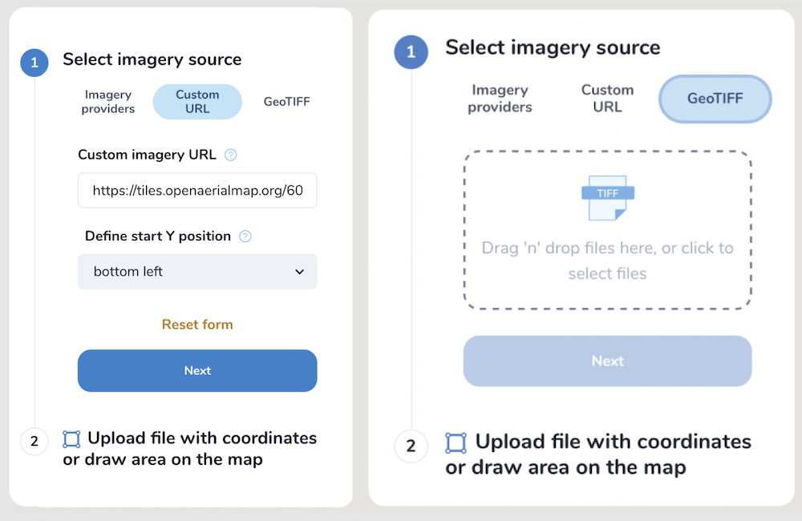

Mapflow - Get started
======================

Go to `Mapflow <https://app.mapflow.ai>`_ and register or login using your Google account.
Mapflow processes imagery and extracts vector objects from it. So as a user, you start processings, or as we call it, **flows**.

How to run your AI mapping in Web app
---------------------------------------

Mapflow is designed to be intuitive. Here is our step-by-step user guide:

 .. image:: _static/ui_flow_basic.png
    :alt: UI Mapflow – run a flow
    :align: center
    :width: 18cm

1. Data source
^^^^^^^^^^^^^^^

1.1. Select the raster source
"""""""""""""""""""""""""""""

|

.. _Imagery basemaps:

Imagery providers
~~~~~~~~~~~~~~~~~~

 Here you can select one of the default providers:

 * `Mapbox Satellite <https://mapbox.com/maps/s satellite>`_ is a provider of global high resolution satellite imagery. The date of the image and updates cannot be chosen.
 * `World Imagery <https://www.arcgis.com/home/item.html?id=226d23f076da478bba4589e7eae95952>`_ is a provider of full coverage of the whole world with high and medium resolution satellite and aerial imagery by ESRI. The frequency of updating images is 3-5 years. 
 
 .. hint::
    You can chack the World Imagery metadata (date, resolution, and precision) by location. To do this, follow this `link <https://www.arcgis.com/apps/mapviewer/index.html?layers=10df2279f9684e4a9f6a7f08febac2a9>`_, zoom in, choose the point on the map and click.

    .. image:: _static/image_metadata.png
        :alt: Search image metadata
        :align: center
        :width: 15cm
        :class: with-border

To read more about satellite images check :ref:`Satellite imagery`

Custom URL
~~~~~~~~~~~~~

The interface of this tab allows you to:

 * Specify the XYZ link to the source of the images. The link is automatically checked for validity (for example, OpenStreetMap - https://tile.openstreetmap.org/{z}/{x}/{y}.png);
 * Define start Y position: XYZ, TMS - top left, WMTS - bottom left. An example of such an open source that supports TMS/WMAT is `OpenAeriaMap <https://map.openaerialmap.org>`_, where you can select a specific satellite image and copy its link in TMS/WMTS format (see example `here <https://geoalert.medium.com/картирование-с-использованием-снимков-с-бпла-в-mapflow-ai-73d98c048c2f>`_);
 * Set the scale (Zoom), which will be processed. All Mapflow models have their recommended input resolution (see on the page :doc:`Model description <pipelines>`), but sometimes it can be useful to play around with the scales and compare the results;
 * Set source image coordinate reference system (espg:3857 or espg:3395);
 * Reset all entered custom parameters;
 * Return to default Imagery providers.

Upload GeoTIFF
~~~~~~~~~~~~~~~~~~

 Here you can upload your own image in GeoTiff format.

.. warning::
    Currently, a preview of the uploaded image is not possible after loading the image, you will see only the area of its extent.
    
The processing AOI must be located in the area of this extent, otherwise the area will be cut off by the extent boundaries. The processing area is calculated by the intersection of the image extent and the AOI.

   Image upload capabilities:

  - The uploaded images must have the area of more than 1 sq.km.
  - The file size must be less than 512 mb.
  - Both sides image dimensions must not exceed 30.000x30.000 pixels
  - The image must be georeferenced and the CRS must be one of:
    - WGS84 (EPSG: 4326)
    - Web mercator (EPSG: 3857)
    - `UTM <https://proj.org/operations/projections/utm.html?highlight=utm>`_ (any zone)
    

.. hint::
    If your image doesn't meet the parameters above, we suggest to use :doc:`Mapflow API <../api/processing_api>` / :doc:`QGIS plugin <../api/qgis_mapflow>` which have more capabilities.
    
Mapflow supports RGB imagery and also process single-band (panchromatic) imagery, but the NN models are not tuned for such kind of data, so the quality of the result may be worse than expected.

1.2. Specify the area of interest
"""""""""""""""""""""""""""""""""

|

This tab is used to add a processing area. The user can draw the area using *Draw rectange* / *Draw polygon* tool or download it in GeoJSON format (draw and download, as well as view the data structure, follow this link - `geojson.io <http://geojson.io/>`_).

.. attention::
  Be aware that for now, only a single area can be drawn or uploaded per processing. If your GeoJSON file has multiple areas within its FeatureCollection, only the first one will be used. If you want to process multiple AOIs, you can split them into separate GeoJSON files and start processing for each one separately. Batch processing may become available in the future releases. Other spatial data formats may also become available for upload in the future, although we recommend using GeoJSON since it is a de-facto standard in web mapping. It is natively supported by web mapping frameworks  (e.g. `Leaflet <https://leafletjs.com/>`_ or `Mapbox <https://docs.mapbox.com/mapbox.js/>`_) and GIS like `QGIS <https://qgis.org/>`_ or the ArcGIS Suite.

2. AI model
^^^^^^^^^^^

Select one of the AI models (see :doc:`Model description <pipelines>`).

3. Post-processing options
^^^^^^^^^^^^^^^^^^^^^^^^^^

In this step, you can select additional processing options. Different AI models have their own options.

AI model "Buildings":

* *Classification* - we currently recognize the following building types: apartment buildings, single-household dwellings, industrial, commercial, other non-residential (see `Urban Mapping classes <../um/classes>`_).
* *Merge with OSM* - compare the results with the buildings in OpenStreetMap and, if a sufficient overlap has been found, use the ones from the OSM instead.
* *Simplification* - simplification and polygonization of building contours.
* *Building heights* - for each building, we estimate its height using its wall's and shadow's length. If this option is selected, all roof contours will be shifted in accordance with their height, i.e. converted to footprints.

.. important::
  **Building heights** option requires a minimum area of 50 sq.km.

AI model "Forest with heights" – classification by heights is currently available only in :doc:`Mapflow for QGIS and API <../api/qgis_mapflow>`:

* Classifies vegetation by height: by default 0-4 m for shrub ("low vegetation"), 4-10 m for regular forest ("medium forest"), 10+ m for area with tall trees ("high forest"). Clasification is done per vegetated area, and not per single tree (see `Forest Mapping classes <https://docs.mapflow.ai/forest/classes.html>`_).

4. Run the processing
^^^^^^^^^^^^^^^^^^^^^^

At this step, you can set the name of your processing or use the initially generated one (the button allows you to generate variants of the name).

The "Start processing" will start processing.

The "Clear Selection" will clear the previously selected processing parameters.

.. attention::
  Once you have selected the model and the processing parameters, you will see the total cost of your processing counted in Mapflow credits (our local currency units). Upon registration, you receive 250 credits for free for testing the platform (See the :doc:`Mapflow credits <prices>`).

View the results
----------------

In the "Processing history" you see the progress of processing as well as view and get the processing results.
Each running processing displays the selected model, the status, the creation date and the processing cost.

View on the map
^^^^^^^^^^^^^^^^^

After the successful processing completion, the card can be opened to view more detailed information about the processing parameters - AI Model, Post-processing, Area, Data Source.

 .. image:: _static/processing_card.png
     :alt: Processing card
     :align: center
     :width: 8cm
     :class: with-border no-scaled-link 

Click the "View on the Map" to quickly view the processing result on the built-in interactive map.

 .. image:: _static/preview_map.png
     :alt: Preview results
     :align: center
     :width: 18cm

Feature attributes
^^^^^^^^^^^^^^^^^^

Depending on the model and the options applied the extracted features might contain the semantic information that is written in the feature properties in GeoJSON.

 .. image:: _static/feature_attr.png
     :alt: Preview results
     :align: center
     :width: 18cm

E.g. "Buildings" model with "simplification" and "classification" options:

.. list-table::
   :widths: 10 20
   :header-rows: 1

   * - PROPERTY
     - DESCRIPTION
   * - Area
     - Feature area in meters
   * - Class_id
     - Buildings typology (see the :doc:`../um/classes`)
   * - Shape_type
     - The geometry primitive depending on the polygonization algorithm that's been applied to the feature mask
   * - Processing_date
     - The date of the processing completion
   * - Simplification_score
     - The score is counted by the intersection of the pixel feature and polygonized feature. The higher score - the closer polygonized feature to the pixel one.

Rate the processing
^^^^^^^^^^^^^^^^^^^

.. important::
 We encourage you to rate the processing results. ⭐️⭐️⭐️ Your assessment is important for further improvement of the Mapflow AI models. We review all the user's feedback and get back to you if any issues.

Interact with the processing results
^^^^^^^^^^^^^^^^^^^^^^^^^^^^^^^^^^^^

The Processing menu includes the items as follows:

 .. image:: _static/additional_parameters.png
     :alt: Additional parameters
     :align: center
     :width: 8cm

- Click "Duplicate" on an existing processing to use its parameters as a starting point for a new one (on restart with the same parameters, new processing is started).
- Click "Source details" on the existing processing to view information about source details and AOI.

.. tip::
 If you want to duplicate processing to change some params, like choosing another AI mapping model for the same AOI - use Duplicate

1. Download GeoJSON.

Allows to download results as a file in GeoJSON format.

.. warning::
   This option is not available in the free plan. Only paying users (see `pricing <https://mapflow.ai/pricing>`_) can use this option.

2. "Open with geojson.io" - view the results in the browser using `geojson.io <http://geojson.io/#data=data:application/json,%7B%22type%22%3A%20%22Polygon%22%2C%20%22coordinates%22%3A%20%5B%20%5B%20%5B%2037.490057513654946%2C%2055.923029653520395%20%5D%2C%20%5B%2037.490057513654946%2C%2055.949815087874605%20%5D%2C%20%5B%2037.543082024840288%2C%2055.949815087874605%20%5D%2C%20%5B%2037.543082024840288%2C%2055.923029653520395%20%5D%2C%20%5B%2037.490057513654946%2C%2055.923029653520395%20%5D%20%5D%20%5D%7D>`_.

.. tip::
 The geosjon.io app allows you to save the results in a different GIS-compatible format (CSV, KML, TopoJSON, WKT, Shapefile). Just click "Save" and select the format of your preference in the menu bar.

.. image:: _static/geojson.io.png
   :name: Preview map
   :align: center
   :width: 15cm

|

3. "Open with `kepler.gl <https://kepler.geoalert.io/>`_" - view the results using this embedded app. It is a simple but powerful tool for geospatial data visualization and analysis.

 .. image:: _static/kepler_gl.png
   :alt: Preview map
   :align: center
   :width: 15cm

You can find detailed information about Kepler.gl in their `user manual <https://docs.kepler.gl/docs/user-guides/j-get-started>`_.*

Team accounts
-------------

Users can run a Team account to invite collaborators and set up Mapflow limits.
Currently, you need to reach out to us to create a Team and assign an Owner role to your existing Mapflow account.
Once the Team is created the Owner can invite new members, and assign and manage their limits. Only the Owner gets access to the Team profile.

.. image:: _static/team_accounts.png
   :alt: Preview map
   :align: center
   :width: 15cm

|

.. warning::
    If the members' email is already registered as a Mapflow account, the Team Owner should reach out to Support (help@geoalert.io) to ask to link the account.

Working with API
-----------------

Mapflow provides a REST API which, for example, allows you to query for currently running flows and fetch the results.
If you are developing an application and want to use our API, - check out :doc:`../api/processing_api`.

.. important::
  You must follow the requirements specified with :ref:`Model requirements` when uploading your own images for processing through the API of the Mapflow platform. Send a request using data preprocessing to help@geoalert.io.

The service uses the **Basic Auth** authorization type - use the API token, which must be generated in the `api tab <https://app.mapflow.ai/account/api>`_ of the profile settings.

 .. image:: _static/api_tab.png
   :alt: Preview map
   :align: center
   :width: 8cm
   :class: no-scaled-link 

