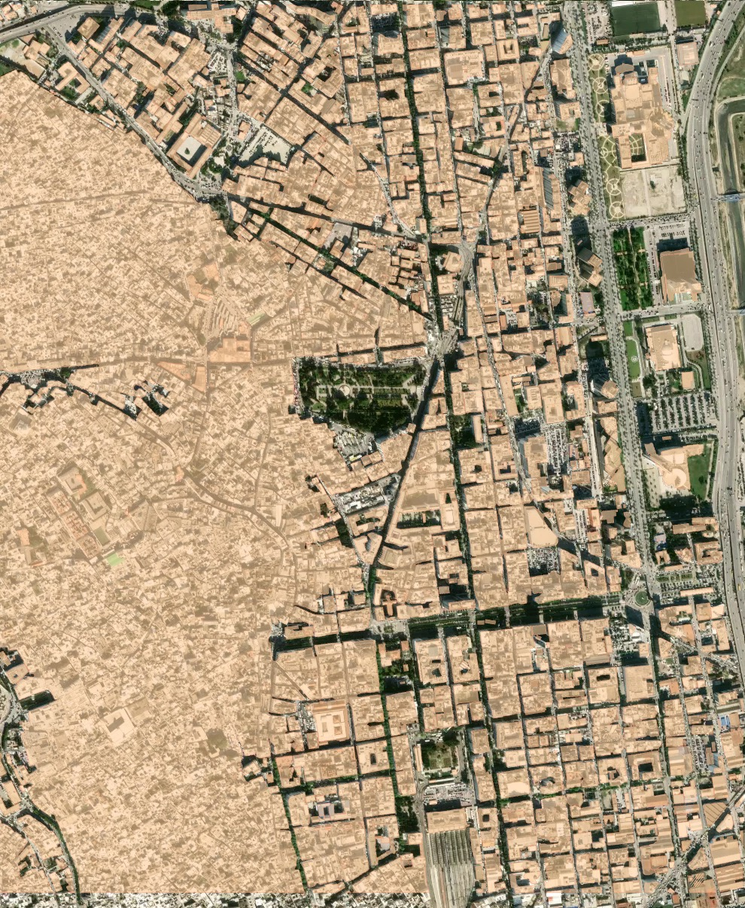
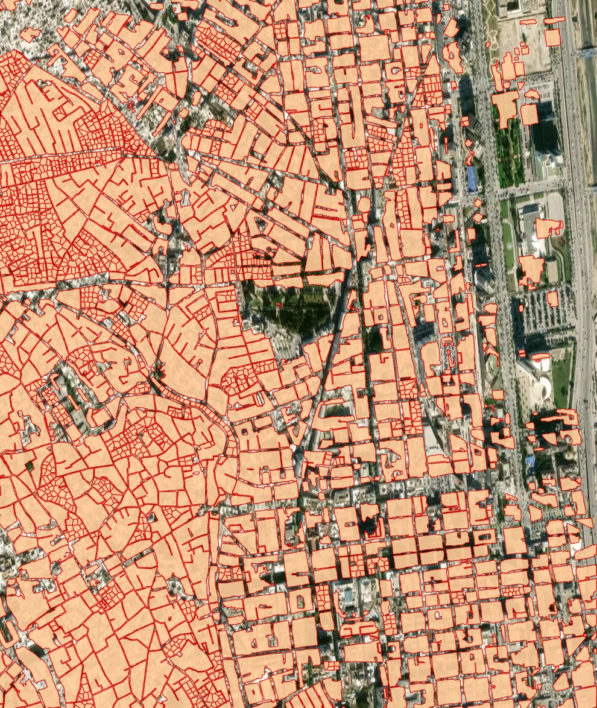

🏘 High-density housing (Mapflow Web)
-------------------------------------------

Our “high-density housing” AI model is designed for areas with terraced or otherwise densely built buildings, common in the Middle East, parts of Africa, etc. This model, just like the regular building model, detects the building roofs.

Firstly, the building blocks are segmented as a whole, and then each block is attempted to be devided into individual houses based on the detection of individual roof markers with rectangular grid or Voronoi diagram.

Processing result sample for dense urban development area (Tunisia, Africa):

   
   HD buildings model, no post-processing options

   
   HD buildings model, instance segmentation and post-processing with grid options