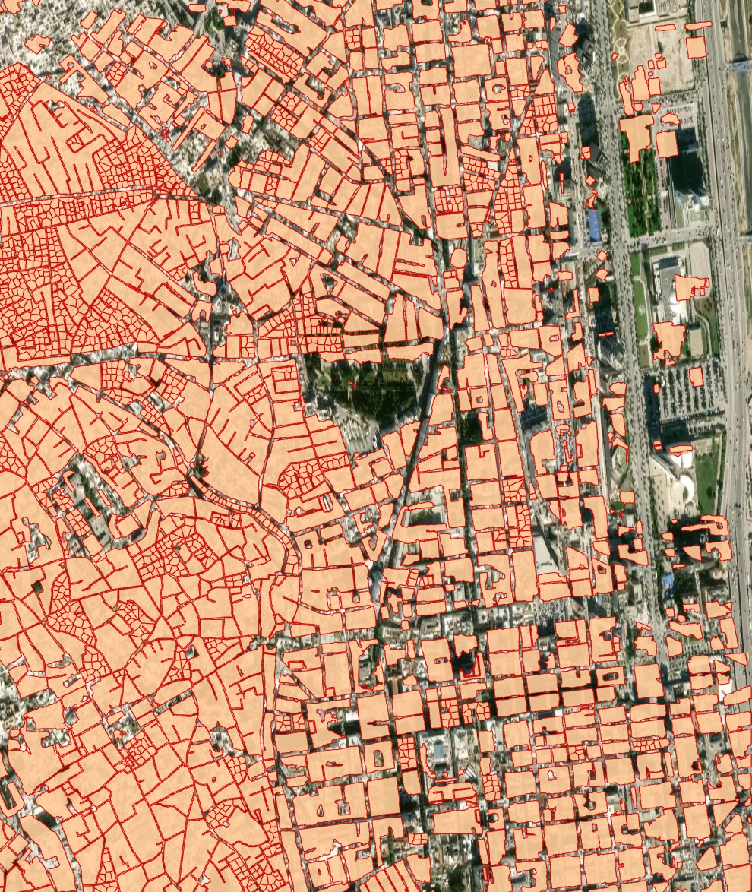

.. meta::
   :description: Detect building roofs in terraced and densely built areas typical of the Middle East and Africa. Available as a custom Mapflow model on request.

🏘 High-density housing (CUSTOM)
---------------------------------

.. note::
   This model has been deprecated as default one and moved to custom. it's available only by request.

The “high-density housing” AI model is designed for areas with terraced or otherwise densely built buildings, common in the Middle East, parts of Africa, etc. This model, just like the regular building model, detects the building roofs.
Firstly, the building blocks are segmented as a whole, and then each block is attempted to be devided into individual houses based on the detection of individual roof markers with rectangular grid or Voronoi diagram.

Processing result sample for dense urban development area (Tunisia, Africa):

   
   High-density buildings model, instance segmentation and post-processing with grid options

.. tip::

   Looking to run this in production? See the `model catalog and deployment options <https://mapflow.ai/models>`_, or `request a custom model <https://mapflow.ai/custom-models>`_.
