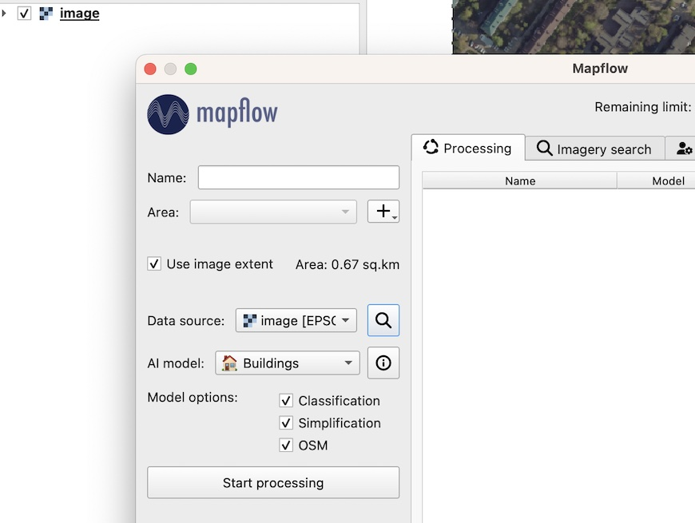
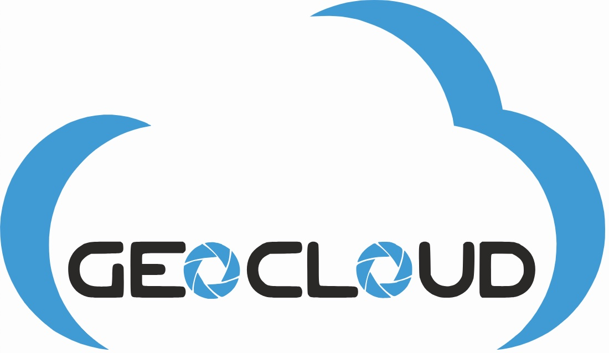
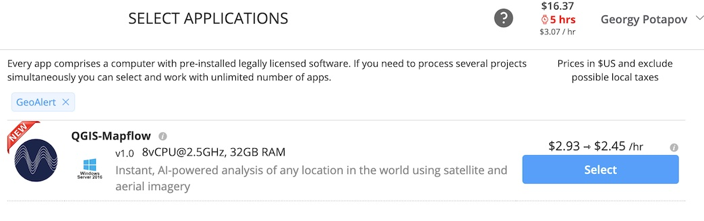
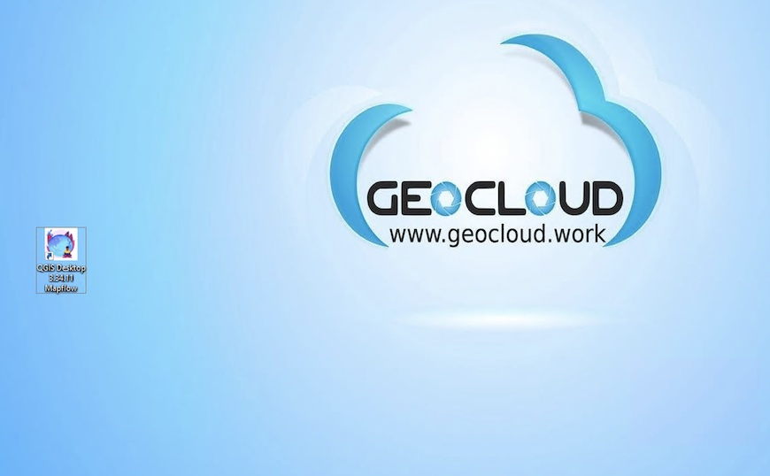

.. _howto:

Userguides - How To 🙋‍♂️
=========================

.. _oauth2_setup:

How to log in using OAuth2
---------------------------

.. include:: oauth2_setup.rst

.. How to change the data type of your image to Uint8 bit in QGIS
.. --------------------------------------------------------------

.. 1. Check the data type of your image. 
.. Right-click on the imagery layer - i - Information from provider. The Data type must be Byte. Follow the next steps if the Data type is Int16, Float 32 etc.

    
..     .. figure:: _static/information.png

  

.. 2. Right click on your image Layer Properties -  Symbology tab, then customize the display of your image. Select desired channels for Band rendering, adjust brightness and contrast. 
      
    
..     .. figure:: _static/symbology.png

.. 3. Right-click on the layer’s name, go to the  Export in the context menu, Save as…

 
..     .. figure:: _static/export.png
    

.. 4. Check Output mode as Rendered Image

..     .. figure:: _static/save_raster.png
    

.. 5. Save your image  - navigate to the desired folder, input the file name then click OK

.. 6. Use the new image layer as Imagery source when using the Mapflow plugin for QGIS

.. _qgis_plugin:

.. include:: qgis_plugin.rst

How to process your own UAV images with Mapflow
--------------------------------------------------

Unmanned aerial vehicles – UAVs or, more commonly, drones – have become a deeply integrated part of the geomatic industry over the last ten years. This is owing to their increasing usability, falling hardware costs, and easing government regulations. Yet, as more data is available with UAV surveys, more data need to be processed operatively. 
To process your UAV data you might be looking for some cloud or desktop software to create a mosaic or orthophoto.  Do you know that you can easily publish your data with Openaerialmap and analyze (say detect and calculate some objects and calculate their areas) with Mapflow QGIS or Mapflow Web? 

Let’s take the “UAV buildings” :doc:`buildings_aerial_imagery_model` model that extracts the detailed building outlines (the recommended image resolution is 10 cm).

Upload images to Mapflow Web
~~~~~~~~~~~~~~~~~~~~~~~~~~~~

1. Select raster source – you can either use Custom URL (see below how to publish your image with Openaerialmap and get the TMS link) or upload your image as GeoTIFF.

.. figure:: _static/select_provider_2.png
            :align: center
            :class: with-border
            :scale: 50

|

.. warning::

    *Currently, a preview of the uploaded image is not possible after loading the image, you will see only the area of its extent.*

2. Define the processing Area.
The processing area (AOI) must be located within the area of the image extent, otherwise, the area will be cut off by the extent boundaries. The processing area size is calculated by the intersection of the image extent and the AOI.

.. important::

    Image upload requirements:
    The file size must be less than 1 Gb. Both sides image dimmesions must not exceed 30.000x30.000

    The image must be georeferenced and the CRS must be one of:
    * WGS84 (EPSG: 4326)
    * Web mercator (EPSG: 3857)
    * UTM (any zone)

    If your image doesn’t meet the parameters, we suggest using Mapflow API / QGIS plugin which has more capabilities.
    Mapflow supports RGB imagery and also processes single-band (panchromatic) imagery, but the AI models are not tuned for such kind of data, so the quality of the result may be worse than expected.

Upload images with Mapflow – QGIS
~~~~~~~~~~~~~~~~~~~~~~~~~~~~~~~~~~~~

You can upload your own GeoTIFF (up to 1 GB, max. 30000x30000 px. by default). All raster layers loaded in your QGIS (1) are visible in the drop-down list (2) and can be selected for upload. 

.. important::

    Please, consider the requirements for :ref:`AI Models <Model requirements>` when uploading your own images. 
    Contact us if you have difficulties to handle a large dataset or your file size exceeds our limits.

How to use external data providers in Mapflow
--------------------------------------------------

.. _oae:

Use Openaerialmap as an imagery publication and access service
~~~~~~~~~~~~~~~~~~~~~~~~~~~~~~~~~~~~~~~~~~~~~~~~~~~~~~~~~~~~~~~

`OpenAerialMap <https://openaerialmap.org/>`_ is an open collection of UAV imagery data, crowdsourced by users. The project is supported by a consortium of companies developing open source software and services for working with spatial data.
As soon as your aerial image is published on OpenAerialMap it's presented on the public map and can be fetched using TMS/WMTS protocols.

Select the image and copy link to TMS to connect it to Mapflow Custom URL.

  .. figure:: ../api/_static/qgis/search_openaerialmap_image.jpg
         :alt: Search for imagery in OpenAerialMap 
         :align: center
         :width: 15cm
         :class: with-border no-scaled-link 
    
1. Copy link to TMS and paste it into the “Custom imagery URL” in your new Mapflow processing. 
2. Check if you see the image on the map, go through the next steps (AI model, processing params) to and start the processing.

..note::
    Your can use this service to publish your own UAV data (note that it will become publicly accessible). 
    As soon as your aerial image is published on Openaerialmap it’s displayed on the public map and can be connected using TMS/WMTS or downloaded as GeoTIFF file. 
    Both ways are OK to work with Mapflow.

.. _Nearmap_:

Use Nearmap as an imagery provider
~~~~~~~~~~~~~~~~~~~~~~~~~~~~~~~~~~~~

`Nearmap <https://nearmap.com>`_ provides access to its Vertical and Panorama Imagery via a Tile API. If you have a subscription to their service you can use it easily with Mapflow Custom URL. 

URL format:

``https://api.nearmap.com/tiles/v3/{tileResourceType}/{z}/{x}/{y}.{format}?apikey={YOUR_API_KEY}``

Find more in the Nearmap `API documentation <https://help.nearmap.com/kb/articles/84-tile-api>`_.

    .. figure:: _static/nearmap_custom_url.jpg
        :align: center
        :width: 15cm
        :class: with-border

How to optimize large image files
------------------------------------

Preparing and optimizing the large size images
~~~~~~~~~~~~~~~~~~~~~~~~~~~~~~~~~~~~~~~~~~~~~~~~~~~~~~~~

Here are few tips on how to prepare and optimize your data and reduce the image size to upload it faster and not to exceed the Mapflow upload limit.

Usually UAV image is an RGB compiosite provided as GeoTIFF of 16 or 8 bit. 
The data type will be automatically converted to 8 bit on the side of the Mapflow.
Alternatively: use the `preprocessing script <https://github.com/Geoalert/mapflow_data_preprocessor/>`_ for preparing your image for Mapflow processing.

You can reduce the size of the image using GDAL translate. (https://gdal.org/)
E.g. using JPEG compression.
``gdal_translate -co compress=JPEG input.tif output.tif``
By default the compression quality is 75% (``gdal_translate -co compress=JPEG -co jpeg_quality=75 input.tif output.tif``) but it doesn’t really impact the quality of the Mapflow mask whenever the resolution of the input iage meets the recommended params.

The same can be done using QGIS interface:

    .. figure:: _static/optimize_qgis.png
        :align: center
        :width: 20cm
        :class: with-border no-scaled-link

Tell us if you have more tips to share with the community or if you have more questions – we are ready to help.

**Run the flow!**

How to view results using Kepler.gl
-------------------------------------

**Kepler.gl** is an open source tool designed for geospatial data analysis. It is a simple yet powerful for displaying and exploring geodatasets.

To view the processing results in the Mapflow, select the required processing and press the button *"Open in kepler.gl"*.

.. note ::
   You can share your processing view in Kepler by copying the open URL (right click on *"Open in kepler.gl"* --> Copy Link Address)

Using the Kepler you can change the visual properties of data, set filters, and choose a background map.

Layers tab
~~~~~~~~~~~~

Click on the layer name to bring up the *Layer settings* from the drop-down menu. To hide all data, click on the *eye* icon.

.. figure:: ../kepler/_static/view_layer_settings.png
    :alt: View layer settings
    :align: center
    :width: 15cm

|

These settings allow you to choose a more suitable type of received data:

* *Fill color.* You can choose any color from the palette for polygons, and also hide the display of data by changing the position of the slider. You can change the transparency of polygons (property *Opacity*) in the additional settings of this function.
* *Stroke color.* You can choose any color from the palette for outlining polygons, as well as completely remove the stroke. You can change the transparency of the stroke (property *Opacity*) In the additional settings of this function.
* *Stroke width.* Controls the thickness of the stroke.
* *Height.* Allows you to view data with heights in 3D format. Set the desired coefficient and select the attribute of the layer with heights.

.. figure:: ../kepler/_static/3D_buildings.png
    :alt: 3D buildings
    :align: center
    :width: 15cm

|

Filters tab
~~~~~~~~~~~~~

This tab allows you to add a filter of interest by a specific attribute of the layer (as in this case, the filter is set by classes with different typology of buildings).

.. figure:: ../kepler/_static/filter_panel.png
    :alt: Filter panel
    :align: center
    :width: 15cm

|

Interaction tab
~~~~~~~~~~~~~~~~~

You can select or remove attributes that will be visible in the menu that appears when you hover over an object. It is also possible to turn on the panel indicating longitude and latitude.

.. figure:: ../kepler/_static/interaction_panel.png
    :alt: Interaction panel
    :align: center
    :width: 15cm
    :class: with-border no-scaled-link

|

Base map tab
~~~~~~~~~~~~~~

Here you can choose the styles of the map, as well as choose to display its various layers.

How to run Mapflow on external infrastructure
----------------------------------------------

Currently, you have to contact us if you have a request to run Mapflow (as a platform or as a separate imagery analysis workflows) on external infrastructure.
However, we partner with cloud integrators to conduct projects for their clients.

How to run Mapflow using Geocloud
~~~~~~~~~~~~~~~~~~~~~~~~~~~~~~~~~~

|

We conduct a `PoC project with Geocloud.work <https://www.geocloud.work/software/geoalert>`_ who enable to work remotely with the licensed geospatial software.

The generic workflow with Geocloud is as follows:

-  Create an account at Geocloud and run the app "QGIS-Mapflow". 

It runs the virtual machine with minimum requirements for QGIS with a preinstalled Mapflow plugin.
Note that you have to run consequently the Storage and the Desktop to get connected to the virtual machine with a remote desktop.

- Run QGIS by clicking on the "QGIS-Mapflow" icon at the desktop workspace

|

- Run the plugin by clicking on the icon in the toolbar

|

.. important::
    ❗️ To enable Mapflow oAuth login use the master password for QGIS which is set to 123456

.. note::
    After you click  the "Login" button you will be redirected to the Mapflow login page in the browser. Use your existing `Mapflow.ai <https://app.mapflow.ai>`_ login and password or create a new account to start working with the plugin.
    You can also use Basic auth (disable "Use OAuth" checkbox) with your Mapflow `Token <https://app.mapflow.ai/account/api>`_. 

- You are all set up to use :doc:`Mapflow – QGIS </userguides/qgis_plugin>` in Geocloud.

.. warning::
    Note that you pay only for the up time in Geocloud. You spend your regular credits for Mapflow (you get 250 credits for free upon the registration).
    There are two prices for Storage / Computer in Geocloud - *Stopped* and *Working*. The Stopped price is applied when Storage / Computer is stopped. The Working price is applied when it is in the working mode. 👉👉 You can stop your computer while doing some long-lasting calculations in Mapflow to spend less.

How to check images metadata in the 🌏 Global mosaic
-----------------------------------------------------

.. include:: search_mosaic.rst

How to run bulk processing using Mapflow API
-------------------------------------------------

.. note::
    ✍️ Check more userguides on :doc:`Mapflow API use cases <use_API>`
