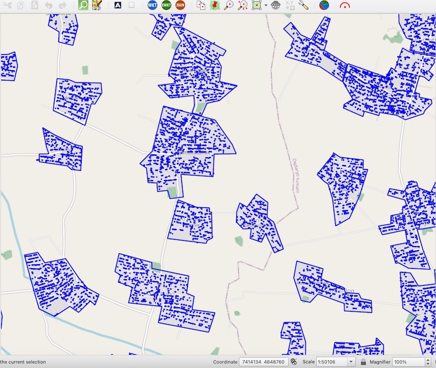

.. _howto:

Userguides - How To
===================

.. _oauth2_setup:

How to set up log in using OAuth2
---------------------------------

.. include:: oauth2_setup.rst

How to change the data type of your image to Uint8 bit in QGIS
--------------------------------------------------------------

1. Check the data type of your image. 
Right-click on the imagery layer - i - Information from provider. The Data type must be Byte. Follow the next steps if the Data type is Int16, Float 32 etc.

    
    .. figure:: _static/information.png

  

2. Right click on your image Layer Properties -  Symbology tab, then customize the display of your image. Select desired channels for Band rendering, adjust brightness and contrast. 
      
    
    .. figure:: _static/symbology.png

3. Right-click on the layer’s name, go to the  Export in the context menu, Save as…

 
    .. figure:: _static/export.png
    

4. Check Output mode as Rendered Image

    .. figure:: _static/save_raster.png
    

5. Save your image  - navigate to the desired folder, input the file name then click OK

6. Use the new image layer as Imagery source when using the Mapflow plugin for QGIS

How to process your own UAV imagery with Mapflow
------------------------------------------------

Unmanned aerial vehicles – UAVs or, more commonly, drones – have become a deeply integrated part of the geomatic industry over the last ten years. This is owing to their increasing usability, falling hardware costs, and easing government regulations. Yet, as more data is available with UAV surveys, more data need to be processed operatively. 
To process your UAV data you might be looking for some cloud or desktop software to create a mosaic or orthophoto.  Do you know that you can easily publish your data with Openaerialmap and analyze (say detect and calculate some objects and calculate their areas) with Mapflow QGIS or Mapflow Web? 

Let’s take the “UAV buildings” :doc:`buildings_aerial_imagery_model` model that extracts the detailed building outlines (the recommended image resolution is 10 cm).

Processing with Mapflow Web
~~~~~~~~~~~~~~~~~~~~~~~~~~~~

1. Select raster source – you can either use Custom URL (see below how to publish your image with Openaerialmap and get the TMS link) or upload your image as GeoTIFF.

.. image:: _static/select_provider_2.png
            :align: center
            :class: with-border
            :scale: 50

.. warning::

    *Currently, a preview of the uploaded image is not possible after loading the image, you will see only the area of its extent.*

2. Define the processing Area.
The processing area (AOI) must be located within the area of the image extent, otherwise, the area will be cut off by the extent boundaries. The processing area size is calculated by the intersection of the image extent and the AOI.

.. important::

    Image upload requirements:
    The file size must be less than 512 mb. Both sides image dimmesions must not exceed 30.000x30.000

    The image must be georeferenced and the CRS must be one of:
    * WGS84 (EPSG: 4326)
    * Web mercator (EPSG: 3857)
    * UTM (any zone)

    If your image doesn’t meet the parameters, we suggest using Mapflow API / QGIS plugin which has more capabilities.
    Mapflow supports RGB imagery and also processes single-band (panchromatic) imagery, but the AI models are not tuned for such kind of data, so the quality of the result may be worse than expected.

Processing with Mapflow – QGIS
~~~~~~~~~~~~~~~~~~~~~~~~~~~~~~~

In case you are already used to working with QGIS you need to install the Mapflow plugin. You can upload your own GeoTIFF (up to 1 GB, max. 30000x30000 px.). All raster layers currently loaded in your QGIS (1) are visible in the drop-down list (2) and can be selected for upload. 
Open files in the Additional options (3) also adds your item to the tree of QGIS layers.

    .. image:: _static/select_raster_qgis.png
       :align: center
       :class: with-border

.. important::

    Please, consider the requirements specified on the page with Models reference when uploading your own images for AI-mapping processing. Contact us if you have a large dataset of images or your file size exceeds our limits.

.. _Openaerialmap:

Use Openaerialmap as an imagery publication and access service
~~~~~~~~~~~~~~~~~~~~~~~~~~~~~~~~~~~~~~~~~~~~~~~~~~~~~~~~~~~~~~~

`OpenAerialMap <https://openaerialmap.org/>`_ is an open collection of UAV imagery data, crowdsourced by users. The project is supported by a consortium of companies developing open source software and services for working with spatial data.
As soon as your aerial image is published on OpenAerialMap it's presented on the public map and can be fetched using TMS/WMTS protocols.

Select the image and copy link to TMS to connect it to Mapflow Custom URL.

  .. figure:: ../api/_static/qgis/search_openaerialmap_image.png
         :alt: Search for imagery in OpenAerialMap 
         :align: center
         :width: 15cm
         :class: with-border

|

Your can use this service to publich your own UAV data (note that it will become publicly accessible). 
As soon as your aerial image is published on Openaerialmap it’s displayed on the public map and can be connected using TMS/WMTS or downloaded as GeoTIFF file. 
Both ways are OK to work with Mapflow.

    .. image:: _static/oam_search.png
       :align: center
       :width: 15cm
       :class: with-border

1. Copy link to TMS and paste it into the “Custom imagery URL” in your new Mapflow processing. 
2. Check if you see the image on the map, go through the next steps (AI model, processing params) to and start the processing.

.. _Nearmap:

Use Nearmap as an imagery provider
~~~~~~~~~~~~~~~~~~~~~~~~~~~~~~~~~~~~

`Nearmap <https://nearmap.com>`_ provides access to its Vertical and Panorama Imagery via a Tile API. 

URL format:

``https://api.nearmap.com/tiles/v3/{tileResourceType}/{z}/{x}/{y}.{format}?apikey={YOUR_API_KEY}``

Find more in the Nearmap `API documentation <https://help.nearmap.com/kb/articles/84-tile-api>`_.

    .. image:: _static/nearmap_custom_url.jpg
       :align: center
       :width: 15cm
       :class: with-border

Preparing and optimizing the large size images
~~~~~~~~~~~~~~~~~~~~~~~~~~~~~~~~~~~~~~~~~~~~~~~~~~~~~~~~

Here are few tips on how to prepare and optimize your data and reduce the image size to upload it faster and not to exceed the Mapflow upload limit.

Usually UAV image is an RGB compiosite provided as GeoTIFF of 16 or 8 bit. 
The type must be Byte (8 bit). If the Data type is Int16 or Float32 etc, please follow the instruction :doc:`howto`.
Alternatively: use the `preprocessing script <https://github.com/Geoalert/mapflow_data_preprocessor/>`_ for preparing your image for Mapflow processing.

You can reduce the size of the image using GDAL translate. (https://gdal.org/)
E.g. using JPEG compression.
``gdal_translate -co compress=JPEG input.tif output.tif``
By default the compression quality is 75% (``gdal_translate -co compress=JPEG -co jpeg_quality=75 input.tif output.tif``) but it doesn’t really impact the quality of the Mapflow mask whenever the resolution of the input iage meets the recommended params.

The same can be done using QGIS interface:

    .. image:: _static/optimize_qgis.png
       :align: center
       :class: with-border

Tell us if you have more tips to share with the community or if you have more questions – we are ready to help.

**Run the flow!**

How to use Nearmap as an imagery source

How to view results using Kepler.gl
-----------------------------------

**Kepler.gl** is an open source tool designed for geospatial data analysis. It is a simple yet powerful for displaying and exploring geodatasets.

To view the processing results in the Mapflow, select the required processing and press the button *"Open in kepler.gl"*.

.. note ::
   You can share your processing view in Kepler by copying the open URL (right click on *"Open in kepler.gl"* --> Copy Link Address)

Using the Kepler you can change the visual properties of data, set filters, and choose a background map.

Layers tab
~~~~~~~~~~~~

Click on the layer name to bring up the *Layer settings* from the drop-down menu. To hide all data, click on the *eye* icon.

These settings allow you to choose a more suitable type of received data:

* *Fill color.* You can choose any color from the palette for polygons, and also hide the display of data by changing the position of the slider. You can change the transparency of polygons (property *Opacity*) in the additional settings of this function.
* *Stroke color.* You can choose any color from the palette for outlining polygons, as well as completely remove the stroke. You can change the transparency of the stroke (property *Opacity*) In the additional settings of this function.
* *Stroke width.* Controls the thickness of the stroke.
* *Height.* Allows you to view data with heights in 3D format. Set the desired coefficient and select the attribute of the layer with heights.

Filters tab
~~~~~~~~~~~~~

This tab allows you to add a filter of interest by a specific attribute of the layer (as in this case, the filter is set by classes with different typology of buildings).

.. figure:: ../kepler/_static/filter_panel.png
    :alt: Filter panel
    :align: center
    :width: 15cm

Interaction tab
~~~~~~~~~~~~~~~~~

You can select or remove attributes that will be visible in the menu that appears when you hover over an object. It is also possible to turn on the panel indicating longitude and latitude.

Base map tab
~~~~~~~~~~~~~~

Here you can choose the styles of the map, as well as choose to display its various layers.

.. include:: iterative_mapping.rst

How to run bulk processing using Mapflow API
------------------------------------------------

In case you have multiple polygons to process or update, it can be boring to upload them one by one using Web or GIS user tools. In this case, you'd better think of using Mapflow :ref:`Processing API`.
In this example let's assume we have a list of polygons indicating the populated places borders and we want to extract features like "buildings" with Mapflow processing API.

1. To make it more realistic let's download some populated places borders for the sample area in Uzbekistan using Openstreetmap.
To do this we can make a query with Overpass Turbo API like this:
We can use QuickOSM plugin in QGIS which is very friendly when it comes to downloading a managable volume of data from Openstreetmap.  

Authorization with Mapflow token
~~~~~~~~~~~~~~~~~~~~~~~~~~~~~~~~~

Let's  Mapflow token for further authorization. 

.. code:: python

    import base64

    token = input("token:") # Your Mapflow token goes here. Obtain it at https://app.mapflow.ai/account/api

    username, password = base64.b64decode(token).decode().split(':')
    print(username, password)

Now you get your token decoded as a username and a password and use it for the authorization with the requests.

Create the project (it's optional)
~~~~~~~~~~~~~~~~~~~~~~~~~~~~~~~~~~~~~~~

.. hint::
   It might be useful to organise your processing with the **projects**. To do this create the new project with the following API method.

.. code:: python

    import requests
    import json

    url = "https://api.mapflow.ai/rest/projects"
    headers = {
        'Content-Type': 'application/json'
        }

    payload = json.dumps({
            "name": "My new project"  # Your project name
        })

    response = requests.request("POST", url, headers=headers, auth=(username,password), data=payload)

    if  response.status_code == 200:
        print(response.text)
    else:
        print(f"Request failed")
        print(response.text)

Here we get the response containing the project ID, that we can use to create the processings in this specific project. 

Response example:

.. code:: json

            {
            "id": "fb49b97e-51ec-4b31-872f-d1411284de85",
            "name": "My new project",
            ...
        }

See more in :ref:`Projects - API`

Prepare AOIs for the processings
~~~~~~~~~~~~~~~~~~~~~~~~~~~~~~~~~~~~~~~~~~

Let's save areas of interest with the properties as a GeoJSON file as it's simple and straightforward format to be used in any application or GIS software. 
Then we open this file and create a python dictionary to loop through all GeoJSON features that we are going to use as AOI geometries for creating the processing. Like this:

.. code:: python

    with open('<path to the file>', 'r') as file:  # Define your GeoJSON file path
    geojson_data = json.load(file)

    for feature in geojson_data['features']:
        name = feature['properties']['name']   # Extract the "name" property from OSM data
        print(name);

Let's check if we created the data array from our file and display all the features by their names. At the next step, we will use the ``name`` property to define the processing. The "name" is optional yet it's more convenient to work with the results afterwards.

Run the Processings
~~~~~~~~~~~~~~~~~~~~

Now we are ready to create the processing for each AOI using its geometry.  

.. code:: python

    url = "https://api.mapflow.ai/rest/processings"

    for feature in geojson_data['features']:
        name = feature['properties']['name']
        geometry = feature['geometry']
        payload = json.dumps({
            "name": name, 
            "projectId": "fb49b97e-51ec-4b31-872f-d1411284de85",  # Here is your project Id to link the processing to the specific project. 
            "wdName": "🏠 Buildings",
            "geometry": geometry
        })
        response = requests.request("POST", url, headers=headers, auth=(username,password), data=payload)

        if  response.status_code == 200:
            print(f"Request successful: {name}")
        else:
            print(f"Request failed for feature: {name}")
            print(response.text)

If everything was done correctly - the list of successfully created processing will be displayed.

Download all the results using Mapflow API
-------------------------------------------

When all processings are complete you can download easily the results for each one.

If you have one processing with the multiple AOIs *(by default the number of AOIs in one processing is limited to 10)* you can run a single API call to download the results:

.. code:: bash

    curl --location 'whitemaps-internal.mapflow.ai/rest/processings/<ID>/result' \
    --header 'Authorization: Basic <YOUR API TOKEN>' -O <YOUR PATH TO FILE>.geojson

In case of the multiple processings, you might find it useful to run the small script.

1. Get the list of all "ids" and "names" by processing:

.. code:: python

    import requests
    import json

    url = "https://api.mapflow.ai/rest/projects/fb49b97e-51ec-4b31-872f-d1411284de85/processings"

    response = requests.request("GET", url, auth=(username,password))

    json_data = response.json()

    values = []
    for item in json_data:
        if "id" in item and "name" in item:
            values.append((item["id"], item["name"]))

    if  response.status_code == 200:
        for id, name in values:
            print(f"{id}, {name}")
    else:
        print(response.text)

Response example:

.. code:: bash

    5f748822-c94a-4233-ae1e-7622973bf9b5, Бой
    87f258e6-c1ce-4deb-8155-ccd6b21ac237, Авазли
    1e24c0e5-9b6f-4a26-9970-82dfb1f67807, Avazali
    0316606a-4c04-4196-bdab-6495af4bb7b0, Авлиятепа
    38435f06-6b85-420e-86f8-3ebef4755480, Акбуйра
    33ffec93-ef2b-4ead-a51e-30cad1bcb71d, Аксулат
    c8f73cf5-8a44-4c36-8b2e-49b27f7f5da5, Актепа
    6eaca828-41ec-4ce5-aea4-b9f039211bbe, Арабхана
    ...

2. Save results for all the listed processings:

.. code:: python

    output_json = '<path to the folder>' # Define local folder to save files

    for id, name in values:
        response = requests.request("GET", url + id + '/result', headers=headers)

        if  response.status_code == 200:
            with open(output_json_file + name + '.geojson', 'w') as geojson:
                geojson.write(response.text)    
                print(f"File saved")
        else:
            print(f"Request failed")
            print(response.text)

