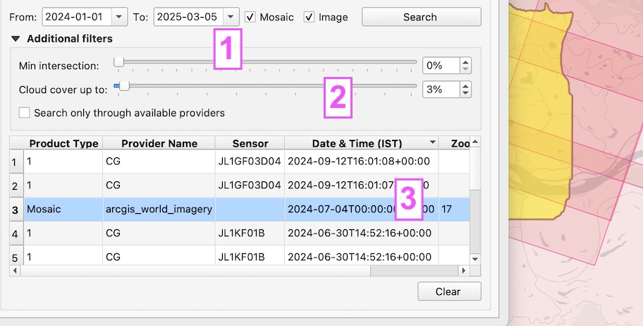

.. _Imagery search  main:

Imagery search
================

"Imagery search" allows Mapflow users to search for available satellite imagery over their area of analysis.
It's powered by Mapflow API providing access to the global satellite data providers. 

Imagery providers available for the search and ordering:
- ORBVIEW (aggregates and provides satellite imagery from the leading Chinese satellite operators)

Imagery providers supported for the account-based integration:
- ArcGIS Worldview
- :ref:`Maxar secureWatch / MGP <Maxar SecureWatch>`

.. note::
    Read more about how to use :ref:`Imagery providers` with Mapflow.

.. warning::
    Currently you can use Imagery search tools in Mapflow <> QGIS and API. The web implementation is coming soon.

Using Mapflow Imagery Search in QGIS
--------------------------------------

By default you can search all the providers that are available for your account.

1. Switch to the tab "Imagery Search". To start the search, set the dates and the product type filters ("Mosaic" – Imagery basemaps like ArcGIS or Global mosaic and/or "Images" - Satellite imagery archives)
2. Set additional filters like a minimum intersection with your area of analysis.
3. If there is non-empty response, it will add the **🔎 Imagery Search metadata** layer to your QGIS project. You can select one or multiple results in the table - or use the layer's attribute table to start the analysis and processing with Mapflow models.

|

.. hint::
    In the Arcgis search results you see the zoom level at which the mosaic is available over you area. You can configure the table columns in the Settings.

.. figure:: _static/arcgis-new-plugin.gif
         :align: center
         :class: with-border no-scaled-link
         :width: 18cm
|