.. _Imagery search  main:

🔍 Imagery search and ordering
--------------------------------

"Imagery search" allows Mapflow users to search for available satellite imagery over their area of analysis.
It's powered by Mapflow API providing access to the global satellite data providers through our partner integrations. 

Imagery providers available for the search and (NEW!) ordering:
    * Historical imagery (aggregates and provides satellite imagery from the leading satellite operators)

Imagery providers supported for the account-based integration and search:
    * ArcGIS World Imagery

.. seealso::
    Read more about how to use :ref:`Imagery providers` with Mapflow.

.. important::
   ❗️ You need to subscribe to `Mapflow Premium <https://mapflow.ai/pricing>`_ to be able to order commercial data providers and run the analysis.

.. _imagery-search-web:

Using Imagery Search in Mapflow WEB
~~~~~~~~~~~~~~~~~~~~~~~~~~~~~~~~~~~~

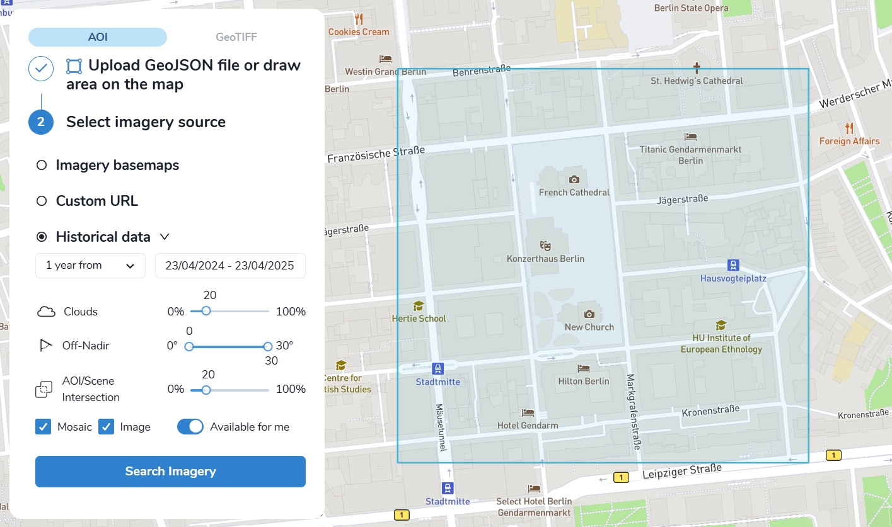

|

To start the processing using the Imagery Search data, you must:

1. Select a date range or a specific date;
2. Set the search parameters (Clouds, Off-Nadir, AOI/Scene intersection);
3. Apply provider filters:

    - "Mosaic"
    - "Image"
    - "Available for me" - The search results will show only those providers that are connected to your account.

Imagery provider types:

    *Mosaic* - Imagery basemaps like ArcGIS or Global mosaic allowing to search images by date and AOI/Scene intersection.

    *Image* - Satellite imagery archives allowing to search for historical images by multiple criteria including Clouds, Off-Nadir, and resolution.

    👉 *Available for me*  - Filters the results by the providers that are connected to your account to run the analysis with Mapflow.

4. After clicking "Search Image", a table with search results and images footprints will appear:

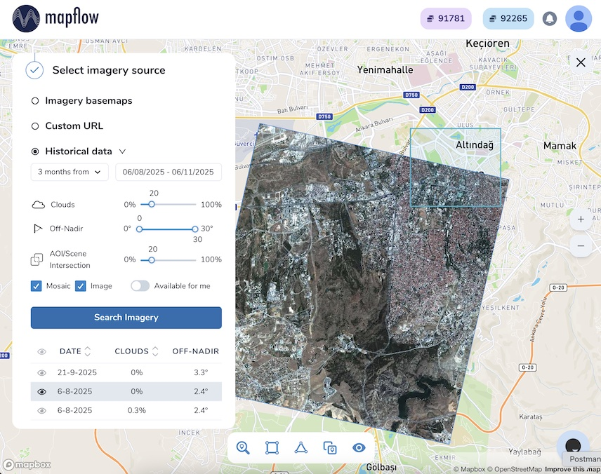

|

5. You can sort, enable or disable images on the map, and preview them if the provider supports this feature (The preview will be automatically shown on the map after selecting the image in the table);

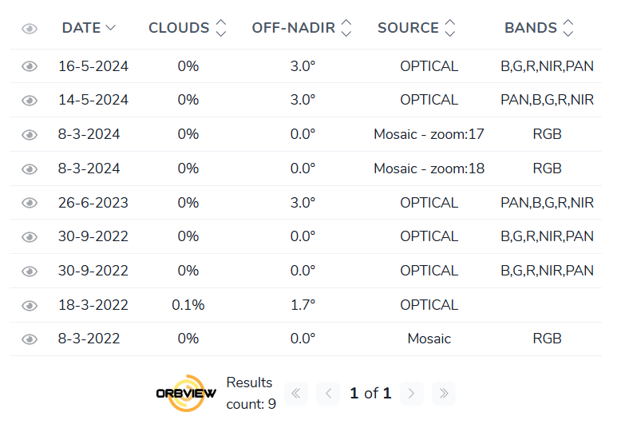

|

6. At the final step, you need to select the desired image by clicking on it in the table and click "Save". Now you are ready to start processing!

.. warning::
    👆️️️️️️ You are able to start the processing only using available providers (**"available for me"**). 
    If you try to use the image from the provider that is not connected to your account, you will see the corresponding warning *"The provider is not available for your account, you need to change the plan"*. 
    You need to subscribe to Mapflow Premium to be able to order commercial data providers. 

.. _my-imagery-in-search:

NEW! Search your own imagery (My Imagery)
~~~~~~~~~~~~~~~~~~~~~~~~~~~~~~~~~~~~~~~~~~

In addition to the global satellite data providers, the Imagery Search also looks through your own imagery: the images and mosaics you uploaded to :ref:`My Imagery <My imagery main>`. You don't need to switch anywhere - your own data is searched automatically along with the external providers every time you click **Search Imagery**.

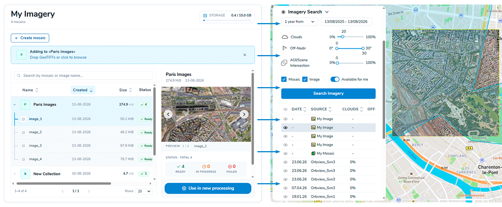

  Your imagery → right in the search results!

To use it:

1. Draw or upload the AOI that covers your imagery (see :ref:`Select AOI`).
2. Set the search parameters as usual and click **Search Imagery**.
3. In the results table, your own data is marked in the **Source** column:

    - 🖼️ **My Image** - a single image uploaded to a mosaic;
    - 🧩 **My Mosaic** - a whole mosaic (collection of images).

.. note::
   Your uploaded imagery usually has no acquisition metadata (date, cloud cover, off-nadir angle, resolution). Such cells are shown as "**-**" in the table, and the **Clouds** / **Off-Nadir** / **AOI/Scene intersection** filters do not hide your own imagery even if you tighten them.

.. note::
   Only the imagery with the *Ready* status is searchable. Images that are still uploading (*In progress*) or failed are not shown in the search results.

You can select a "My Image" / "My Mosaic" result, preview it on the map and start the processing from it exactly like from any other search result:

1. Click the row in the results table to select the image.
2. Click **Save** and proceed to the processing settings - the selected imagery will be used as the source for the processing.

Planned Search in Mapflow WEB
~~~~~~~~~~~~~~~~~~~~~~~~~~~~~~

If you are not satisfied with the current search results or you want to get new images updates without repeating the search manually, this service will do the job.

How to create a planned search
^^^^^^^^^^^^^^^^^^^^^^^^^^^^^^^^^

1. Draw or upload the areas of interest from the GeoJSON file, select all or only the necessary ones in the table. If your GeoJSON features contain the property "name", the AOI names will be automatically loaded into the table. You can also manually assign the aoi name in the edit mode (the "Edit" button in the AOI menu).

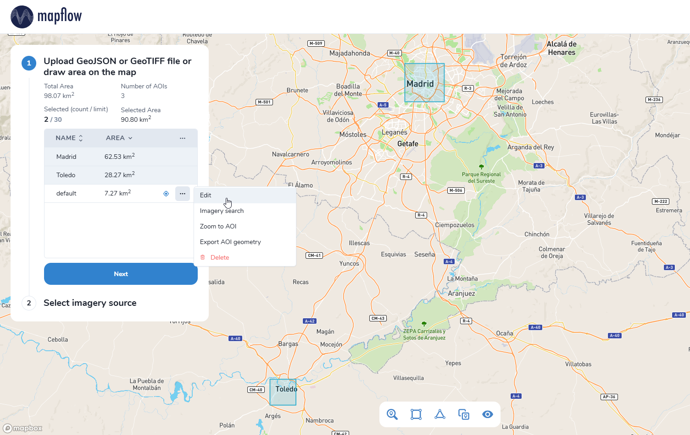

|

.. tip::
  The AOI name you assign will appear in notifications about new images found for this area. To go directly to the results for this area, simply click on the notification in the app or the "View Search results" button in the email.

    .. figure:: _static/templates_notifications.gif
        :alt: Search menu
        :align: center
        :width: 13cm
        :class: with-border

2. Set the required search criteria and click "Search Imagery"

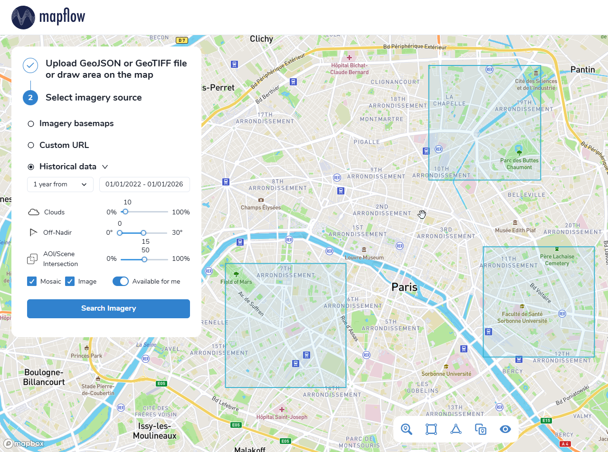

|

.. note::
  If the total area of your search area exceeds 700 km², when you click on "Search Imagery" instead of an immediate search, you will be prompted to create a postponed background search. 

    .. figure:: _static/templates_large_area_search.png
       :align: center
       :width: 9cm
       :class: with-border

3. After that, the search results will appear and the "Save as schedule" button will be available

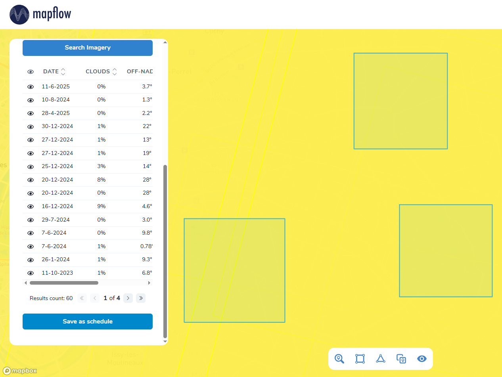

|

4. When you click on it, you will be prompted to choose the name of this search schedule

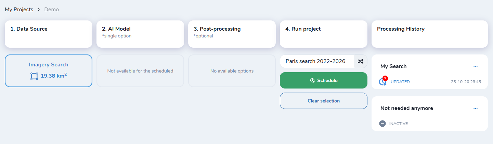

|

5. After creation the search will complete after a while and the search results will be available to you using "View on the map" button

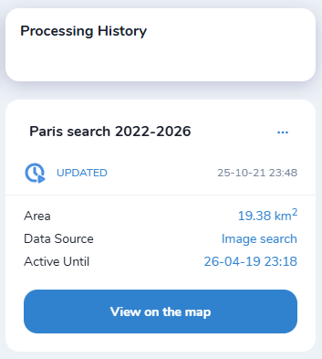

|

Viewing background search results
^^^^^^^^^^^^^^^^^^^^^^^^^^^^^^^^^^

Now a background search will be launched in Mapflow and you will be notified when new images arrive.

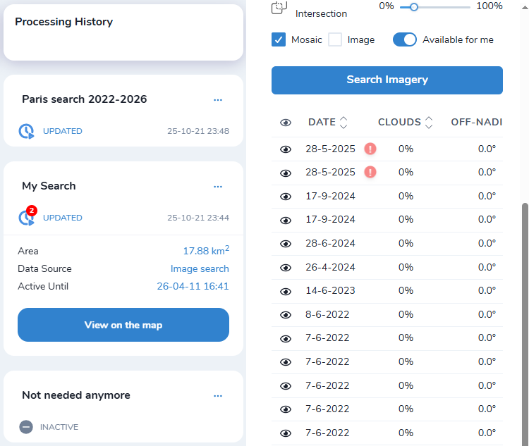

  The search card shows the label |alert| of the **new image** found. Clicking on an image in the results table will remove the label.

.. note::
  **Two key points on viewing results:**

  - When opening the search, you will see **all** results found for the given area(s)
  - If your search consists of multiple AOIs and you're interested in specific ones, you can select them in the "Upload GeoJSON or GeoTIFF file..." section → Now results will only be displayed for the selected AOIs. Also, you can select/deselect AOI by clicking on the map, the results table will be updated automatically.

Processings <> Planned Search
^^^^^^^^^^^^^^^^^^^^^^^^^^^^^^^^

Processing is launched in the same way as from :ref:`instant search <imagery-search-web>`:

- Open a planned search
- Select the desired image and click "Save"
- Select the necessary parameters and start the processing!

All processing launched from a search is linked to it. You can find them in the search's AOI table. Simply select the necessary ones on the map, and they will all be displayed on one map.

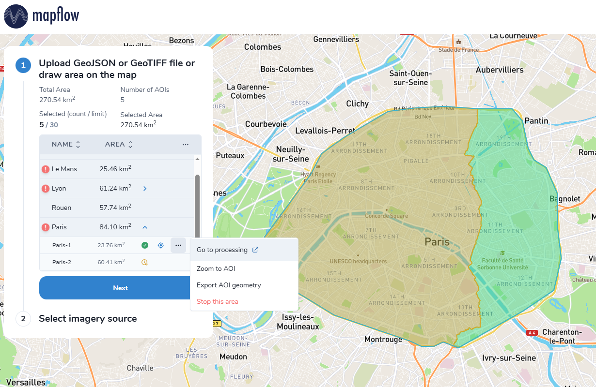

|

Some actions you can perform with processing from the search AOI table:

- Open this processing in a new tab
- Download processing boundaries
- Clip the search AOI to the boundary of its processing ("Stop this area" button)

Last one can be useful if you are already satisfied with the processed part of the AOI and do not want to see it in the search results (the trimmed part will no longer be used in the background search).

.. figure:: _static/templates_stop_this_area.gif
  :alt: Search menu
  :align: center
  :width: 13cm
  :class: with-border

|

Main operations with Planned Search
^^^^^^^^^^^^^^^^^^^^^^^^^^^^^^^^^^^^^^

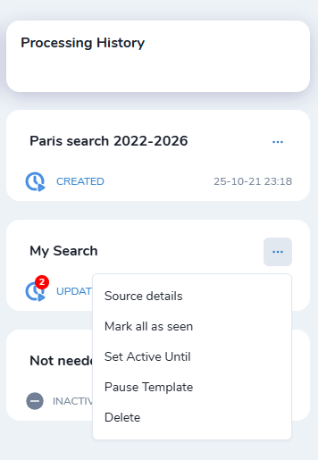

|

- **Source details** - Here you can view and download the geometry of your search
- **Mark all as seen** - If you have a lot of unread images, you can mark them as viewed all at once
- **Set Active Until** - You can change the lifetime of the background search (6 months by default at creation)

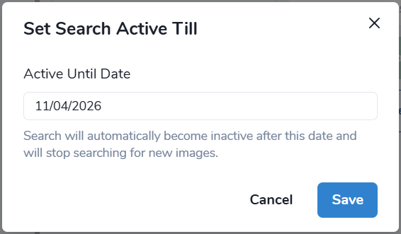

  After expired, the Search will not be deleted, but paused

- **Pause/Resume Search** - The pause means that it will stop the background search, but you can still view its results
- **Delete** - Permanently deletes the search

Modifying the AOI search
^^^^^^^^^^^^^^^^^^^^^^^^^

You can add a new AOI to an existing search, modify the geometry, or delete areas that have already been processed. After any AOI changes, you will need to confirm these changes. The search will be updated, and the **results will be synchronized** accordingly.

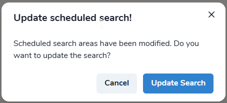

|

**You can also change the search criteria for the existing search:**

"View on the map" → Adjust the search parameters → "Search Imagery" → "Save as schedule". Now the background search will work according to the new parameters.

.. figure:: _static/templates_update_params.gif
  :alt: Search menu
  :align: center
  :width: 16cm
  :class: with-border

|

Using Mapflow Imagery Search in QGIS
~~~~~~~~~~~~~~~~~~~~~~~~~~~~~~~~~~~~~

1. Switch to the tab "Imagery Search". To start the search, set the dates and the product type filters ("Mosaic" – Imagery basemaps like ArcGIS or Global mosaic and/or "Images" - Satellite imagery archives)
2. Set additional filters like a minimum intersection with your area of analysis.
3. If there is non-empty response, it will add the **🔎 Imagery Search metadata** layer to your QGIS project. You can select one or multiple results in the table - or use the layer's attribute table to start the analysis and processing with Mapflow models.

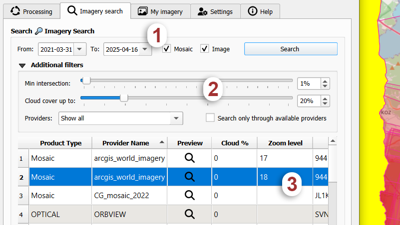
|

.. hint::
    In the Arcgis search results you see the zoom level at which the mosaic is available over you area. You can configure the table columns in the Settings.

.. figure:: _static/arcgis-new-plugin.gif
         :align: center
         :class: with-border no-scaled-link
         :width: 18cm
|

.. seealso::
   👉 See :ref:`Mapflow <> QGIS` for more information on how to use Imagery Search in Mapflow Web and QGIS plugin.

Planned Search in QGIS
~~~~~~~~~~~~~~~~~~~~~~~

**Planned Search** is a recurring background search. You define the search area and parameters once, and Mapflow keeps looking for new imagery over that area - you will be notified when new images are found. The search runs in the background, so you can keep working with the plugin in the meantime, review the results at any time and start processing directly from them.

Creating a planned search
^^^^^^^^^^^^^^^^^^^^^^^^^^

1. Switch to the **Imagery Search** tab and set the area of interest: draw it on the map or select an existing polygon layer (for example, a GeoJSON file loaded into QGIS). If the layer has a ``name`` attribute, it will be used as the AOI name. AOI names can also be assigned or changed later.
2. Set the search parameters: date range, cloud cover, off-nadir angle, minimum intersection, product types and providers.
3. Specify the search name in the **Processing name** field.
4. Open the **Search** button menu and choose **Plan search**.

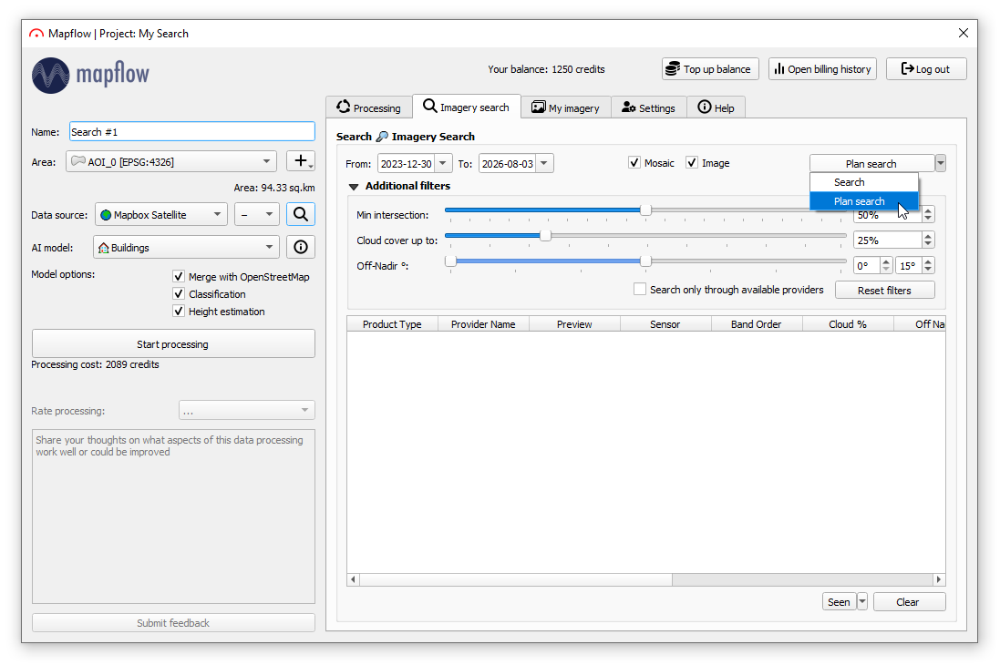

|

The planned search is created and starts running in the background. It will keep looking for new imagery over the selected areas, and you will be notified when results are ready.

The planned search appears in the **Processing** table with the workflow **"Planned"**. Its status reflects the search state:

* **Searching** – the initial search is in progress;
* **Created / Updated** – the search is active and being checked for new imagery (the number of new images, e.g. *Updated (3)*, is shown when there are any);
* **Inactive** – the search is paused;
* **Failed** – the search failed and can be restarted.

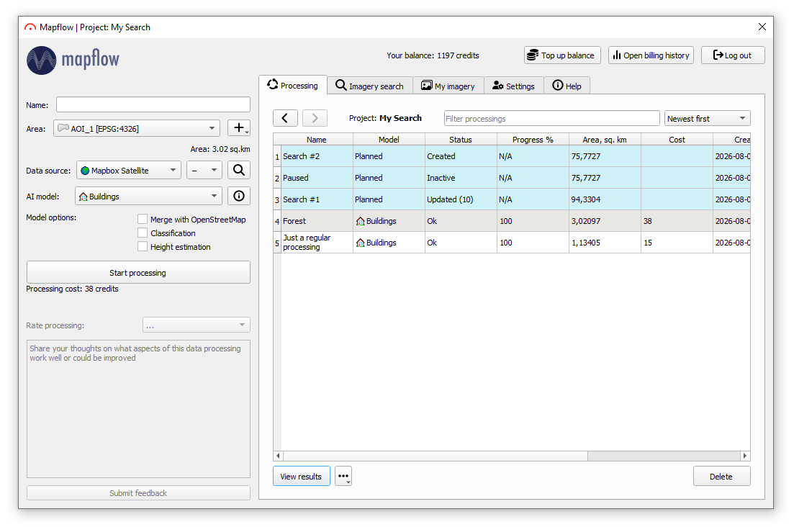

|

.. note::
   If the area of interest is too large for an immediate search, clicking **Search** will prompt you to create a planned search instead - the search area would take too long to process synchronously. Confirm with **Plan Search**, and the planned search will be created and run in the background.

  .. figure:: _static/planned_search_prompt.png
           :align: center
           :class: with-border
           :width: 11cm

Opening a planned search
^^^^^^^^^^^^^^^^^^^^^^^^^

Select the planned search in the **Processing** table and click the |right_arrow| navigation button (or double-click the row). The plugin enters the planned search view: the table now shows the search AOIs, each followed by the processings that were launched for it, and the **"No AOI"** group for processings not linked to any area.

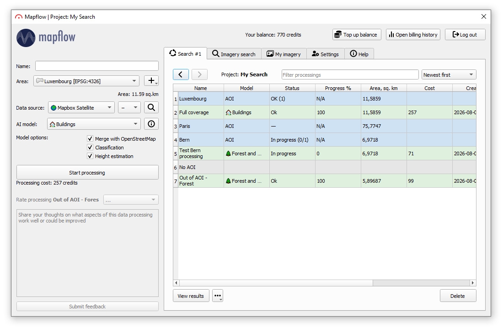

|

The AOI rows show the aggregate status of their processings (*OK (n)*, *In progress*, *Failed*). On the map, the planned search is displayed in a dedicated group in the Layers panel — each AOI and its processings are grouped together, and processings not tied to any AOI appear on the map when you click them.

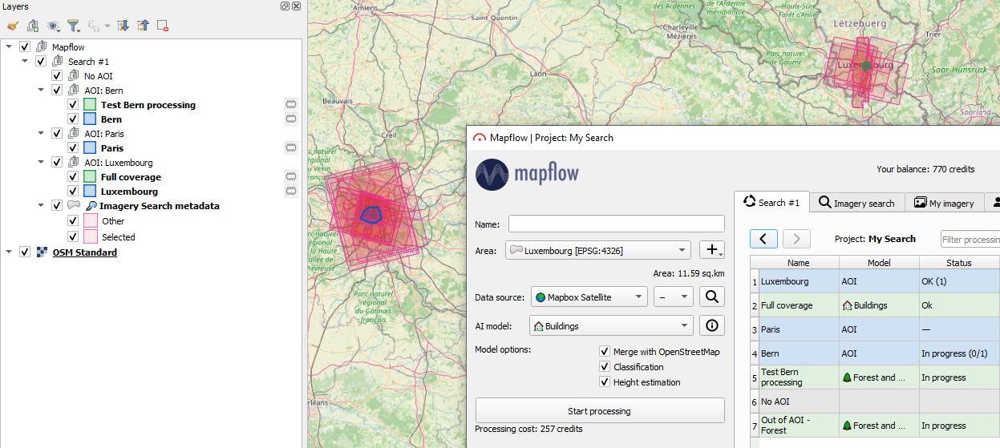

|

Viewing the search results
^^^^^^^^^^^^^^^^^^^^^^^^^^^

Open the planned search and switch to the **Imagery Search** tab. The table shows the images found for **all** AOIs of the planned search. To display results only for specific areas, select the corresponding AOI rows in the processings table - the results are updated automatically.

New images are marked with the **(!)** sign. You can mark the selected new images as seen with the **Seen** button, or mark all of them with **Seen all** - the label will disappear.

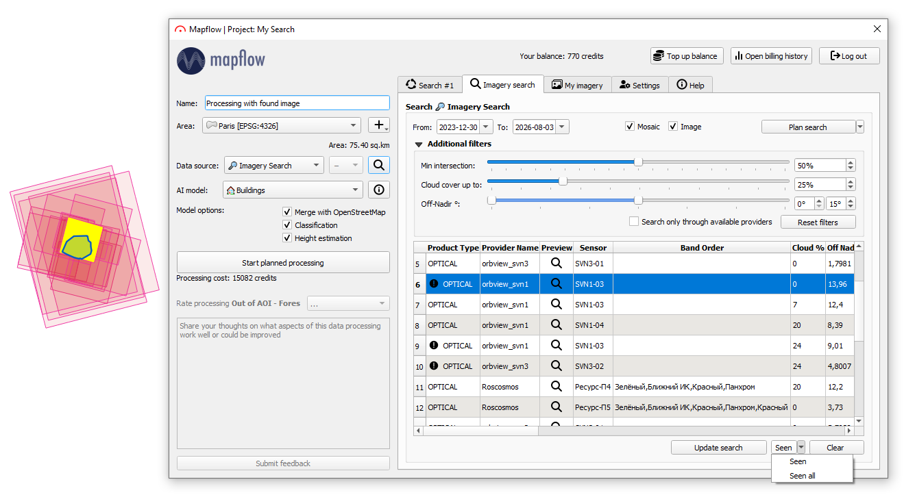

|

You can also adjust the search criteria of the existing planned search: change the filters (dates, cloud cover, off-nadir angle, intersection, providers) on the **Imagery Search** tab and click **Update search** — the new parameters are saved to the planned search, and the results are re-fetched with them. The results can be sorted by clicking the column headers.

Running processing from the search results
^^^^^^^^^^^^^^^^^^^^^^^^^^^^^^^^^^^^^^^^^^^

Select one or several images in the results table and click **Start planned processing** - the processing will be launched from the selected imagery, linked to this planned search. The new processing appears in the processings table grouped under the AOI it intersects, and its footprint is displayed on the map.

.. figure:: _static/planned_search_run_processing.gif
         :align: center
         :class: with-border
         :width: 16cm

|

Managing the search AOIs
^^^^^^^^^^^^^^^^^^^^^^^^^

Select an AOI row and open the options menu (the "..." button next to *View results*):

* **Rename AOI** – assign a new name to the area;
* **Delete AOI** – remove the area from the search;
* **Add AOI from layer…** – add new areas from polygon layers in your QGIS project (for example, a GeoJSON file);
* **Draw AOI on the map** – draw a new area with the QGIS add-feature tool and save it;
* **Update selected AOI** – edit the geometry of the area right on the map (move the vertices, then click **Save AOI**);
* **Exclude from search** – remove the already processed area from the search AOI (available on a processing row): the footprint of the processing is subtracted from every AOI it intersects, so this area will no longer be searched for new imagery.

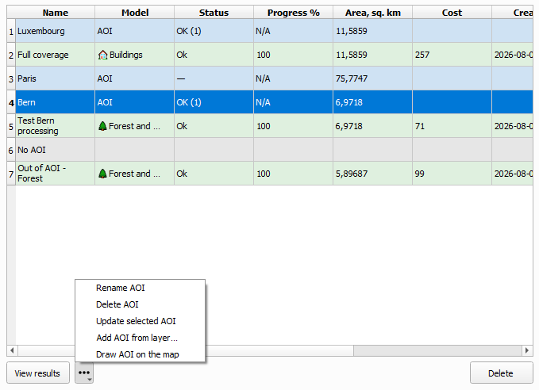

|

After any AOI change the search is updated, and the search results are synchronized accordingly. Take a look at AOI management in action:

.. figure:: _static/planned_search_edit_aoi.gif
         :align: center
         :class: with-border
         :width: 16cm

|

.. note::
   **Exclude from search** is a convenient way to gradually free up the search from already processed areas whose search results you no longer need.

  .. figure:: _static/planned_search_exclude.gif
           :align: center
           :class: with-border
           :width: 13cm

Pausing, resuming and restarting a planned search
^^^^^^^^^^^^^^^^^^^^^^^^^^^^^^^^^^^^^^^^^^^^^^^^^^

Select the planned search in the **Processing** table and open the options menu:

* **Pause** – stops the background search: no more updates on newly found images, but the search results remain available and you can still run processing from them;
* **Resume** – activates the paused search again;
* **Restart** – re-runs the search that failed.

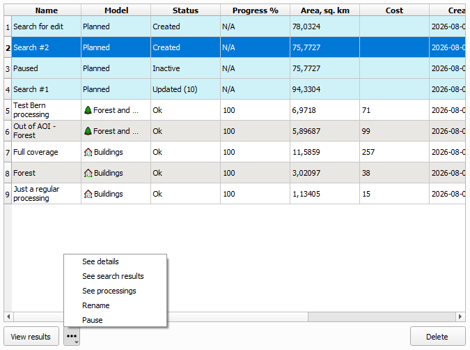

|

Planned search limits
^^^^^^^^^^^^^^^^^^^^^^

* If the search area is too large for an immediate search, you will be prompted to create a planned search automatically (see above).
* On the free plan you cannot create a planned search larger than **1000 km²**.
* On the free plan you can have up to **2 active** planned searches. If you exceed this limit, new searches can still be created, but they will be added in a **paused** state. Upgrade your plan to resume them and create new active searches.