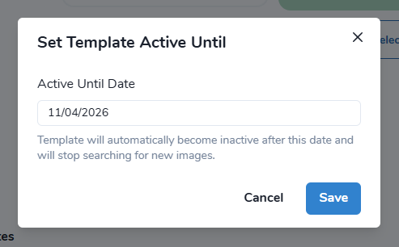

.. _Imagery search  main:

Imagery search
================

"Imagery search" allows Mapflow users to search for available satellite imagery over their area of analysis.
It's powered by Mapflow API providing access to the global satellite data providers through our partners. 
❗️ You need to subscribe to `Mapflow Premium <https://mapflow.ai/pricing>`_ to be able to order commercial data providers and run the model.

Imagery providers available for the search and ordering:
    * Historical imagery (aggregates and provides satellite imagery from the leading satellite operators)

Imagery providers supported for the account-based integration and search:
    * ArcGIS Worldview
    * :ref:`Maxar secureWatch / MGP <Maxar SecureWatch>`

.. seealso::
    Read more about how to use :ref:`Imagery providers` with Mapflow.

Using Imagery Search in Mapflow WEB
------------------------------------

.. image:: _static/historical_data_tab.png
  :alt: Imagery search tab
  :align: center
  :width: 16cm
  :class: with-border no-scaled-link  

|

To start the processing using the Imagery Search data, you must:

1. Select a date range or a specific date;
2. Set the search parameters (Clouds, Off-Nadir, AOI/Scene intersection);
3. Apply provider filters:

    - "Mosaic"
    - "Image"
    - "Available for me" - The search results will show only those providers that are connected to your account.

.. note:: 
  Imagery provider types:
    *Mosaic* - Imagery basemaps like ArcGIS or Global mosaic allowing to search images by date and AOI/Scene intersection.
    *Image* - Satellite imagery archives allowing to search for historical images by multiple criteria including Clouds, Off-Nadir, and resolution.
    👉 You can filter the search results by provider type or filter out the results from the providers that are available to you.

4. After clicking "Search Image", a table with search results and images extents will appear:

.. figure:: _static/historical_data_images.png
  :alt: Imagery search results
  :align: center
  :width: 16cm
  :class: with-border

|

5. You can sort, enable or disable images on the map, and preview them if the provider supports this feature (The preview will be automatically added to the map after selecting the image in the table);

|

6. At the final step, you need to select the desired image by clicking on it in the table and click "Save". Now you are ready to start processing!

.. warning::
    👆️️️️️️ You are able to start the processing only using provider that is connected to your account. If you try to use the image from the provider that is not connected, you will see the corresponding warning "The provider is not available for your account, you need to change the plan". You need to subscribe to Mapflow Premium to be able to order commercial data providers. 

NEW! Schedule your search
----------------------------

If you are not satisfied with the current search results or you want to get new images search updates without repeating the search manually, this service will do the job.

How to create a scheduled search
~~~~~~~~~~~~~~~~~~~~~~~~~~~~~~~~

1. Set the required search criteria and click "Search Imagery"

.. figure:: _static/templates_params.png
  :alt: Templates params
  :align: center
  :width: 13cm
  :class: with-border

|

.. note::
  If the total area of your search area exceeds 250 km², when you click on "Search Imagery" instead of an immediate search, you will be prompted to create a postponed background search. 

    .. figure:: _static/templates_large_area_search.png
       :align: center
       :width: 9cm
       :class: with-border

2. After that, the search results will appear and the "Save as schedule" button will be available

.. figure:: _static/templates_save_button.png
  :alt: Templates save button
  :align: center
  :width: 13cm
  :class: with-border

|

3. When you click on it, you will be prompted to choose the name of this search schedule

.. figure:: _static/templates_schedule_button.png
  :alt: Templates schedule button
  :align: center
  :width: 13cm
  :class: with-border

|

4. After creation the search will complete after a while and the search results will be available to you using "View on the map" button

|

Viewing background search results
~~~~~~~~~~~~~~~~~~~~~~~~~~~~~~~~~~

Now a background search will be launched in Mapflow and you will be notified when new images arrive.

.. figure:: _static/templates_new_images.png
  :alt: Templates new images
  :align: center
  :width: 13cm
  :class: with-border

  The search card shows the label |alert| of the **new image** found. Clicking on an image in the results table will remove the label.

.. note::
  To start processing based on the found image you need to select the desired image by clicking on it in the table and clicking “Save” button.

.. note::
  Two key points on viewing results:

  - When opening the search, you will see **all** results found for the given area(s)
  - If your search consists of multiple AOIs and you're interested in specific ones, you can select them in the "Upload GeoJSON or GeoTIFF file..." section → Now results will only be displayed for the selected AOIs

Main operations with Search Schedule
~~~~~~~~~~~~~~~~~~~~~~~~~~~~~~~~~~~~~

.. figure:: _static/templates_menu.png
  :alt: Templates menu
  :align: center
  :width: 9cm
  :class: with-border

|

- **Source details** - Here you can view and download the geometry of your search
- **Mark all as seen** - If you have a lot of unread images, you can mark them as viewed all at once
- **Set Active Until** - You can change the lifetime of the background search (6 months by default at creation)

  After expired, the Search Template will not be deleted, but paused

- **Pause/Resume Template** - The pause means that it will stop the background search, but you can still view its results.
- **Delete** - Permanently deletes the search template

.. note::
    You can also change the search criteria for the existing search:

    "View on the map" → Adjust the search parameters → "Search Imagery" → "Save as schedule". Now the background search will work according to the new parameters.

    .. figure:: _static/templates_update_params.gif
      :alt: Templates menu
      :align: center
      :width: 16cm
      :class: with-border

.. warning::
    ❗️ If you rename the search - it will create a new search schedule with the new name instead of updating the existing one. If you want to rename the search and create the new one just click on the name.

    .. figure:: _static/update_search_name.jpg
      :alt: Templates menu
      :align: center
      :width: 8cm
      :class: with-border no-scaled-link

Using Mapflow Imagery Search in QGIS
--------------------------------------

1. Switch to the tab "Imagery Search". To start the search, set the dates and the product type filters ("Mosaic" – Imagery basemaps like ArcGIS or Global mosaic and/or "Images" - Satellite imagery archives)
2. Set additional filters like a minimum intersection with your area of analysis.
3. If there is non-empty response, it will add the **🔎 Imagery Search metadata** layer to your QGIS project. You can select one or multiple results in the table - or use the layer's attribute table to start the analysis and processing with Mapflow models.

|

.. hint::
    In the Arcgis search results you see the zoom level at which the mosaic is available over you area. You can configure the table columns in the Settings.

.. figure:: _static/arcgis-new-plugin.gif
         :align: center
         :class: with-border no-scaled-link
         :width: 18cm
|

.. seealso::
   👉 See :ref:`Mapflow <> QGIS` for more information on how to use Imagery Search in Mapflow Web and QGIS plugin.