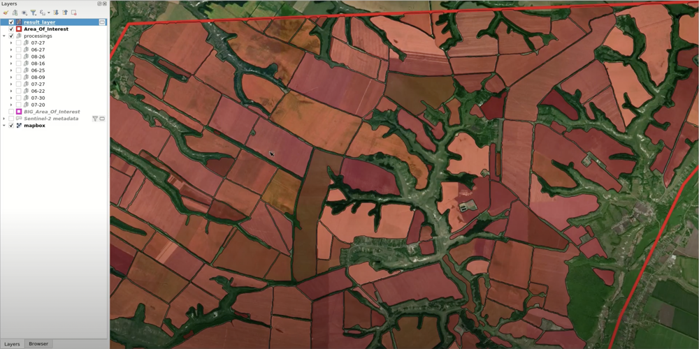

Iterative mapping tutorial
==========================

If you use Mapflow for agricultural landuse management, we suggest you have a look at the methodology described below. It can help you streamline the mapping process so you could focus on the end goal and results instead. All you need is our QGIS plugin (a.k.a. Maflow for QGIS) installed. If you haven't installed it yet, :doc:`here's <../api/qgis_mapflow>` how you can do it.

Before we begin, however: Mapflow will digitize the fields for you, but the imagery for it to work on you need to select yourself. **We strongly recommend you preview images before processing them** because their quality may vary. Ones with high cloud cover (including cloud shadows) or no-data pixels in the AOI will likely produce poor results. Here are examples of two images that will inevitably yield unsatisfactory results:

  Fields detected using a clouded Sentinel-2 image

  An example of a Sentinel-2 image that has no-data pixels for the AOI.

Sometimes you may not be able to find a single suitable image for your entire AOI. In that case, we recommend you process the best available images separately and then combine the results. On average, you will need to process ten images for a territory of 1000 km\ :sup:`2`.

An Iterative mapping process
~~~~~~~~~~~~~~~~~~~~~~~~~~~~~~
1. Start processing on the Sentinel-2 images:

   * In QGIS, load your AOI as a layer;
   * Open the plugin and go to *Providers tab*; select Sentinel-2 in the drop-down list in the upper left corner and your AOI layer as the *Area* below;
   * Adjust the search criteria: select the search period in From and To; adjust the maximum allowed cloud cover and the minimum required intersection percentage in *Additional Filters*;
   * Click *Search imagery*; it may take up to a minute, depending on the size of your AOI and the search period;
   * The search results will show up in the table below. Each row describes a single image. You can sort the table by date and cloud cover and you can further filter the results by adjusting the dates and the filters as you did in the previous step. 
   * Search results have also been added to your QGIS project as a layer called *“Sentinel-2 metadata”*. The layer is synchronized with the table: every time you select a row in the table, the corresponding image is selected in the layer, and vice versa.
   * Now, select an image and double click on its table row. You will see it got added to the project as a raster layer. AOI have a real value (they're not black or transparent).

    .. note:: 
      This is a preview, - a coarse representation of the actual image. The image itself will have a 30-times better resolution (10m instead of 300m in the preview). You'll want an image which in which cloud don't cover your AOI and all pixels within your 

  .. figure:: _static/iterative_mapping/10.png
    :alt: Providers tab
    :align: center
    :width: 15cm

  * Once you've made your choice, make sure the image row is selected in the table, go to *Processing tab*; type in a name for your processing, select *"Sentinel-2 Fields"* in the *Mapflow Model* drop-down list and check that your AOI layer is selected as the *Area* and the *Imagery source* is set to *Sentinel-2*; if everything looks good, hit *Start processing*.

|

  Repeat the same for five to ten images covering the same area so the best available image is processed for every part of your AOI. 

2. Next, create a new polygon layer called “results” into which we'll merge the results.
3. Download the processing results by double-clicking the corresponding rows in the *Processings table*. Group raster and vector layer for each processing for simplicity. Create a mutually exclusive group for these groups.

|

4. Reorder the layers so that the best results are on top. Normally, it takes about ten seconds to determine if the results are good enough.

|

5. Choose the topmost result layer pair (vector and raster). Select all objects in the vector layer and copy them into the “results” layer.

|

6. In the “results” layer, select and delete poorly digitized polygons. Now, the “results” layer has gaps which should be filled with successfully contoured polygons from the other result layers.

|

7. Select the next best processing and put its vector layer on top of the “results” layer. Select well-contoured polygons from this layer and copy them into the “results” layer.

|

If there are still gaps in the “results” layer, repeat *step #7* until you the all gaps are filled in. After several iterations, you should get fully contoured agricultural fields for your AOI. 

|
.. note:: 
    Watch `this video <https://youtu.be/ZTsT27FyQPI>`_ for a visual example of this iterative markup process.
