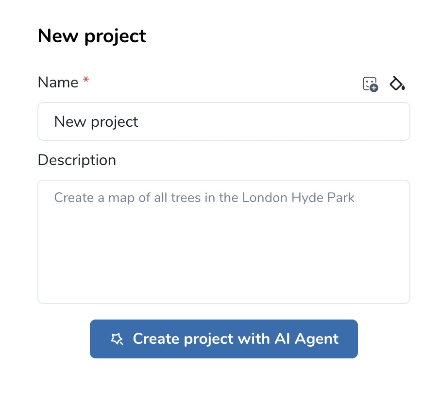

.. _mapflow-agent:

Mapflow AI Agent
=================

The **Mapflow AI Agent** is an intelligent assistant built into the Mapflow web app. It guides you through the full AI-mapping workflow — from defining an area of interest to running a processing — using natural-language conversation. The agent collects parameters, recommends models and imagery sources, estimates cost, and launches the processing on your behalf, while always asking for your confirmation before spending credits.

.. contents:: Table of Contents
   :local:
   :depth: 2

Workflow
---------

The agent is launched from the project creation dialog on the main dashboard.

**Step 1. Dashboard**

Open the Mapflow `dashboard <https://app.mapflow.ai>`_. The dashboard lists all of your projects and is the starting point for any new mapping task.

**Step 2. Create project**

Click **Create project** to open the *New project* dialog. Set a name, optionally customize the icon and color, and add a description that explains what you want to map.

**Step 3. Create project with AI Agent**

Instead of configuring the project manually, click **Create project with AI Agent**. The agent reads the project description as your initial request and starts a conversation to gather everything needed to run a processing.

|

From this point the agent drives the workflow: it clarifies your intent, proposes a model, helps you define an AOI, finds suitable imagery, estimates cost, and runs the processing once you confirm.

.. note::
   The agent never executes paid actions (ordering imagery, starting a processing) without an explicit confirmation from you. See :ref:`imagery-agent-instructions` for the detailed decision logic the agent uses when searching for imagery.

Agent toolset
--------------

The agent has access to a fixed set of tools that correspond to specific Mapflow API capabilities. Each tool is invoked transparently during the conversation; you do not need to call them directly.

.. list-table::
   :header-rows: 1
   :widths: 28 72

   * - Tool
     - Purpose
   * - ``query_mapflow_docs``
     - Answers questions about Mapflow features, models, pricing, and limitations using the official Mapflow documentation as a source.
   * - ``get_limits``
     - Checks the limits of your current Mapflow plan (max AOI size, available providers, credit balance) so the agent can stay within them.
   * - ``list_models``
     - Lists the AI models available to your account and recommends the one that fits your task.
   * - ``save_selected_model``
     - Records the model the user has chosen so it is used in subsequent steps (cost estimation, processing launch).
   * - ``get_geoboundary``
     - Resolves a toponym (place name) into a geographic boundary. Useful when the user references an area by name rather than coordinates.
   * - ``save_aoi``
     - Adds an Area of Interest to the project from a GeoJSON geometry.
   * - ``buffer_aoi``
     - Creates a buffer zone of a given radius around an AOI or a point location.
   * - ``list_imagery_sources``
     - Lists the imagery sources (basemaps and commercial providers) available to the user and recommends a default.
   * - ``search_imagery_catalog``
     - Searches both basemaps and commercial catalogs for images matching the AOI, date range, cloud cover, and resolution criteria.
   * - ``save_selected_image``
     - Attaches the chosen imagery source to the processing configuration.
   * - ``calculate_cost``
     - Estimates the processing cost in credits based on the selected model, AOI, and data source.
   * - ``start_processing``
     - Launches the processing run after the user confirms the parameters and cost.
   * - ``get_processing``
     - Polls and reports the status of a running processing so the user is kept up to date.

Example interaction
--------------------

A typical conversation with the agent follows the pattern below. The agent's tool calls are noted in italics for illustration only — they are not visible in the chat UI.

.. code-block:: text

   User:  "Create a map of all trees in the London Hyde Park."

   Agent: "I can help with that. I'll use the 🌲 Forest model.
           First, let me locate Hyde Park."
          [get_geoboundary → returns polygon for Hyde Park]
          [save_aoi → AOI stored]

   Agent: "I found Hyde Park (~1.4 km²). It fits within your plan limits."
          [get_limits, list_models, save_selected_model: Forest]

   Agent: "For tree mapping the date of imagery is not critical, so I
           recommend Mapbox Satellite at zoom 18 (0.5 m/px) as the source."
          [list_imagery_sources, save_selected_image: Mapbox z18]

   Agent: "Estimated cost: 12 credits (1.4 km² × 8 credits/km²).
           Shall I start the processing?"
          [calculate_cost]

   User:  "Yes."

   Agent: "Processing started. I'll let you know when it's finished."
          [start_processing, get_processing → status: IN_PROGRESS]

Buffering an AOI
-----------------

When the user gives the agent a point location or a small geometry, the agent can expand it into a usable AOI with ``buffer_aoi``. The animation below shows the agent creating a buffer around a location:

.. figure:: _static/agent/agent_buffer.gif
  :alt: Agent creating a buffer around an AOI
  :align: center
  :width: 16cm
  :class: with-border

|

Related guides
---------------

* :ref:`imagery-agent-instructions` — the detailed decision logic the agent applies when searching for and recommending imagery.
* :doc:`get_started` — manual project and processing creation.
* :doc:`pipelines` — overview of available AI models and workflows.
