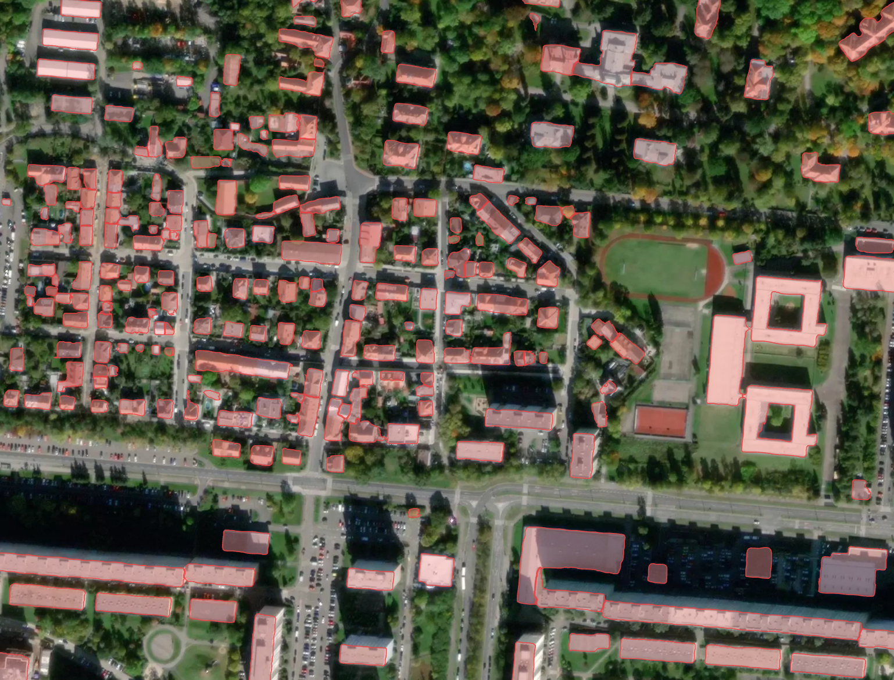
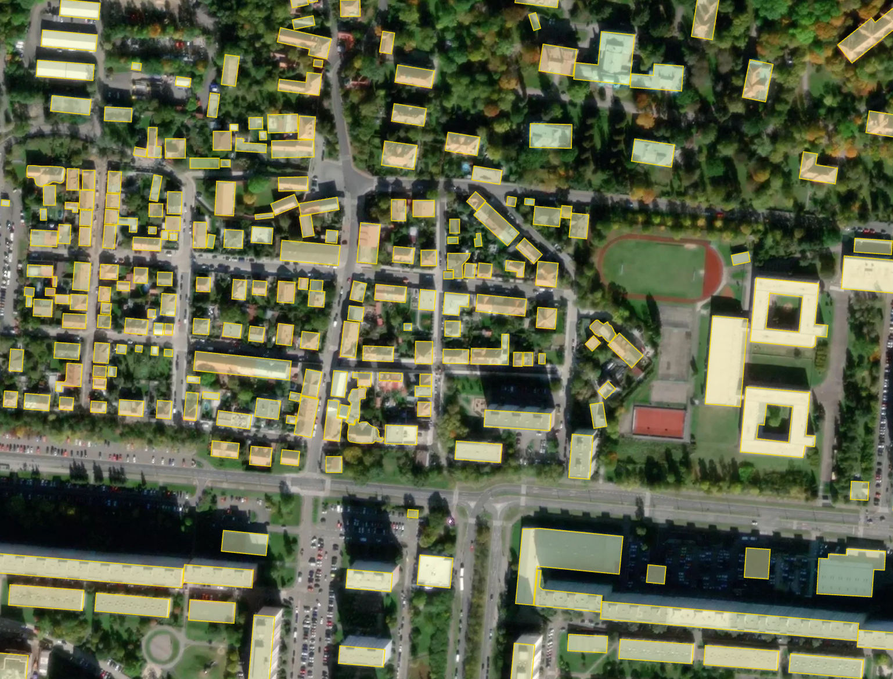
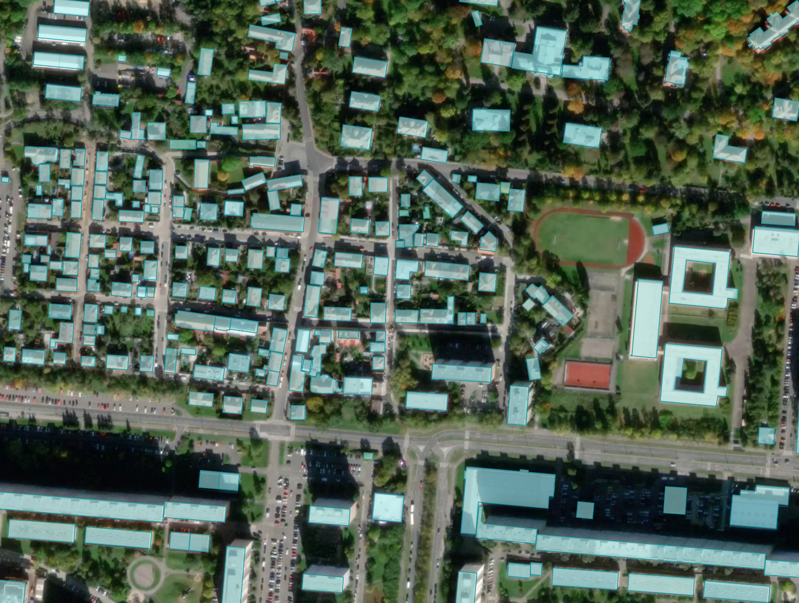

Buildings
---------

Extracting of rooftops of buildings from imagery of high resolution.
High performance deep learning model is trained to detect the buildings roofs. 
Three different models are used for different geographic regions for better fit to the various urban environments around the world. The decision is automatic, based on the location of your AOI.

*Note:* The building candidates with area less than 25 sq.m. are removed to avoid clutter

The model does not extract the footprints directly, because they are not clearly visible in the images, but we can obtain them, just like human cartographers, by moving the roof to the bottom of the wall (see Additional options).

**Additional options:**

* *Classification by types of buildings* – typology of buildings is represented by the main classes (see :doc:`reference <../../um/classes>`).
* *Building heights [Mapflow Web only]* - building height estimation by the length of the shadow and the visible part of the wall. This option also provides building footprints instead of roofs. See our `article <https://medium.com/geoalert-platform-urban-monitoring/buildings-height-estimation-7babe6420893>`_ for some details on the technology.
* *Simplification* - the algorithm corrects the irregularities of the contours of our model. The irregular geometries are replaced with rectangles, circles or arbitary polygons with 90 degree angles, which fits better to the original shape. Also the corrected buildings are rotated to align with the nearest roads. This option produces much more map-friendly shapes which look better and are easier to edit, but some shape accuracy can be lost. See our `blog post <https://medium.com/geoalert-platform-urban-monitoring/urban-mapping-going-over-post-processing-issues-f89170131b56>`_ for more information and some visuals.
* *Merge with OSM [Mapflow Web only]* - some of the areas have great coverage of OpenStreetMap data, and if you prefer human-annotated data, you can select this option. In this case, we check for each building whether it has a good corresponding object in OSM (Jaccard index more than 0.7) and if there is one, we replace our result with OSM contour. This makes the result not based on the image, so the buildings can be shifted from actual positions, and some changes that have occurred after OSM mapping may be lost.

**Processing results samples**

A sample of processing result with different options for Prague, Chech Republic.

   
   Result without postprocessing: irregular building shapes, but best fit to the actual rooftop contour seen in the image.

   
   Result with simplification: most of the buildings become rectangular.

   
   Result merged with OSM: some of the buildings imported from OSM have more accurate shape, but may be shifted from the image position.