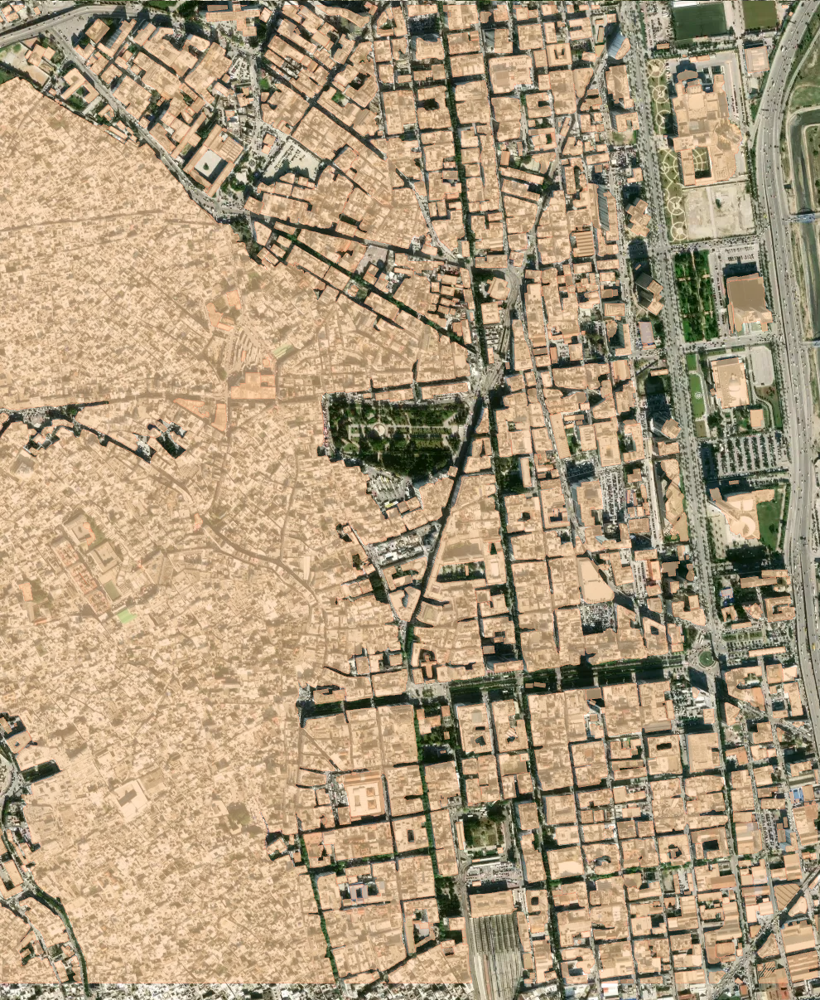
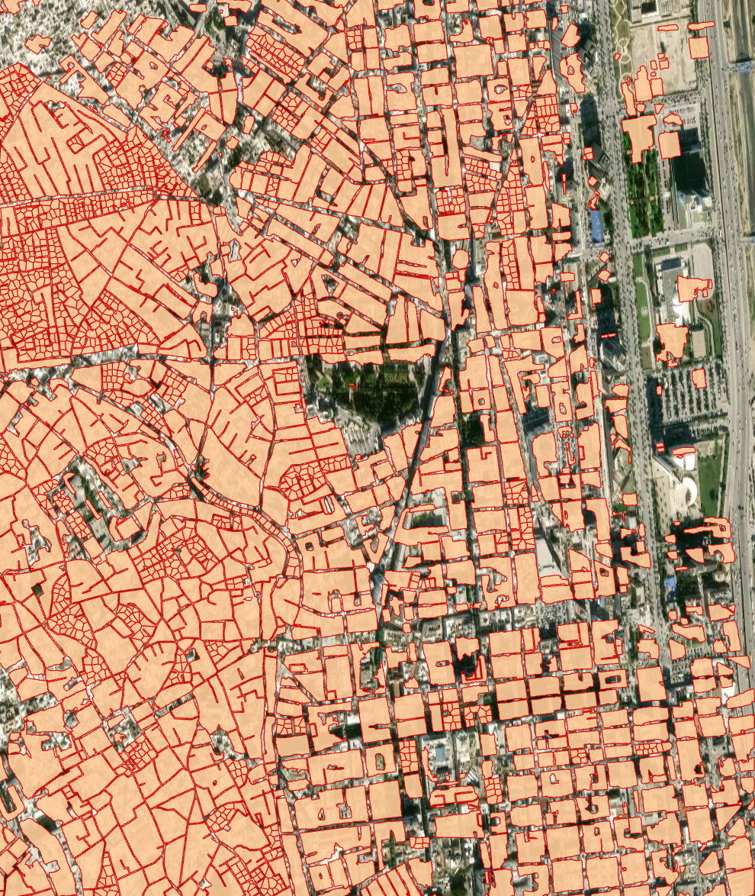

High-density housing
====================

Our “high-density housing” AI model is designed for areas with terraced or otherwise densely built buildings, common in the Middle East, parts of Africa, etc. This model, just like the regular :doc:`building model <buildings_model>`, detects the building roofs.

Firstly, the building blocks are segmented as a whole, and then each block is divided into individual houses with rectangular grid or Voronoi diagram, based on the detected individual roof markers.

**Processing results samples**

Processing result sample for dense urban development area (Tunisia, Africa):

   
   Standard model for buildings segmentation, with polygon simplification

   
   High density buildings model