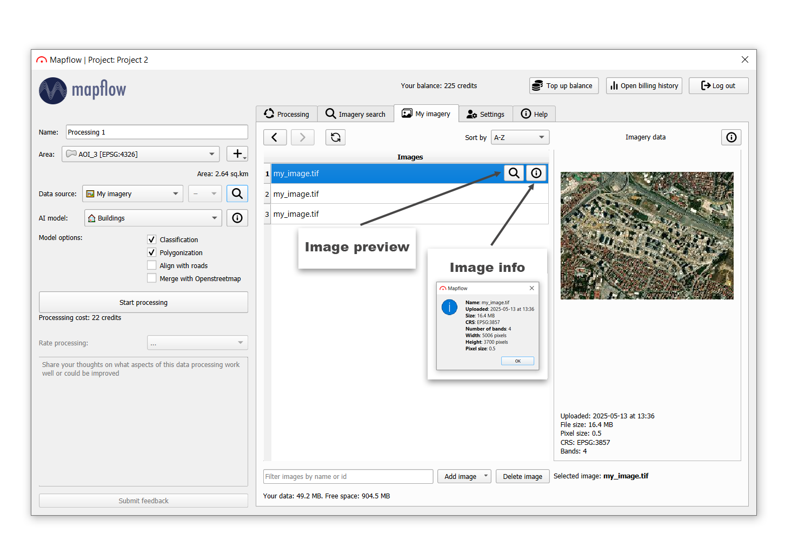
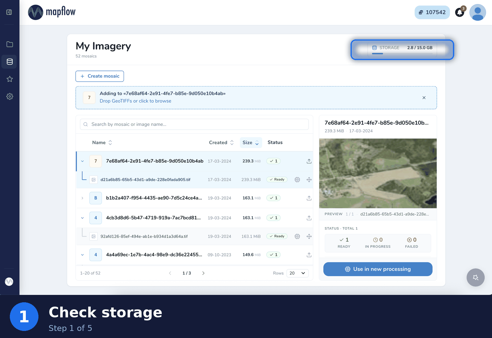
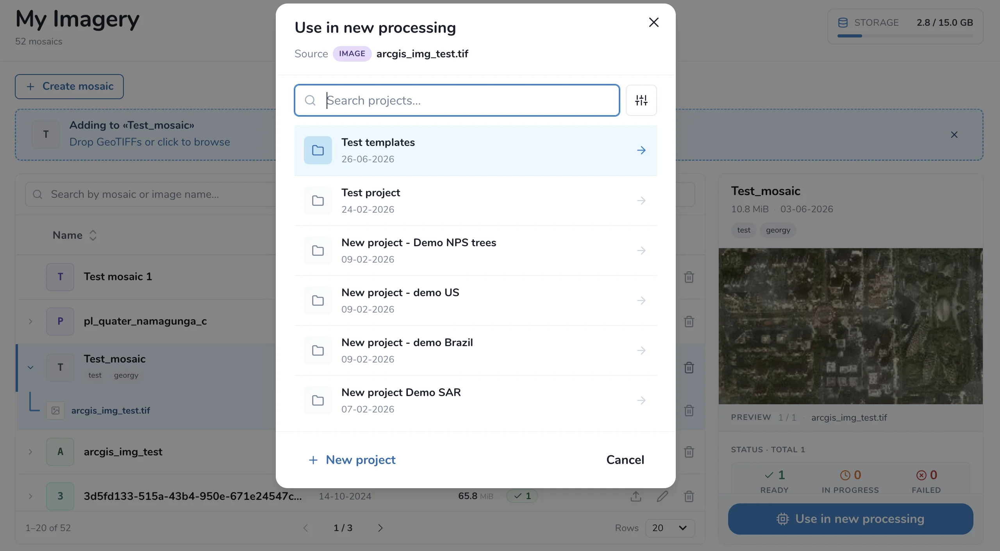
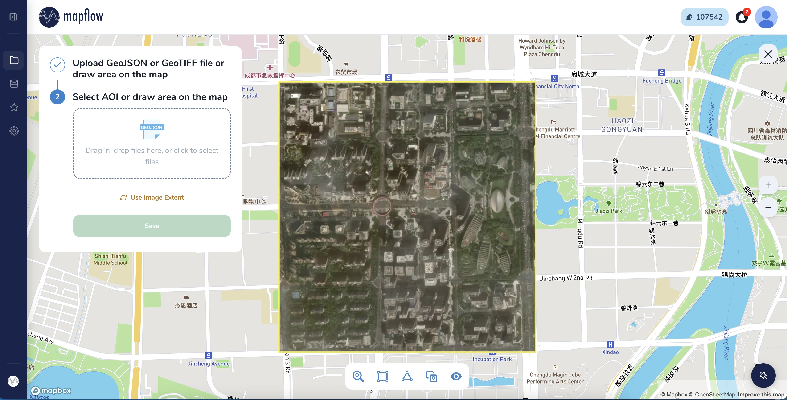

.. _My imagery main:

My Imagery & Data Providers
=============================

.. note::
     In general there are four ways to use aerial or satellite data in Mapflow:

     1. **My imagery** – upload your own images to the Mapflow platform and use them for processing with Mapflow models.
     2. **Imagery basemaps** – external :ref:`imagery providers`, such as Mapbox, ArcGIS, etc., are enabled in Mapflow for instant use. You can use them with default models.
     3. **Custom URL** – you can set your own XYZ or TMS layers, including commercial ones like :ref:`Nearmap <Nearmap_>`, :ref:`Maxar <Maxar Securewatch>`, etc. This is available in Mapflow Web, API and QGIS plugin.
     4. **Imagery Search** – search for the historical commercial imagery in Mapflow Web and QGIS plugin and place your order to get the images from our partners.

.. note::
     ❗️ You can use the tool called *My imagery* in :ref:`Mapflow Web <My imagery main>`, :ref:`Mapflow QGIS plugin <My imagery qgis>`, and :ref:`API <Data API>`.

"My imagery" in QGIS
----------------------

"My imagery" allows you to collect images in separate *Imagery collections*. Using this service, users can easily manage their data collections, reuse images for the next processings and analysis with Mapflow models.

|

Basic usage:
    - Processing of multiple images at one time. If you are experiencing the processing of multiple images in one area, this tool will be helpful.
    - Reusing of the uploaded images for the next processings
    - Adding tags to the imagery collections to make them searchable in the Mapflow projects

The basic scenario of working with "My imagery" service is as follows:
    1. You are creating an imagery collection (a set of images)
    2. Optionally add tags to identify the collection
    3. Upload your images to the collection
    4. Start processing with Mapflow using the whole Imagery collection or the specific image. With both methods, you can limit the processing area by applying an AOI.

.. important::
     Main image upload restrictions and limits are listed in :ref:`Requirements for using the platform <Upload restrictions>`.

.. note::
     Read how to use it in detail in :ref:`Mapflow QGIS plugin <My imagery qgis>`.

"My imagery" Web
-------------------

The **My Imagery** page in Mapflow Web lets you manage your imagery collections (*mosaics*): create new collections, upload your own GeoTIFFs, preview them, monitor storage, and start a processing directly from an uploaded image.

My Imagery main page
~~~~~~~~~~~~~~~~~~~~~~~

|

1. **Storage** – check how much of your storage is used (used / total). When the limit is running out, you can free up space by deleting unused data, or extend your limit by switching to one of the `Premium plans <https://mapflow.ai/pricing>`_.
2. **Create mosaic** – create a new mosaic (image collection) to group related images together.
3. **Upload area** – drop GeoTIFFs (or click to browse) to upload them into the selected mosaic. 

.. note::
     See :ref:`Requirements for using the platform <Upload restrictions>` for supported formats and limits.

4. **Image previews** – browse the table of mosaics and, for the selected mosaic, preview its images along with their status (*Ready*, *In progress*, *Failed*).
5. **Use in new processing** – start a new processing from the selected image.

.. note::
     Each mosaic and image has its own status. The table lists all your mosaics, each with a unique UUID, and can be searched by name, and sorted by name, creation date, size, and status.

Use in new processing
~~~~~~~~~~~~~~~~~~~~~~~~

Selecting **Use in new processing** opens a dialog where you choose the project to start the processing in. Pick an existing project from the list, or create a new one with **+ New project**.

|

Preview and AOI
~~~~~~~~~~~~~~~~~

You can preview your image on the map and set the processing area: upload a GeoJSON/GeoTIFF, draw the area on the map, or click **Use Image Extent** to use the image boundaries. See :ref:`Select AOI` for details on drawing and uploading an AOI.

|

.. include:: imagery_search.rst