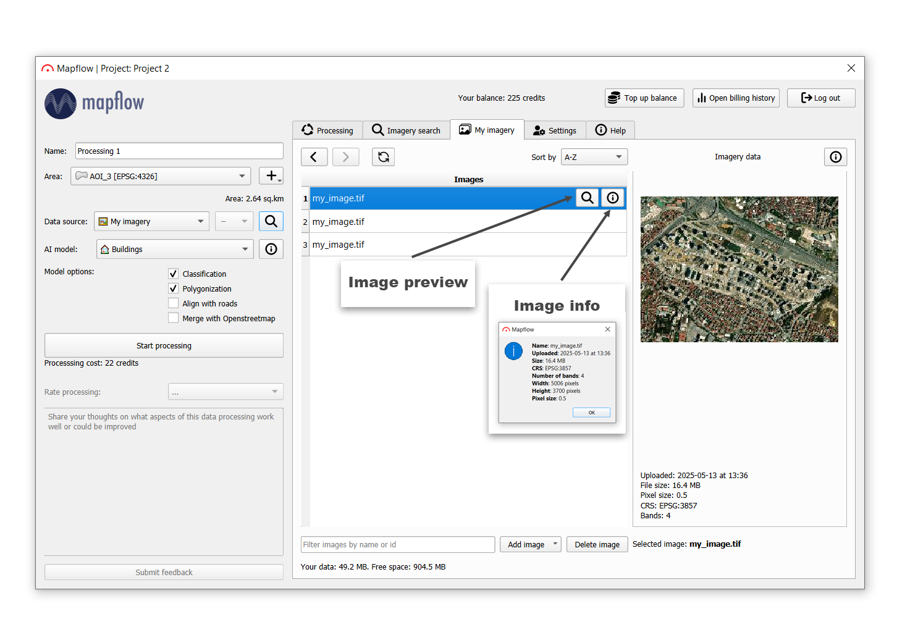

.. _My imagery main:

My imagery
===========

"My imagery" allows you to collect images in separate collections, called "mosaic". Using this service, users can easily manage their data collections, reuse images for the next processings and analysis with Mapflow models.

|

.. note::
     ❗️ Currently, you can use *My imagery* in :ref:`Maplfow QGIS plugin <My imagery qgis>` and :ref:`API <Data API>`. The Web app implementation is in progress.

Basic usage:
    - Processing of multiple images at one time. If you are experiencing the processing of multiple images in one area, this tool will be helpful.
    - Reusing of the uploaded images for the next processings
    - Adding tags to the imagery collections to make them searchable in the Mapflow projects

The basic scenario of working with "My imagery" service is as follows:
    1. You are creating a mosaic (a set of images)
    2. Optionally add tags to identify the mosaic
    3. Upload your images to the mosaic
    4. Start processing with Mapflow using the whole mosaic or the specific image. With both methods, you can limit the processing area by applying an AOI.

.. warning::
     There are two main **restrictions on uploading images** in the free plan - the image should be no more than *1 GB* and no more than *100,000 pixels* by the side. We have no other restrictions on uploading to the mosaic, but it is important that each uploaded image has the SAME parameters as the rest of the images in the mosaic (pixel size, number of bands, georeference). For example, two images with pixel sizes of 10 cm and 1 m cannot be added to the same mosaic.
