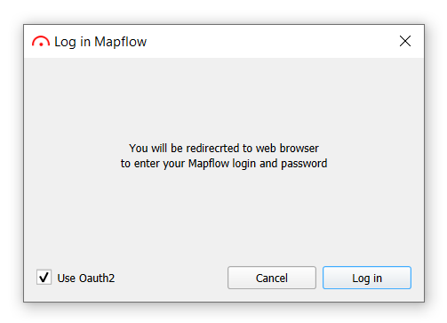
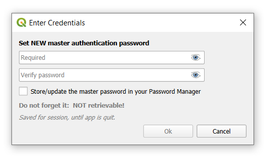
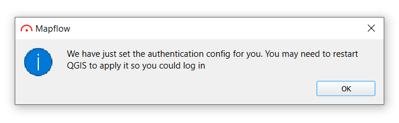
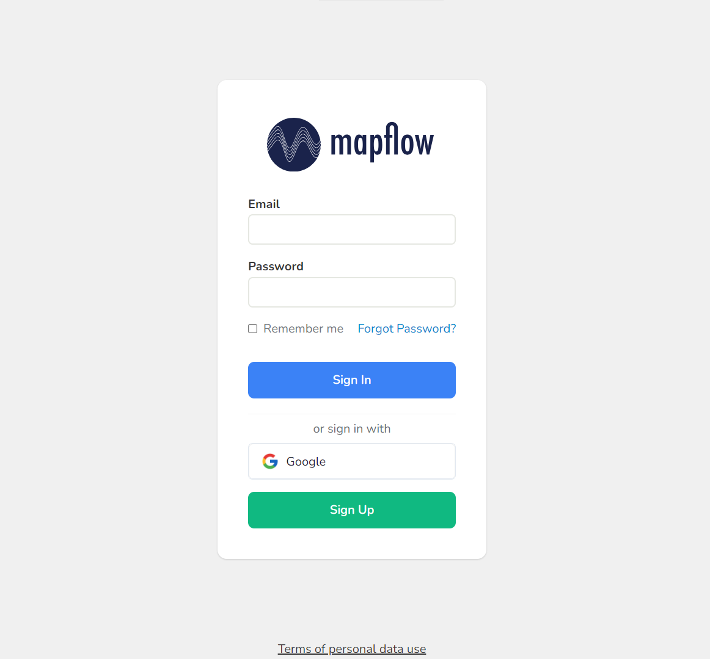
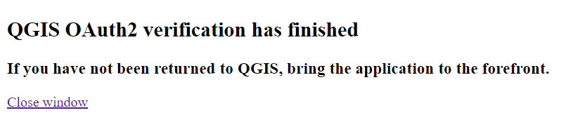

**1. Select the** ``Use OAuth2`` **option in the login window**

|

**2. Set the master password**

You will be prompted to set a new `master authentication password <https://docs.qgis.org/3.28/en/docs/user_manual/auth_system/auth_overview.html#master-password>`_ - qgis feature to ensure the security of sensitive information storage.

|

**3. Click** ``Log in`` **button**

You will receive the following message, **restart** QGIS before the next steps.

|

**4. After restarting QGIS, click** ``Log in``

You will be redirected to the browser to log in/register in the mapflow system:

|

After successfully logging in, you will receive a message about the successful verification of QGIS OAuth2:

|
.. note:: 
  You can close this page

**5. Go back to QGIS**

OAuth login completed!

.. important::
  If you have problems with authorization, you can delete the current authentication config by going to ``Settings -> Options -> Authentication``, select the config and remove it:

  .. figure:: _static/oauth2_login/delete_oauth_config.png
         :align: center
         :width: 15cm
         :class: with-boarder no-scaled-link

|