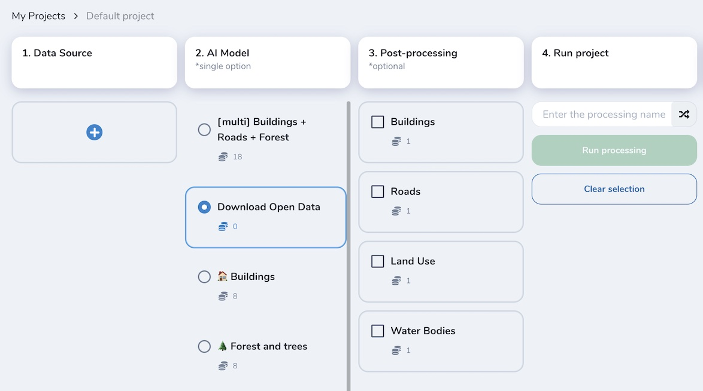
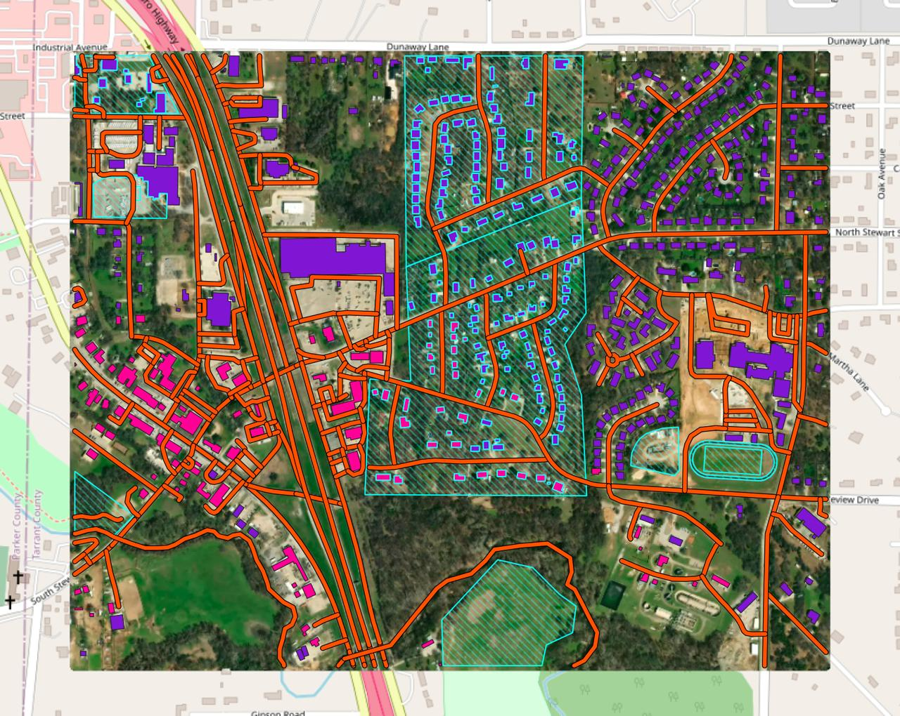

Download Open Data
-------------------

In Mapflow, you can download open mapping data from OpenStreetMap and Overture Maps.
This pipeline **does not use any AI model**. It is designed to support your mapping projects with community-maintained open data.

Select one or more semantic classes and run the workflow.

**Run the pipeline**

|
**Get the results and the image preview (in Web app or QGIS project)**

|
.. warning::
    Results depend on the availability and completeness of open mapping data in your area of interest. You can use it alongside AI-mapping results as a complementary source.

.. note::
    You have to select an image source the same way as for AI-mapping pipelines.
    Note that the results may not be well aligned with the image, because the data comes from an external open data source. The image is provided only for visual reference, so you can decide whether you need to apply edits or run a Mapflow model to complement the results.
