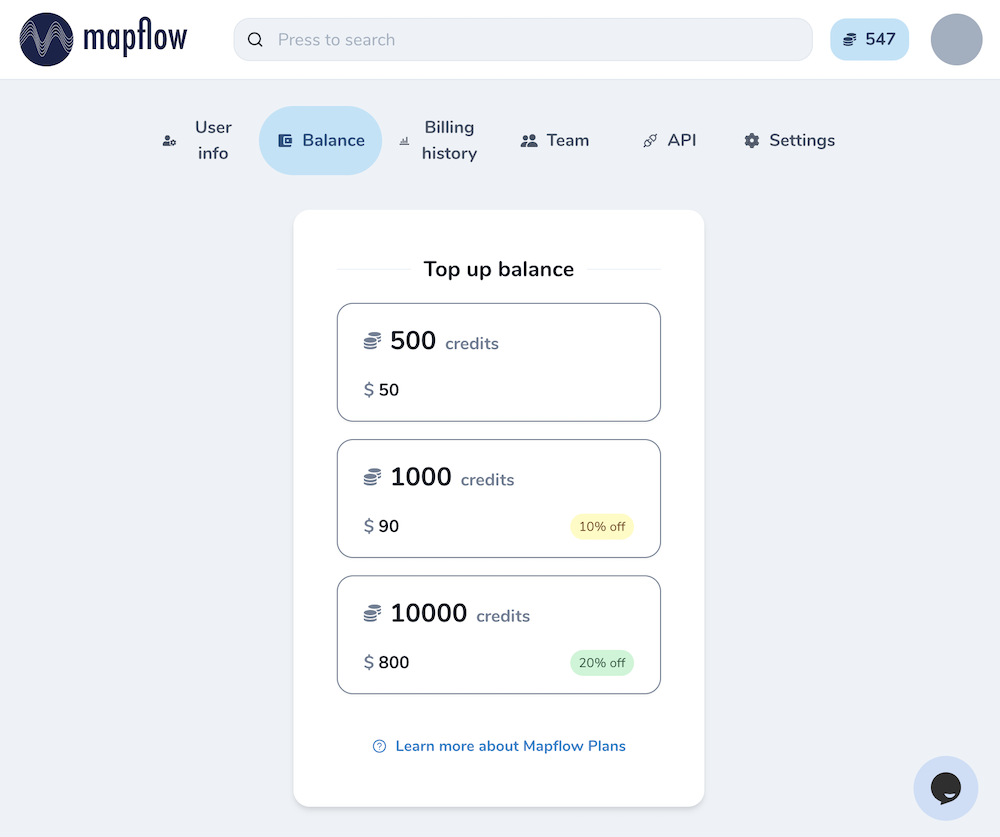
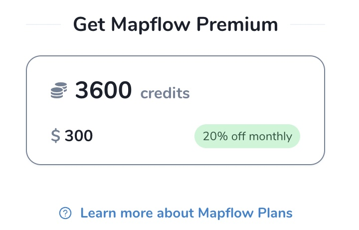

Mapflow pricing
===============

How to top up your balance
--------------------------

.. note::
   Each user gets the free balance of **250** credits to get started with Mapflow AI.
   You can always buy more credits in your `account profile <https://app.mapflow.ai/account/balance>`_.

In order to top up you balance go to `your Mapflow profile <https://app.mapflow.ai/account/balance>`_ and choose one of the options.
You will be asked to pay online.

|

.. _credits:

Mapflow credits
-----------------

Cost of processing makes the sum of **data cost** and **processing cost** given the requested area:

``Cost = Area * (Processing Price + Data Price)``

The price in credits is counted as:
1 Credit = 0.1$ with the progressive discount depending on the number of credits you buy:

.. list-table::
   :widths: 30 15 15 15
   :header-rows: 1

   * - Mapflow Credits
     - 500
     - 1000
     - 10000
   * - You pay
     - $50
     - | :del:`$100`
       | $90
     - | :del:`$1000`
       | $800

All prices below are given in Mapflow credits. Mapflow Web also provides a transparent price breakdown in the processing pipeline.

.. note::
   * All the processings having an area less than 1 sq.km are rounded up to 1 sq.km before price calculation!
   * Total processing cost is rounded up to the nearest integer number of credits

.. _subscription-plans:

Mapflow subscription plans
-----------------------------

Currently Mapflow provides two pricing models: pay-as-you-go and subscription plans. Currently the only plan **"Mapflow Premium"** is available. 
It includes a monthly subscription fee and a package of credits. The subscription fee is charged monthly, the credits are valid for 12 months. It enables some premium options like custom area size, use of the any custom model that you have access to, priority support, and the use of commercial satellite data providers. Check the `Mapflow pricing page <https://mapflow.ai/pricing>`_ for details of the subscription. 

|

.. note::
   1. Using the Mapflow Premium one can buy additional credits with pay-as-you-go pricing.
   2. To activate the subscription, go to your `account profile - Balance <https://app.mapflow.ai/account/balance>`_ and choose the Mapflow Premium plan.
   3. To deactivate the subscription, go to your `account profile - Balance <https://app.mapflow.ai/account/balance>`_ and turn off the Mapflow Premium. 

.. important::
   If you want to buy a custom package or use another payment method, or consider using Mapflow on a large scale, check `Mapflow Custom <https://mapflow.ai/pricing>`_ and contact sales.

Model costs
-------------------------

Default Mapflow models
~~~~~~~~~~~~~~~~~~~~~~~~~

.. csv-table::
  :file: _static/csv/web_processing_prices.csv
  :header-rows: 1
  :class: longtable
  :widths: 1 1 3

.. note::
   If you want to have a custom model with another set of options, consider applying for `Mapflow Custom <https://mapflow.ai/contacts>`_. Pricing for custom models varies by project scope. To get the quotation and apply the discount, please share your project requirements (contact sales@geoalert.io).

Data costs
--------------

.. important::
   If you are using your own imagery, GeoTIFF or Custom URL, the data cost is always 0 credits.

Imagery basemap costs
~~~~~~~~~~~~~~~~~~~~~~~~~~~~
When using default imagery basemaps (Mapbox, Arcgis WorldView Imagery), the price starts from a min. of 1 credit, depending on the model and the zoom level (`What is zoom? <https://wiki.openstreetmap.org/wiki/Zoom_levels>`_) - if you change the zoom, the price is automatically recalculated.

Imagery ordering costs
~~~~~~~~~~~~~~~~~~~~~~~~~~~~
If you are using commercial providers and order the new image, the cost varies depending on the resolution of the satellite sensor. We partner with streaming data providers, which means you don't have to deal with price lists and files over FTP; instead, you can search for imagery that better meets your date and area requirements. Zoom level is fixed and changing it is not possible for the imagery ordering. 

See the data prices and the corresponding resolution of the imagery sensors in the table below.

.. csv-table::
  :file: _static/csv/data_prices.csv
  :header-rows: 1
  :class: longtable
  :widths: 20 10 10 10

Examples of quotations
-------------------------

.. epigraph::
    *I want to process 3.3 sq.km of Commercial provider at 18 zoom using the Buildings model*

    ``Cost = 3.3 * (5+46) = 168 credits``

.. epigraph::
    *I want to process 0.01 sq.km of My imagery using the Buildings model and applying the Polygonization option.*
    
    Area is rounded up to 1 sq.km, the user's data cost is 0, so the cost will be:

    ``Cost = 1 * (5+3) = 8 credits``