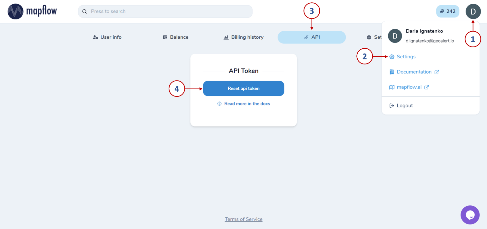

How to use the Mapflow <> QGIS plugin 
---------------------------------------

**Object mapping in remote sensing images using Mapflow plugin for QGIS**

Interpretation and subsequent digitization of satellite imagery is a rather laborious process. The use of AI-based image recognition technologies leads to a reduction in labor costs and an increase in data processing speed.

In the QGIS, the process of detecting objects of various types can be automated using the Mapflow plugin. To accomplish this, you can follow the steps described below.

**1. Installation of Mapflow plugin and logging in**

First of all, you have to install the plugin in QGIS. To do this, go to the tab called Plugins -> Manage and Install Plugins, find Mapflow using the search bar and click Install Plugin.

|

After installation, the plugin icon will appear in the toolbar: |plugin_icon|. Clicking on it will open the authorization window, in which you need to click on "Get token".

|

A window will open in which you have to quickly and for free register on `Mapflow.ai <https://app.mapflow.ai/>`_. After that, by clicking on the user, you need to go to Settings and select the API tab.

|

By clicking on the "Reset api token" button, you will get access to the authorization key, which must be copied and saved, as well as pasted into the authorization window in QGIS. After that - click "Log in".

Another way to log in to the plugin is using Oauth2. By checking the appropriate option in the authorization window, you will need to set a master password.

|

Then, following the instructions, restart QGIS and click "Log in" again. This will redirect you to the browser, where the Mapflow authorization window will open. After successful login or registration, a page will open notifying you of this.

|

And in QGIS the main tab of the plugin will open, so you can proceed to the next steps.

**2. Object recognition using Mapbox data provider**

In order to start processing, first you must specify its name. Next, choose the area of interest by drawing it on the map / loading from a vector file / taking the extent of the map.

|

In the upper-left corner of the main QGIS window in the Browser panel, you can open the OpenStreetMap basemap and navigate around the map to identify the area of interest.

|

Let’s leave the remaining parameters as default: Mapbox data provider and a model for buildings classification. Then click "Start processing".
A new row will appear in the processing table. Upon completion of processing (Progress – 100%), after some time, you can load the result to the map by clicking on "View results" (or double-clicking on the row). The raster layer and the identified objects will be displayed on the map: buildings are automatically classified by their type (where red is residential and purple is commercial).

|

The resulting vector objects can be saved in GeoJSON format (by clicking on the additional options next to View results) and then used for mapping, analysis, or filled with additional attribute information.

|

**3. Object recognition using your own imagery**

Previously, we looked at one of the simplest scenarios for working with the Mapflow plugin. However, its functionality is not limited to a single data provider. In addition to the default providers, you can use the search in the imagery catalog or process your own images. 
After adding the image you are interested in to QGIS as a raster layer, you can select it in the "Data source" field and run processing. The result can look like this: the boundaries of trees of different heights, identified in your image.

|

In this quick tutorial, we looked at the main options for detecting objects in remote sensing images with the help of the Mapflow plugin for QGIS. In addition to buildings and forest vegetation, there are models for recognizing roads or construction sites. A more extensive overview of the plugin's capabilities, as well as various options for data sources, are discussed in the documentation for :ref:`Mapflow <> QGIS`.
