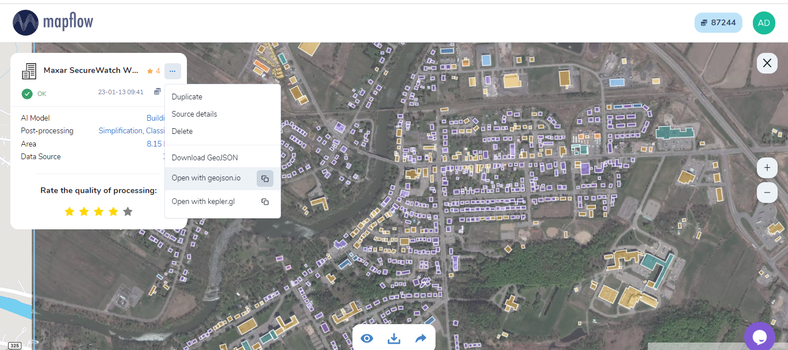
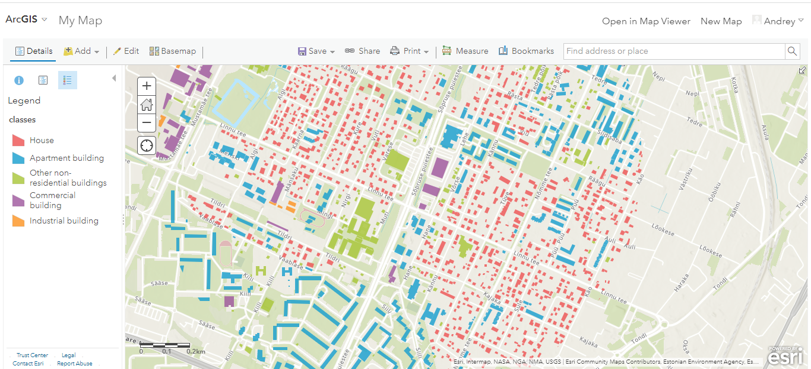
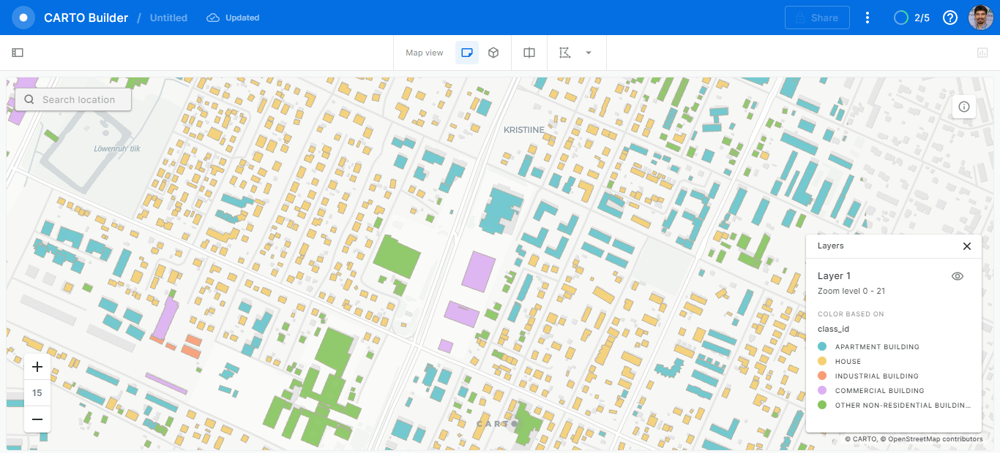

Reference on using the platform
================================

.. note::
    This document outlines the requirements for using the Mapflow platform, including supported data formats, preprocessing steps, and model-specific guidelines.

Requirements for using the platform
-------------------------------------

Upload GeoTIFF requirements
~~~~~~~~~~~~~~~~~~~~~~~~~~~~~
.. note::
    Please pay attention to the following:

    * Images you upload are preprocessed in `Uint8` format. If your image is not of this type and you want to preview it manually before uploading to the Mapflow server, please use our `image preprocessing script <https://github.com/Geoalert/mapflow_data_preprocessor/>`_ or other tools to translate it to the appropriate format;
    * Your image must be georeferenced in geographic or projected coordinate system, ellipsoid WGS84, it is recommended to use UTM or Web Mercator;
    * Your image is supposed to be RGB composite, RGBa and Singleband will work as well*;
    * The default limit for file size is 1 Gb for free users. If you have a bigger file – reduce its size or consider switching to the paid plan; 
    * Each Mapflow model has its recommendations for the spatial resolution of the input data, see :ref:`Model_requirements` below

In case of non-compliance with any requirements, the system reports an error. 
If you are using Mapflow Web or Mapflow QGIS plugin, the error messages are shown in the user interface.
For more details, see :doc:`errors description <../api/error_messages>`.

.. _Model_requirements:

Model requirements
~~~~~~~~~~~~~~~~~~~~~~~~~~~~~

The table below lists model requirements for spatial resolution of the input imagery.

**"Required"** means that the imagery with resolution outside of this range will
be rejected from processing and the request will fail.

**"Recommended"** means that the model is fit specifically for this spatial resolution.
Any images of higher resolution will be downsampled before processing, so it gives no profit to upload higher resolution.
Images of lower resolution (if meeting the "required" section) will be upsampled,
but the results will not be so good as for recommended resolution.

GSD is specified in `UTM coordinate system <https://proj4.org/en/9.2/operations/projections/utm.html>`_,
and may not correspond to what you see as "pixel size" if your image's coordinate system differs.

`Learn more <https://wiki.openstreetmap.org/wiki/Zoom_levels>`_  about zoom and spatial resolution of imagery basemaps.

.. list-table::
   :widths: 20 50 10 10 10 10
   :header-rows: 1

   * - Model
     - Description
     - Recommended zoom
     - Recommended GSD m/px
     - Required zoom range
     - Required GSD range, m/px
   * - Buildings
     - Extract roof contours, with optional classification, simplification and height estimation
     - 18
     - 0.5
     - 17 – 18
     - 0.1 - 1.5
   * - Forest
     - Extract segmentation masks of forested areas from high-resolution RGB images
     - 18
     - 0.5
     - 17 – 18
     - 0.1 - 2.0
   * - Forest Heights
     - Classiy masks of forested areas by height classes based on predefined thresholds
     - 18
     - 0.5
     - 17 – 18
     - 0.1 - 2.0
   * - Tree crowns
     - Extract segmentation masks of tree crowns. Optionally converts to points or polygons.
     - 19
     - 0.3
     - 18
     - 0.5
   * - Roads
     - Extract road mask from high-resolution satellite imagery
     - 18
     - 0.5
     - 17 – 18
     - 0.1 - 1.2
   * - Constructions
     - The model highlights areas in the satellite image that contain construction sites and buildings under construction
     - 18
     - 0.5
     - 17 – 18
     - 0.1 - 2.0

\* Mapflow.ai can also process single-band (panchromatic) imagery, but the NN models are not tuned for such kind of data, so the quality of the result may be worse than expected.

Forest mapping classes
-------------------------

Here is presented a list of classes for the Forest vegetation Mapping Model.
There are two options for forest semantic classification:

* Classification by heights – classification of the areas of vegetation and shrub vegetation by height classes according to the specified thresholds: 0-4 m, 4-10 m, 10+ m. Forest areas of each height class are polygonized in separate features, the height class is indicated in its properties. Heights thresholds are customizable values in the processing pipeline.

* Classification by overgrowth density – classification of the area of vegetation and shrub vegetation into classes according to the density and height: high forest, low (growing) forest, open woodland, and shrub.

   .. tabularcolumns:: |p{3cm}|p{5cm}|p{7cm}|

   .. csv-table::
      :file: ../forest/_static/csv/classes_forest.csv 
      :header-rows: 1 
      :class: longtable
      :widths: 1 1 1 

.. _buildings_classes:

Buildings mapping classes
---------------------------

   .. tabularcolumns:: |p{3cm}|p{5cm}|p{7cm}|p{3cm}|

   .. csv-table::
      :file: ../um/_static/csv/classes_um.csv 
      :header-rows: 1 
      :class: longtable
      :widths: 1 1 1 1

Buildings Mapping visualization with ArcGIS Online, Carto, etc
~~~~~~~~~~~~~~~~~~~~~~~~~~~~~~~~~~~~~~~~~~~~~~~~~~~~~~~~~~~~~~~~~~~~~~~~~~~

Mapflow Web easily processes imagery and extracts vector objects that can be downloaded in **GeoJSON** format. We recommend using GeoJSON since it is a de-facto standard in web mapping. 
It is natively supported by web mapping frameworks (e.g. Leaflet or Mapbox) and GIS software like QGIS or the ArcGIS Suite.

.. note::
   GeoJSON is an open standard format designed for representing simple geographical features, along with their non-spatial attributes. It is based on the JSON format. The features include points, linestrings (Mapflow roads), polygons (Mapflow buildings footprints, forest and field masks), or multi-part collections of these types.
   Mapflow allows different options for actions with processing results stored in GeoJSON. You are able to download or “Open with **geojson.io**”.

    Open with geojson.io

.. note::
   `Geojson.io <https://geojson.io>`_ allows you to view and save the results in a different format (CSV, KML, TopoJSON, WKT, Shapefile). Click “Save” and select the format in the menu bar.

.. figure:: ../um/_static/img/geojson.io.png
    :alt: Interaction panel
    :align: center
    :width: 20cm

Using GeoJSON allows you to use only drag&drop to visualize Mapflow output results in numerous Web-GIS without converting data formats. `See this video <https://youtu.be/ZG5fVut87ZQ>`_ about how to upload and style a building classification results with ArcGIS online, Carto, and Evergis online.

    Building footprints in ArcGIS online

    Building footprints in Carto

