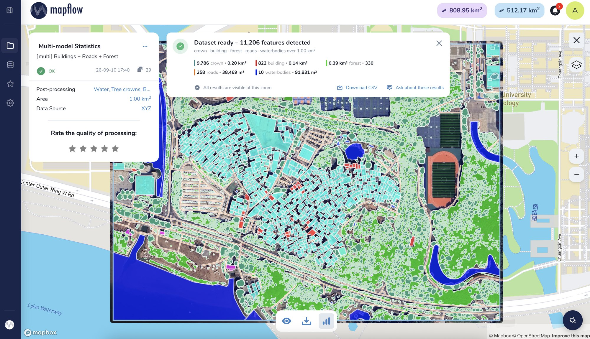
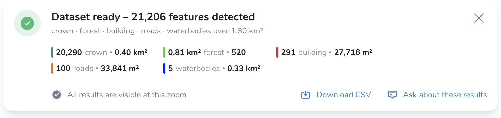

.. meta::
   :description: Read the Mapflow processing results summary - feature counts, areas and lengths per layer, CSV export and questions to the Mapflow Agent.

.. _results summary:

Results Summary (Statistics)
""""""""""""""""""""""""""""""""""""""""""""

Getting a vector layer is only part of the imagery analysis workflow. The next question is usually:
*what did the model actually find?*

Every completed processing in Mapflow Web opens with an instant **summary** of its results – the number
of detected features and their totals (area, length, counts) per output layer. The summary is calculated
for the whole processing AOI, regardless of what is currently visible on the map.

|

.. note::
     The service is powered by the **Statistics API** and is available for every default Mapflow model.
     Custom-model workflows include basic statistics, and their summaries can be customized as well
     (see :doc:`custom_pipelines`).

The summary panel
""""""""""""""""""""""

When the processing is finished, the panel appears above the map with the total number of detected
features, the list of the output layers and the processed area:

|

The panel contains:

1. **Header** – the status of the dataset and the total number of detected features, e.g.
   *"Dataset ready – 11,206 features detected"*.
2. **Subtitle** – the output layers included in the processing and the size of the processed area,
   e.g. *"crown · building · forest · roads · waterbodies over 1.00 km²"*.
3. **Per-layer statistics** – one entry per layer, colored as the layer on the map, with the feature
   count and the corresponding total (area or length).
4. **Zoom hint** – tells you whether all the results are currently rendered on the map. At a low zoom
   level the map may display a part of the features, while the statistics are always counted for the
   whole result.
5. **Actions** – :ref:`Download CSV <statistics csv>` and :ref:`Ask about these results <statistics agent>`.

If you closed the panel, or opened an earlier processing, you can bring the summary back with the
**statistics** button |stats_button| in the toolbar under the map.

What each model reports
""""""""""""""""""""""""

Each model highlights the statistics that matter for its output:

.. list-table::
   :widths: 10 20
   :header-rows: 1

   * - MODEL
     - STATISTICS
   * - 🏠 Buildings
     - Number of buildings and their total area. With the *Classification* option applied, the counts
       are also given by building type (see :ref:`Building Mapping classes <buildings_classes>`).
   * - 🚗 Roads
     - Total length of the extracted road network.
   * - 🌲 Forest and trees
     - Total vegetation area. With the *Tree crowns* option applied, the number of the extracted crowns
       is reported as well.
   * - 🌍 Land use
     - Area per land use category.
   * - 💧 Water bodies
     - Number of the water bodies and their total area (the layer is added by the *Water* post-processing option).
   * - [multi] models
     - One entry per output layer, e.g. *crown*, *building*, *forest*, *roads*, *waterbodies*.

.. _statistics csv:

Download the statistics as CSV
"""""""""""""""""""""""""""""""

Click **"Download CSV"** in the summary panel to save the numbers as a table – one row per layer or
class, with the counts and the totals. Use it to attach the figures to a report, or to compare several
processings of the same area.

.. note::
     PDF reports will be available soon.

.. _statistics agent:

Ask the Mapflow Agent about the results
"""""""""""""""""""""""""""""""""""""""

Click **"Ask about these results"** to continue in the :doc:`Mapflow Agent <mapflow_agent>` chat. The
Agent instantly receives the structured statistics of the processing, so you can ask it to explain the
numbers, compare the layers, or estimate the values you need, e.g.:

* *"How much of the area is covered by vegetation?"*
* *"What is the average building footprint here?"*
* *"Summarize the results for a report."*

.. seealso::
     :ref:`View the results <View the results>` in the Get started guide, and the
     :doc:`Mapflow Agent <mapflow_agent>` user guide.
