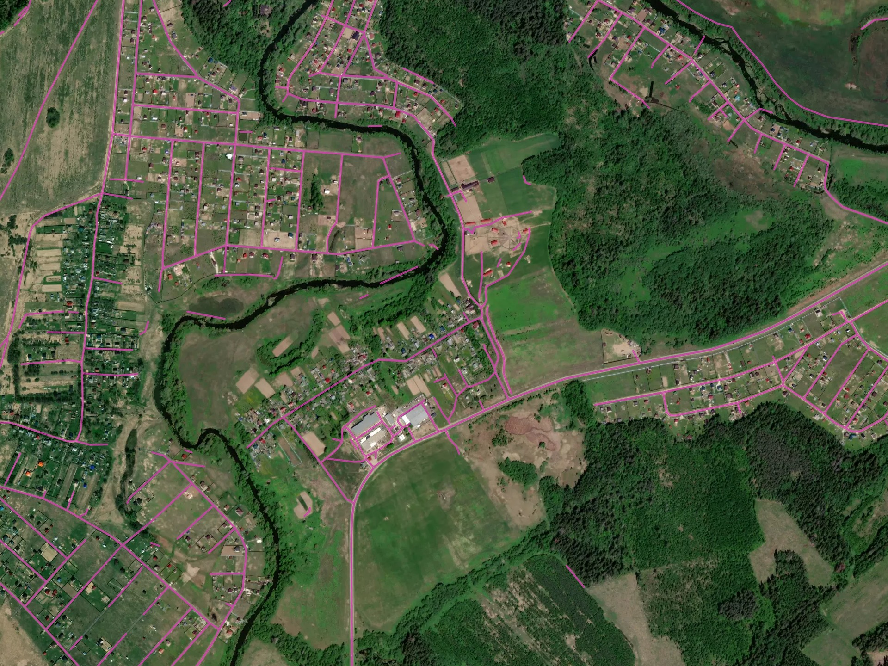
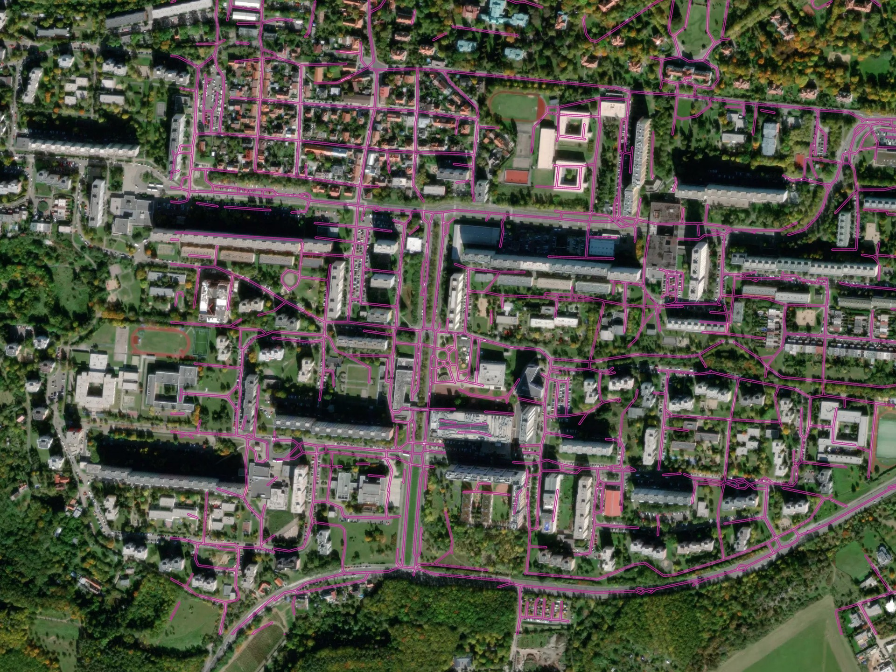

🚗 Roads
--------

Model for road segmentation in high resolution imagery (0.3 - 0.5 m)\

The model is trained primarily for rural and suburban areas. Multi-task learning is applied in order to improve the road mask connectivity, especially in the spots obscured by trees or buildings. Best suited for areas with low urbanization, and can fail in cities where wide roads with sidewalks and complex crossroads are present.
We extract the road central line in order to decrease the clutter and optimize the extracted road network, and then the road lines are inflated back to polygonal object.

In version 1.1 we added the road graph postprocessing:

* geometry simplification;
* merging of the gaps;
* removal of double edges;
* removal of detached and too short segments;

**Processing results samples**

   
   Optimal conditions for the model: rural/suburban territory, Russia

   
   More complex environment - urban territory in Prague, Czech Republic