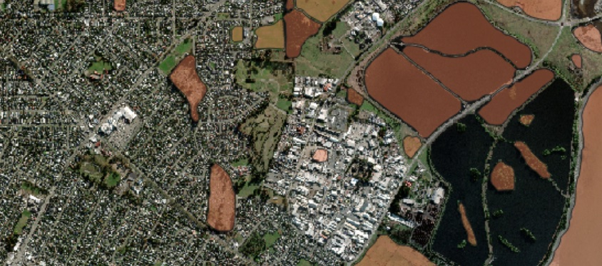
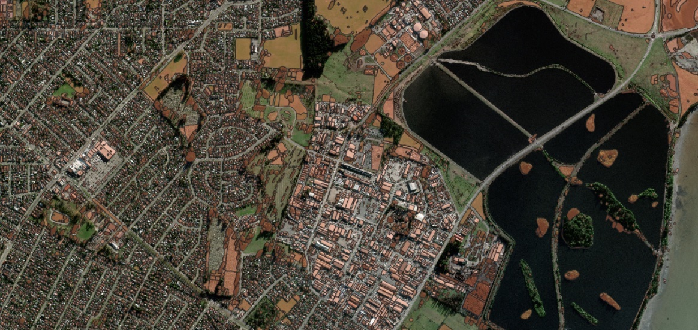

✨ Segment anything (DEPRECATED)
---------------------
.. warning::
   This model has been deprecated as default one. it's available only by request.

The “Segment Anything” (originaly introduced by Meta as *universal segmentation model*) is available as yet another experimental model in Mapflow. We adjusted it to Mapflow workflows to be used on a scale. There are the same steps required to launch this model: 

1. Select your data source 
2. Select your geographical area - either polygon, GeoJSON file, or your image extent

Yet there is one difference in the model workflow:

- if you run this model using GTIFF file — the original resolution of the image will be used
- if you run it via TMS (e.g. :ref:`Imagery basemaps` like Mapbox Satellite) — you need to select the Zoom level (image resolution) from the model options which will be used for the input

|

Depending on the input resolution, the SAM model will interpret and generate different objects. It can be empirically classified by the zoom levels as follows.

SAM options – semantic classification
^^^^^^^^^^^^^^^^^^^^^^^^^^^^^^^^^^^^^^

.. list-table::
   :widths: 10 40
   :header-rows: 1

   * - ZOOM LEVELS
     - SEMANTIC OBJECTS
   * - 14
     - Land use, forests, parks, fields, bodies of water
   * - 16
     - Small fields, large buildings, lawns, plots
   * - 18
     - Farms, buildings, groups of trees, etc.
   * - Aero
     - Houses, trees, vehicles, roof structures, etc.

   E.g. Result – SAM (zoom 14)

   E.g. Result – SAM (zoom 16)

   E.g. Result – SAM (zoom 18)

   E.g. Result – SAM Aero (zoom 20), single trees. Some polygons are not very accurate and some target objects are missing, but the overall result is relevant and can be used for more accurate mapping. 

   E.g. Result – SAM Aero (zoom 20), containers. Appropriate for small typicall objects, requires little manual cleaning. 

.. note::
   ❗️ SAM is not provided in :doc:`Mapfow for QGIS <../../api/qgis_mapflow>` list of default models, as the zoom options are not enabled in the current plugin’s design. Yet if you work in QGIS and want to try SAM there — send us a request and we will connect corresponding workflow scenarios with all zoom options specified.

