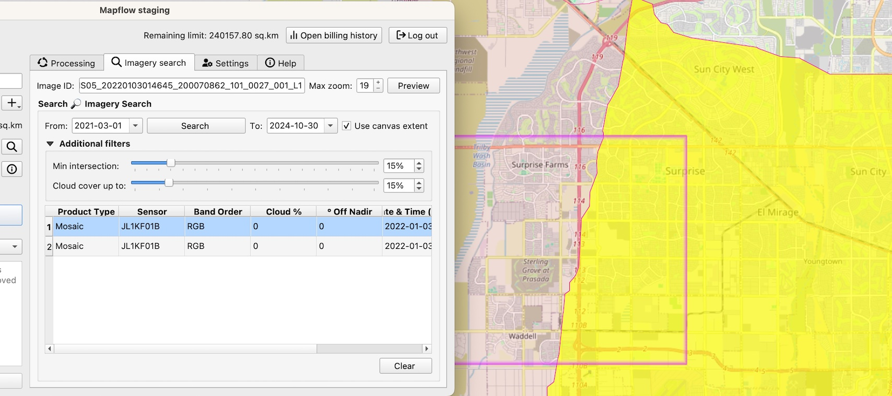
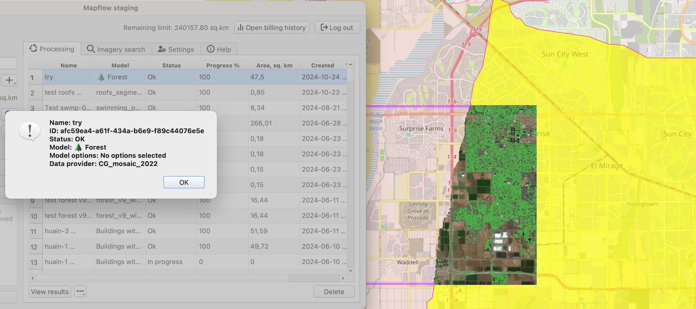

Mapflow Data API enables search for the Global Mosaics metadata.

.. note::
    Commercial 🌏 Global mosaic is the annually updated satellite imagery composite covering most of the World. The mosaic is composed of "Jilin" Chinese satellites imagery (RGB, 0.75–0.5 m/px). The preview is limited to zoom 12.
    **🌏 ArcGIS World Imagery** is a provider of the global coverage composed of high and medium resolution satellite imagery and aerial imagery, hosted by ESRI. The frequency of updating images is 1-5 years depending on the territory.

How to use :doc:`Mapflow – QGIS <qgis_plugin>` to search for mosaic's metadata and run the analysis:  

1. Switch to the Tab "Imagery Search"
2. Set search filter parameters including the area (it can be your area of analysis or a map canvas), period of time, cloud %, and the % of the intersection with AOI.
3. Select the "Product type = Mosaic" in the Search results. You will see the mosaic image "cutline" indicating the specific image that is used in the mosaic. 

|

.. note::

    There are two types of products in the Imagery Search API available:
    * The **Scene** product is available for ordering by request. Now you need to contact us to order the specific image.
    * The **Mosaic** product is available for instant analysis if the corresponding data provider is linked to your Mapflow account.

1. Run the processing. The resulting area of analysis will be clipped by the intersection with the area of analysis.

|

To run the processing over the whole area of analysis – just clear the selection and use the **Data Source: 🌏 Global mosaic 2022** or the **Data Source: 🌏 ArcGIS World Imagery**.