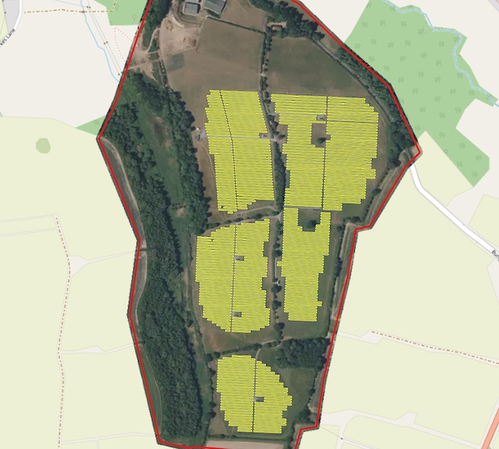

|:sunny:| Solar panels (CUSTOM)
--------------------------------

.. note::
   This model is available by request.

Solar panels is a model trained for detecton of Photovoltaic elements using aerial imagery (working zoom levels 19-21). It's capable of detection PV elements both on the rooftops and on the ground. The testing benchmark score is ``F1 > 0.87``.

.. list-table::
   :widths: 15 30 15 5 15
   :header-rows: 1

   * - Model name
     - Model type
     - Zoom level
     - F1 (testing)
     - Geo domain
   * - Solar panels
     - Detector + segmentator
     - zoom 19-21
     - pixelwise > 0.77
     - Global

