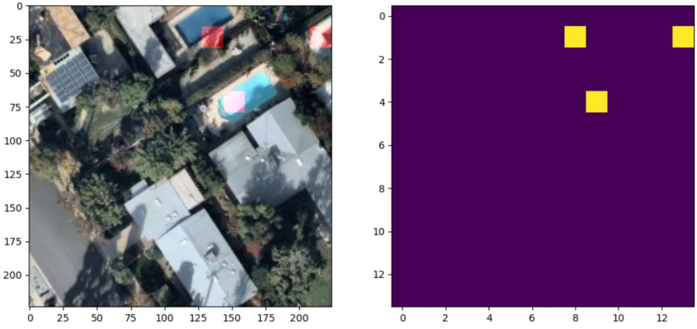

Swimming pools (CUSTOM)
--------------------------------

.. note::
   This model is available by request.

Swimming pools detection and classification. The model is trained on the high resolution aerial imagery (working zoom level 19). The testing benchmark score is ``F1 > 0.95``.

.. list-table::
   :widths: 15 30 15 5 15
   :header-rows: 1

   * - Model name
     - Model type
     - Zoom level
     - F1 (testing)
     - Geo domain
   * - Swimming pools
     - Detector + classification
     - zoom 19-20
     - > 0.95
     - Global

`Read more <https://medium.com/geoalert-platform-urban-monitoring/how-we-approached-a-foundational-model-and-ended-up-with-a-detector-a-real-use-case-b754059650e8?source=friends_link&sk=e46d38b56760d47b8ad0cfa410c2f0dc>`_ about the use cases and the model application