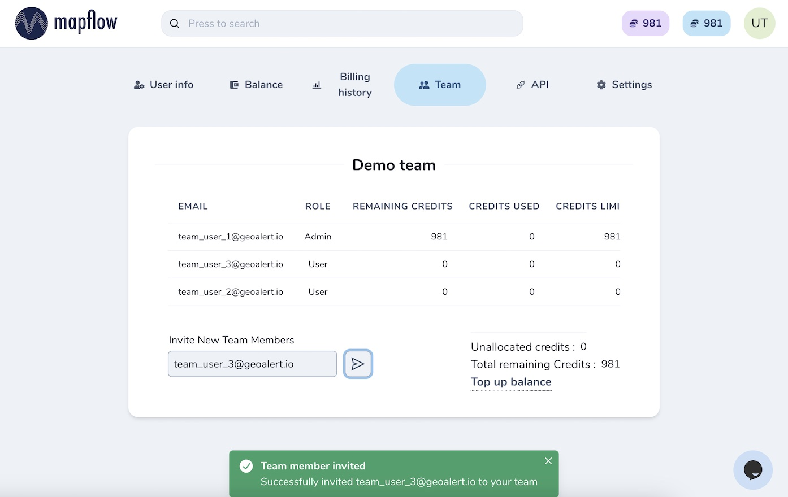

.. _Team accounts:

Team accounts
==============

Users can switch to a Team account to invite collaborators, share projects and manage Mapflow limits.

Once the Team is created, the Owner (Team Admin) can invite new members and assign and manage their limits. Only the Team Admin has access to the Team profile.

|

.. note::
   We highly encourage you to switch to the Team account if you are looking forward to working with other collaborators and managing multiple projects. Feel free to contact our support, so we can assist you in setting up an efficient workflow.

Create a new Team
------------------

To create a new Team enter the name and start inviting new members by their email.

.. image:: _static/team/create_team.jpg
   :alt: create a team
   :align: center
   :width: 15cm
|

.. warning::
   If the user you would like to invite to the new Team is already registered at Mapflow, reach out to Support (help@geoalert.io) to link the account.

The Team Admin is able to assign the limits to the Team members within the remaining credits. 
If your Team account is switched to the area-based billing, the Team Admin will manage the limits in sq. km.

.. image:: _static/team/team_balance.jpg
   :alt: create a team
   :align: center
   :width: 15cm
|

Project sharing in the Team
----------------------------

You can share your project with anyone in the Team and assign his role as needed. 
Go to *Project --  Share* and invite your specific coworkers or / and activate the option "Anyone in the team".

.. image:: _static/project_share/share-team.jpg
   :alt: Share project
   :align: center
   :width: 15cm
|

There are four types of the project user's role:

* **readonly** - can view the project history and the results
* **contributor** – can run the workflows in the project
* **maintainer** – can run and edit the workflows, and share projects with users (up to maintainer role)
* **owner** – full rights to edit all roles in the project

Your collaborators will see the new shared projects in their dashboard and use them according to the role assigned.

.. note::
    You can share your project with the non-team users for the view-only access. Go to the Project -- Share and enter the Mapflow user's email.