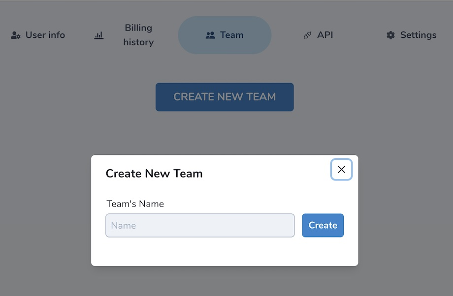
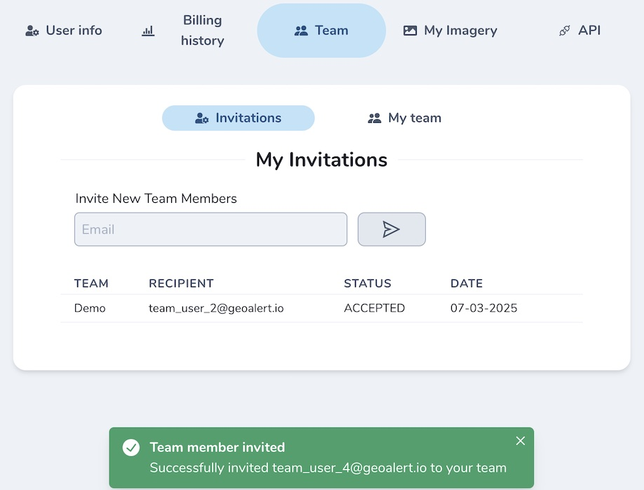
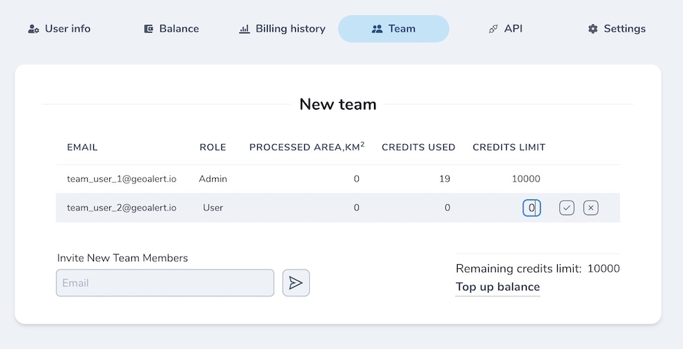
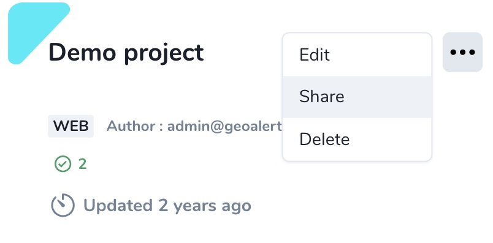
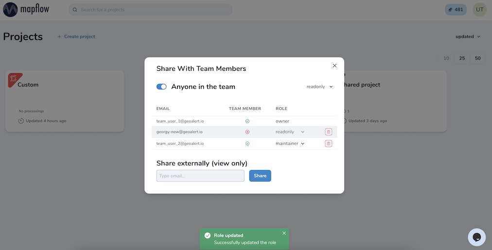

.. _Team accounts:

Team accounts
==============

Users can switch to a Team account to invite collaborators, share projects and manage credit limits.

Once the Team is created, the creator (Team Admin) can invite new members and assign their limits. The Team profile is accessible only to the Team Admin.

.. note::
   We highly encourage you to switch to the Team account if you are looking forward to working with other coworkers and managing multiple projects. Feel free to contact our support, so we can assist you in setting up a Team workflow.

Create a new Team
------------------

To create a new Team enter the name and start inviting new members by their email.

|

Inviting new team members
---------------------------

Switch to the tab **Invitations**. Enter user email associated with his Mapflow account.
If user is not registered at Mapflow, he will get an invitation by email and will be able to join the Team following the registration.

|

.. note::
   As a Team admin, you will see all the invitations sent and may revoke them. As a Team member, you will see only your invitations to the Team. 

Managing Team balance
-------------------------

As soon as one creates a Team, his credit balance becomes the Team balance and is available for assignment to Team members, including the Team Admin himself.
This means the Admin has to assign and manage all the limits, including himself, within the remaining balance.

.. centered::
   1. Team balance
   2. Personal balance
   3. Team user assigned balance

.. note::
   If your Team account is switched to area-based billing, the only difference is that the balance is assigned in sq. km.

Project sharing in the Team
-------------------------------

You can share your project with anyone in the Team and assign his role as needed. 
Go to the `Projects <https://app.mapflow.ai/en/projects>`_. 
Click on a dot menu icon in a project card -- Share. 

|

Select your coworkers or toggle "Anyone in the team" if you want to share with all of them.

|

There are four types of the project user's role that can be assigned to your coworkers:

* **readonly** - can view the project history and the results
* **contributor** – can run the workflows in the project
* **maintainer** – can run and edit the workflows, and share projects with users (up to maintainer role)
* **owner** – full rights to edit all roles in the project

Your collaborators will see the new shared projects in their dashboard and use them according to the role assigned.

.. note::
    You can also share your project with any users outside your team for the view-only access. 
    Go to the Project -- Share and enter the existing Mapflow user's email.
    If the new user is not registered at Mapflow.ai, invite him to register first.